# 7.1. Включение прибора и использование клавиатуры для выбора режима работы

При запуске прибора на дисплее появляются служебные надписи - «Инициализация памяти», а затем «Инициализация прошла», указывающие, что программа загружена в память прибора и готова к работе (Рис.7.1.)

  
*Рис.7.1.*

Данные надписи высвечиваются на экране в течение нескольких секунд, после чего появляется исходная рабочая заставка, представленная на рис. 7.2.

  
*Рис.7.2.*

В нижней части экрана изображены управляющие клавиши **[ < ]** и **[ > ]**, с помощью которых можно выбрать один из двух главных режимов работы прибора:
- Режим измерения и анализа вибрации (подробности см. в разделе 7.3)
- Режим балансировки (подробности см. в разделах 7.4 и 7.5)

**Дополнительные функции:**  
Для ввода и корректировки коэффициентов преобразования датчиков вибрации используйте клавишу **[ # ]** (см. раздел 7.2).

---

# 7.2. Ввод или корректировка коэффициентов преобразования датчиков вибрации

## Процедура ввода коэффициентов
1. Находясь в главном меню (рис.7.2), нажмите клавишу **[ # ]** → откроется окно «Секретный пароль» (рис.7.3).  
     
   *Рис.7.3.*

2. Введите пароль **3.14** (используя цифровые клавиши + **[Ent]**).  
   - Для исправления ошибок используйте **[ < ]** (Сброс).  
   - **Важно:** Дробная часть вводится через запятую (знак «*»).

3. После успешного ввода откроется меню корректировки коэффициентов (рис.7.4):  
     
   *Рис.7.4.*

## Корректировка коэффициентов
### Канал 1 (Кпр.1)
- Нажмите **[ > ]** → отобразится текущий коэффициент (рис.7.5):  
    
  *Рис.7.5.*
  - **[ > ]** → сохранить текущее значение.  
  - **[Ent]** → ввести новое значение (рис.7.6):  
    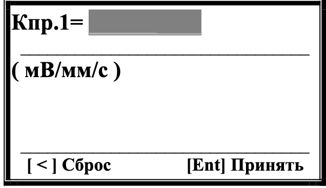  
    *Рис.7.6.*  
    - Используйте цифровые клавиши для ввода → подтвердите **[Ent]**.
    - Для исправления ошибок используйте **[ < ]** (Сброс). 

### Канал 2 (Кпр.2)
- После сохранения Кпр.1 откроется окно Кпр.2 (рис.7.7):  
  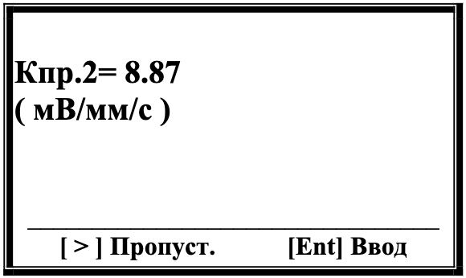  
  *Рис.7.7.*
- Процедура аналогична Кпр.1 (рис.7.8):  
    
  *Рис.7.8.*

**Возврат:** При нажатии кнопки **[Ent]** (Принять) происходит возврат в меню «Коэффициенты» (Рис.7.3) из которого можно выйти в главное меню прибора (Рис.7.2)

---

# 7.3. Работа прибора в режиме «Виброметр»

## Активация режима
Нажмите **[ < ]** в главном меню (рис.7.2) → откроется меню измерений (рис.7.9):  
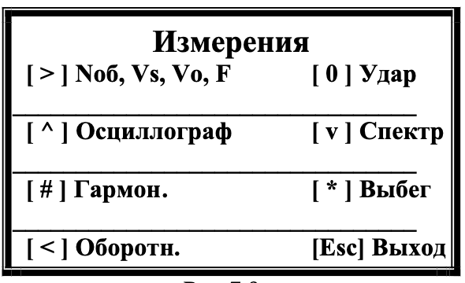  
*Рис.7.9.*

## Режимы работы
| Кнопка       | Функция                                                                 | Ссылка       |
|--------------|-------------------------------------------------------------------------|--------------|
| **[ > ]**    | Циклическое измерение (Nоб, Vs, Vo, F)                                  | Раздел 7.3.1 |
| **[ ^ ]**    | Осциллограф: временная функция вибросигнала                             | Раздел 7.3.2 |
| **[ v ]**    | Спектральный анализ                                                     | Раздел 7.3.3 |
| **[ # ]**    | Гармонический анализ                                                    | Раздел 7.3.4 |
| **[ * ]**    | Определение частот на выбеге                                            | Раздел 7.3.5 |
| **[ 0 ]**    | Метод ударного возбуждения                                              | Раздел 7.3.6 |
| **[ < ]**    | Графическое отображение оборотной составляющей                          | Раздел 7.3.7 |
| **[ Esc ]**  | Возврат к рис.7.1                                                       | —            |

---

## Подготовка к измерениям
### Подключение датчиков
1. **Датчики вибрации**  
   - Установите на корпус машины → подключите к **Х1**, **Х2**.
2. **Фотоэлектрический датчик**  
   - Подключите к **Х3** → нанесите катафотную метку на ротор
   - *Требование:* Нанесите на ротор катафотную метку с контрастной отражающей способностью.

> **Примечание:** Подробные рекомендации по настройке см. в **Приложении 1**.

# 7.3.1. Режим измерения Noб, Vs, Vo, F

**Активация режима:**  
Нажмите кнопку **| > |** в меню «Измерение».

**Функционал:**  
- Циклическое измерение параметров:
  - Частота вращения (Noб)
  - СКЗ вибрации (Vs)
  - Оборотная составляющая (Vo)
  - Фаза вибрации (F)

---

## Процесс работы
1. **Начало измерений**  
     
   *Рис.7.10. Окно старта измерений*

2. **Результаты измерений**  
   После первого цикла на дисплее отображаются:  
   - СКЗ суммарной вибрации (V1s, V2s)  
   - СК3 оборотной составляющей (V1o, V2o)  
   - Фазы (F1, F2)  
   - Частота вращения (Noб)  
   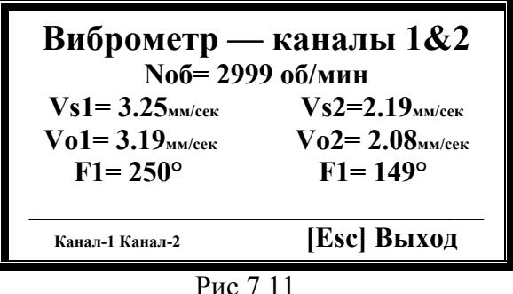  
   *Рис.7.11. Вывод данных*

3. **Особый случай**  
   Если датчик фазового угла не подключен, Nоб = 0 об/мин:  
   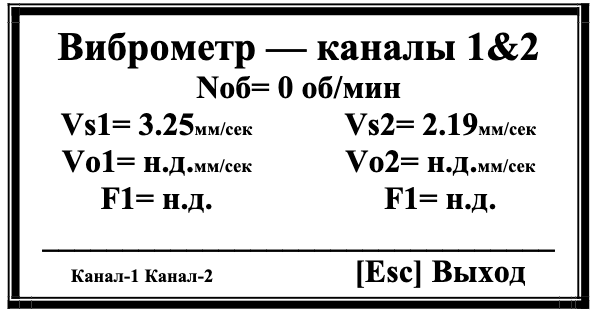  
   *Рис.7.12. Отображение без датчика*

**Выход из режима:**  
Используйте кнопку **[Esc]** (Выход) → возврат в меню «Измерение» (Рис.7.9).

---

# 7.3.2. Режим осциллограф

**Активация режима:**  
Нажмите кнопку **[ ^ ]** в меню «Измерения» (Рис.7.9).

---

## Настройка измерений
1. **Выбор периода измерения**  
     
   *Рис.7.13. Меню выбора периода*

   - После  выбора  нужного  периода  измерения  на экране  появляется  **графическое изображение**  временной  функции 

1. **Графическое отображение**  
   - Временная функция вибросигнала:
     - Канал 1 (красный)
     - Канал 2 (зеленый)
   - Оси:
     - X: Время
     - Y: Амплитуда (мм/сек)  
     
   *Рис.7.14. Графики вибросигналов*

**Обновление данных:**  
Изображение обновляется до нажатия **[Esc]**.

---

# 7.3.3. Режим измерения спектра вибрации

**Активация режима:**  
Нажмите кнопку **[ v ]** в меню «Измерения».

---

## Процесс работы
1. **Выбор частотного диапазона**  
     
   *Рис.7.15. Меню выбора диапазона*  

   - Здесь [1],[2],.. - это соотвествующие кнопки на клавиатуре
  
   Доступные опции:
   | Диапазон | Полоса анализа |
   |----------|----------------|
   | 64 Гц    | 0.5 Гц         |
   | 128 Гц   | 1 Гц           |
   | 320 Гц   | 2.5 Гц         |
   | 640 Гц   | 5 Гц           |

2. **Процесс измерения**  
     
   *Рис.7.16. Статус "Идёт измерение"*

3. **Результаты спектрального анализа**  
   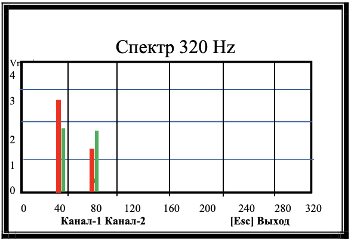  
   *Рис.7.17. Графики спектра вибрации*  
   - Канал 1: красный
   - Канал 2: зеленый
   - Оси:
     - X: Частота (Гц)
     - Y: СКЗ виброскорости (мм/сек)
   - Данное изображение будет периодически обновляться - до нажатия кнопки [Esc]. 
(Выход), после чего на экране появится таблица, содержащая значения составляющих 
спектра вибрации,  определённых в заданном частотном диапазоне  для  обоих  каналов измерения (см. рис.7.18).

4. **Таблица данных**  
   После нажатия **[Esc]**:  
   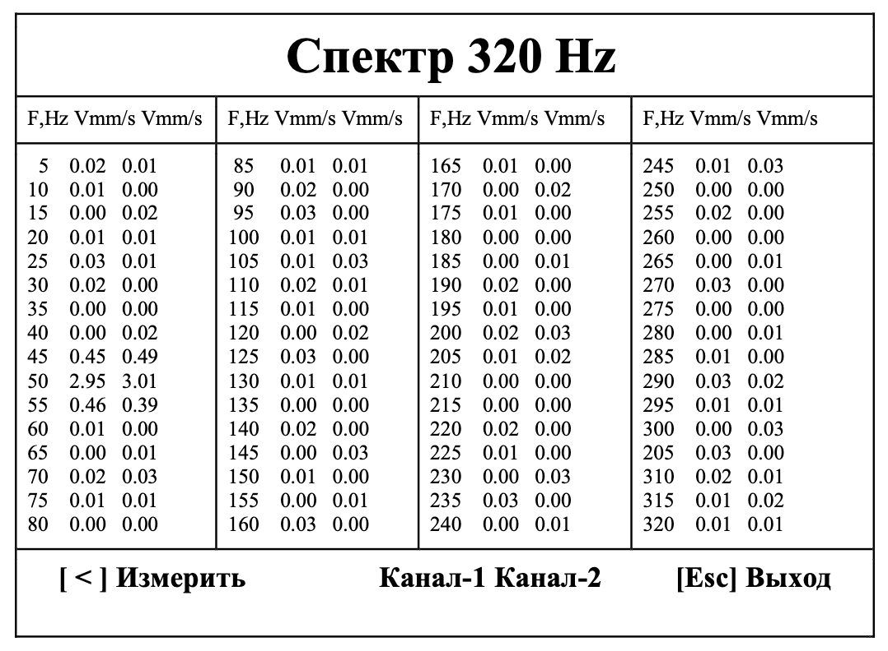  
   *Рис.7.18. Таблица спектральных составляющих*

---

## Управление режимом
- **[ < ] Измерить** → повторить замеры
- **[Esc] Выход** → возврат в меню «Измерения» (Рис.7.9)

# 7.3.4. Гармонический анализ 

> **Внимание!**  
> При работе в данном режиме помимо датчиков вибрации необходимо использовать датчик фазового угла, обеспечивающий синхронизацию процесса измерения с частотой вращения ротора машины, на который настроен датчик.

---

## Процесс работы
1. **Запуск режима:**  
   Нажмите кнопку **[ # ] (Гармон.)** в меню «Измерения» (Рис.7.9).

2. **Начало измерений:**  
   На дисплее появляется статус:  
     
   *Рис.7.19. Статус "Идет измерение"*

3. **Результаты анализа:**  
   После завершения измерений отображаются:
   - Графики спектра гармонических составляющих:
     - Канал 1: красный
     - Канал 2: зеленый  
       
     *Рис.7.20. Графики гармоник*  
     - Оси:
       - **X:** Номер гармоники
       - **Y:** Амплитуда виброскорости (мм/сек)

4. **Таблица данных:**  
   После нажатия **[Esc] (Выход)** выводится:  
   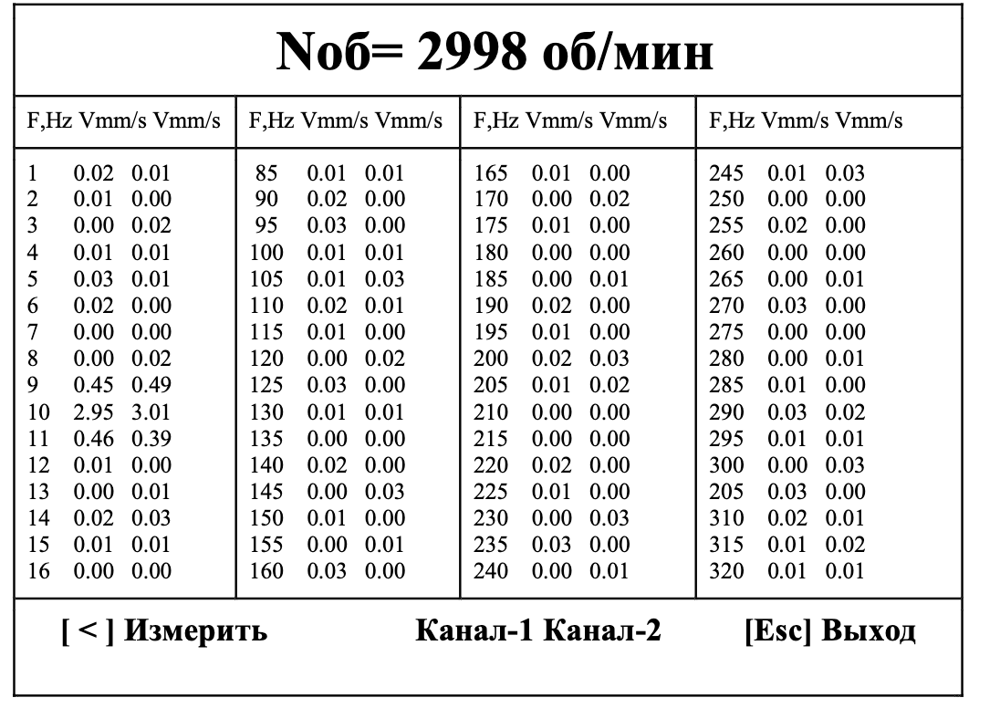  
   *Рис.7.21. Таблица значений СКЗ*

---

## Управление режимом
- **[ < ] Измерить** → повторить анализ
- **[Esc] Выход** → вернуться в меню «Измерения» (Рис.7.9)

---

# 7.3.5. Определение собственных частот колебаний механизма на выбеге

> **Требование:**  
> Используйте датчик фазового угла для синхронизации измерений с частотой вращения ротора.

---

## Пошаговая инструкция
1. **Активация режима:**  
   Нажмите кнопку **[ * ]** в меню «Измерения» → откроется заставка:  
     
   *Рис.7.22. Окно запуска режима*

2. **Подготовка механизма:**  
   - Включите вращение проверяемого механизма
   - Убедитесь, что достигнута рабочая частота вращения
   - Выключите механизм

3. **Старт измерений:**  
   Нажмите **[ > ] (Старт)** → на дисплее появится:  
     
   *Рис.7.23. Статус измерений*

4. **Результаты:**  
   После остановки ротора отображается график:  
     
   *Рис.7.24. График вибрации при выбеге*  
   - **X:** Убывающая частота вращения (об/мин)
   - **Y:** СКЗ вибрации (мм/сек)
   - **Маркер:** Лиловый вертикальный штрих – максимальный резонанс

5. **Дополнительные опции:**  
   - **[ < ] Повтор** → повторить измерение
   - **[ > ] Таблица** → просмотр резонансных частот:  
       
     *Рис.7.25. Таблица резонансов*

---

### Особенности интерпретации:
- В таблице выводятся 5 основных резонансных частот механизма.
- Максимальное значение СКЗ соответствует наиболее мощному резонансу.

# 7.3.6. Определение собственных частот колебаний механизма методом ударного возбуждения

---

## Описание режима
Позволяет определить собственные частоты элементов конструкции по вибрационной реакции на ударное воздействие.

---

## Процесс работы
1. **Запуск режима:**  
   Нажмите кнопку **[ 0 ] (Удар)** в меню «Измерения».

2. **Выбор частотного диапазона:**  
     
   *Рис.7.26. Меню выбора диапазона*  
   - можно выьрать с помощью [1],[2],.. клавиш клавиатуры

3. **Настройка порога срабатывания:**  
     
   *Рис.7.27. Меню порога*  
   Установите значение от **0.1 до 1 мм/сек** 

4. **Ожидание удара:**  
     
   *Рис.7.28. Статус "Ожидание удара"*  
   - Прибор контролирует СКЗ вибрации по каналу 1
   - Произведите удар по конструкции для запуска измерений

5. **Анализ результатов:**  
   При превышении порога отображается спектр затухающих колебаний:  
     
   *Рис.7.29. График спектра*

6. **Расшифровка данных:**  
   Нажмите **[Esc] (Выход)** → выводится таблица спектральных составляющих:  
     
   *Рис.7.30. Таблица частот*

---

# 7.3.7. Графики оборотной составляющей вибрации

> **Внимание!**  
> Используйте датчик фазового угла для синхронизации измерений с частотой вращения ротора.

---

## Процесс работы
1. **Активация режима:**  
   Нажмите **[ < ] (Оборотн.)** в меню «Измерения» (Рис.7.9).

2. **Измерение:**  
     
   *Рис.7.31. Статус "Идёт измерение"*

3. **Результаты:**  
   Графики временной функции оборотной составляющей:  
   - Канал 1: красный
   - Канал 2: зеленый  
     
   *Рис.7.32. Графики вибрации*

---

## Управление режимом
- **[Esc] (Выход)** → возврат в меню «Измерения» (Рис.7.9)

# 7.4. Балансировка

## Активация режима
- **Переход:** Из исходной заставки (Рис.7.2) → нажмите **[ > ] (Баланс.)**
- **Меню выбора:**  
    
  *Рис.7.33. Меню "Выбор типа балансировки"*

---

## Варианты балансировки
| Кнопка       | Действие                                 | Примечание                     |
|--------------|------------------------------------------|--------------------------------|
| **[ < ]**    | Балансировка в **1 плоскости**           | Статическая балансировка       |
| **[ > ]**    | Балансировка в **2 плоскостях**          | Динамическая балансировка      |
| **[Esc]**    | Возврат в главное меню (Рис.7.2)         |                                |

---

# 7.4.1. Балансировка в 1-й плоскости (статическая)

---

## Запуск режима
- **Активация:** В меню "Выбор типа балансировки" → нажмите **[ < ]**  
    
  *Рис.7.34. Окно выбора типа балансировки*

---

## Выбор типа балансировки
### 1. Работа с ранее отбалансированной машиной
- **Кнопка:** **[ > ] (Повторная)**  
- **Условия:**  
  - Масса пробного груза и коэффициенты чувствительности уже сохранены  
  - Пробный груз установлен в плоскости фазовой метки  
- **Процесс:**  
  Требуется **1 пуск** ротора для расчета корректирующего груза  

> **ВНИМАНИЕ!**  
> - Массу пробного груза задавайте **строго в граммах** (см. раздел 7.4.1.2)  
> - Пробный груз должен находиться в плоскости фазовой метки  

### 2. Первичная балансировка
- **Кнопка:** **[ < ] (Первичная)**  
- **Процесс:**  
  - **Пуск 1:** Измерение исходной вибрации  
  - **Пуск 2:** Измерение после установки пробного груза  

---

## Подготовительные операции
1. **Установка датчиков:**  
   - Вибродатчик → вход **Х1**  
   - Лазерный датчик фазового угла → вход **Х3**

2. **Маркировка ротора:**  
   Нанесите на ротор **контрастную отражающую метку**.  
   *Требования:*  
   - Контрастность к поверхности ротора  
   - Четкие границы метки  

> **Справка:** Подробные рекомендации по установке датчиков – **Приложение 1**.

---

# 7.4.1.1. Первичная балансировка

---

## Шаг 1: Выбор единиц измерения массы
1. **Активация режима:**  
   В меню "Балансировка в 1-й плоскости" → нажмите **[ < ] (Первичная)**  
     
   *Рис.7.35. Выбор единиц массы*

2. **Варианты:**  
   - **[ < ] Граммы** → ввод массы пробного груза (Рис.7.36):  
     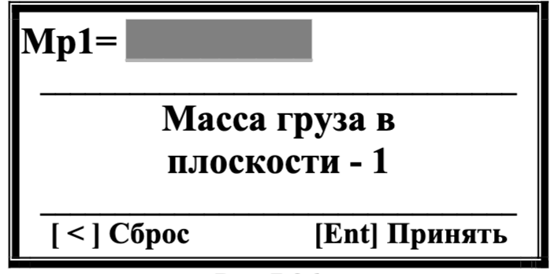  
     *Рис.7.36. Ввод массы в граммах* 

     - Используйте цифровые клавиши → подтвердите **[Ent]**
     - Используйте **[<]** для исправления значения массы.
   - **[ > ] Проценты** → переход к выбору угловых координат (Рис.7.37):  
       
     *Рис.7.37. Вывод результатов*

---

## Шаг 1* : Лопастной режим (опционально*)
1. **Активация:**  
   Нажмите **[ < ] (Лопастная)** → ввод числа лопастей (Рис.7.38):  
   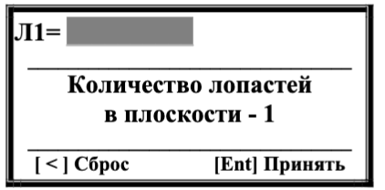  
   *Рис.7.38. Настройка лопастей*  

   - Введите количество лопастей рабочего колеса машины, которые могут быть использованы для установки пробного и корректирующего грузов → подтвердите **[Ent]**
   - Используйте **[<]** для исправления значения количества лопастей .

---

## Шаг 2: Первый пуск (без груза)
1. **Подготовка:**  
     
   *Рис.7.39. Пуск 1*  
   - Убедитесь, что пробный груз **не установлен**
   - Запустите машину → нажмите **[ > ] (Дальше)**
  
   > **ВНИМАНИЕ!**  
   > Перед  началом  измерения  необходимо:
   > - включить  вращение 
   ротора балансируемой машины (первый пуск)  
   > - убедиться, что она вышла на рабочий режим. 

2. **Измерение:**  
     
   *Рис.7.40. Статус измерения*  
   - Длительность: 2-10 сек

   > **ВНИМАНИЕ!**  
   > При возникновении следующих условий:  
   > - Отсутствует сигнал с датчика фазового угла (**датчик не подключен** или **поврежден**)  
   > - Частота вращения ротора **менее 100 об/мин**  
   > 
   > На ЖК-дисплее прибора:  
   > 1. Отображается **предупреждающая надпись**  
   > 2. Указывается **клавиша для нажатия** после устранения неисправности  
   > 
   > **Действия:**  
   > 1. Устраните причину ошибки  
   > 2. Нажмите указанную клавишу → продолжите работу по программе

3. **Результаты:**  
   После завершения на дисплей выводятся:  
   - Частота вращения  
   - СКЗ вибрации  
   - Фаза оборотной составляющей  
     
   *Рис.7.41. Результаты первого пуска*  

### Действия после измерений
- **[ < ] Повтор** → повторить замер  
- **[ > ] Дальше** → переход к следующему шагу  

---

## Шаг 3: Второй пуск (с пробным грузом)

---

### Запуск измерений
- **Активация шага:**  
  После перехода от предыдущего этапа отображается:  
    
  *Рис.7.42. Заставка "Пуск -2. С грузом"*

- **Условия измерений:**  
  - Пробный груз установлен на ротор  
  - Масса груза:  
    | Вариант               | Источник данных               |
    |-----------------------|--------------------------------|
    | Введена вручную       | Предварительные настройки     | 
    | Условно 100%          | Автоматический расчет         |

---

### Управление процессом
- **Кнопки управления:**  
  - **[Esc] (Выход)** → возврат в меню выбора балансировки (Рис.7.33)  
  - **[ > ] (Дальше)** → старт измерений  

> **ВНИМАНИЕ!**  
> Перед началом:  
> 1. Остановите ротор  
> 2. Установите пробный груз в плоскости коррекции  
> 3. Запустите машину → дождитесь выхода на рабочий режим  
> 
> *Рекомендации по выбору массы пробного груза см. в Приложении 1.*

---

### Процесс измерения
1. **Старт замеров:**  
   Нажмите **[ > ] (Дальше)** → начинается цикл измерений (2-10 сек):  
   - Статус измерения (аналогичен предыдущему шагу)

2. **Результаты:**  
     
   *Рис.7.43. Данные после 2-го пуска*  
   - Частота вращения (об/мин)  
   - СКЗ вибрации (мм/сек)  
   - Фаза вибрации (°) 

---

### Действия после измерений
- **[ < ] (Повтор)** → повторный замер (шаг 3)  
- **[ > ] (Дальше)** → переход к **шагу 4** (расчет корректирующего груза)  

---

#### Технические примечания:
- Время измерения зависит от частоты вращения (обратная зависимость)  
- Все данные сохраняются в энергонезависимой памяти прибора  
- Для точности соблюдайте последовательность: **остановка → монтаж груза → запуск**

## Шаг 4: Расчет корректирующего груза

### Отображение результатов в полярных координатах
После завершения измерений на экране отображается:  
  
*Рис.7.44. Параметры корректирующего груза*  

**Структура экрана:**  
| Позиция на экране | Содержание                |
|--------------------|---------------------------|
| Строка 2           | Масса груза (г)           |
| Строка 3           | Угол установки (градусы)  |
| Нижняя строка       | **[ > ] Дальше** - продолжить **[ < ] Повтор** - перезапуск шага 3 **[Esc]** - выход в меню **[ ^ ]** - лопастное разложение |

---

### Лопастное разложение 
- Результаты расчета характеристик вектора 
корректирующего груза, разложенного по лопастям рабочего колеса в плоскости коррекции. 
1. **Активация режима:**  
   Нажмите **[ ^ ] (Лопастная)** → переход к отображению:  
     
   *Рис.7.45. Разложение по лопастям*

2. **Интерпретация данных:**  
   - Формат: `Лопасть Z[номер] = [масса] г`  
   - **н.д.** - отображается если не задано количество лопастей

> **ВНИМАНИЕ!**  
> - Нумерация лопастей начинается с места установки пробного груза  
> - Направление нумерации соответствует вращению ротора  

1. **Возврат к основным данным:**  
   Используйте **[Esc]** → возврат к Рис.7.44

---

### Отображение результатов в процентах
Альтернативный вариант представления:  
  
*Рис.7.46. Результаты в процентах*  

**Особенности формата:**  
- Масса груза: % от массы пробного груза  
- Угол установки: идентичен варианту в граммах  

---

### Критичные требования перед установкой
> **! ВАЖНАЯ ПОСЛЕДОВАТЕЛЬНОСТЬ !**  
> 1. **Демонтируйте пробный груз**  
> 2. **Установите корректирующий груз:**  
>    - Начальная точка: место пробного груза  
>    - Направление: по вращению ротора  
>    - Масса/проценты: согласно расчетам  

---

### Переход к проверке балансировки
- Нажмите **[ > ] (Дальше)** → переход к **Шагу 5**  
- **Цель шага 5:** Проверка эффективности балансировки

## Шаг 5: Проверка эффективности балансировки

###  Запуск проверочного замера
- **Активация шага:**   
    
  *Рис.7.47. Меню проверки*

- **Управление процессом:**  
  | Кнопка         | Действие                                   |
  |----------------|--------------------------------------------|
  | **[Esc] Выход**| Завершение без проверки → Возврат в меню  |
  | **[ > ] Дальше**| Старт проверочного замера                |

> **ВНИМАНИЕ!**  
> Перед началом:  
> - Включите раотающий режим машины  
> - Убедитесь в стабильности вращения  

---

###  Процесс измерения
1. **Старт проверки:**  
   Нажмите **[ > ] (Дальше)** → начинается замер (2-10 сек):  
   *Статус "Идёт измерение!" (Рис.7.40. )*

2. **Результаты:**  
   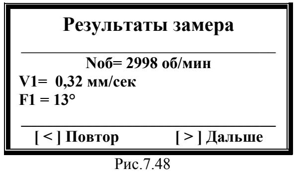  
   *Рис.7.48. Данные после балансировки*  
   - Частота вращения (об/мин)  
   - СКЗ вибрации (мм/сек)  
   - Фаза вибрации (°)

---

### Действия после проверки
- **[ < ] Повтор** → повторный замер вибрации  
- **[ > ] Дальше** → переход к **шагу 6** (финализация процесса)  

---

#### Технические примечания:
- Время измерения обратно пропорционально частоте вращения  
- Все данные сравниваются с исходными значениями до балансировки  
- Рекомендуется минимум 2 проверочных замера для контроля стабильности

## Шаг 6: Финализация процесса балансировки

###  Меню завершения
- **Активация шага:**  
  После проверочных замеров отображается:  
  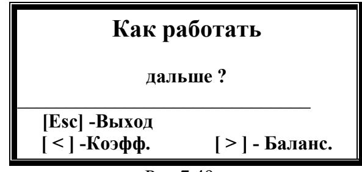  
  *Рис.7.49. Меню "Как работать дальше"*

**Варианты действий:**  
| Кнопка          | Действие                                      |
|-----------------|-----------------------------------------------|
| **[Esc] Выход** | Завершить балансировку → возврат в главное меню |
| **[ > ] Баланс.**| Продолжить коррекцию (последовательные приближения) |
| **[ < ] Коэфф.** | Просмотр/сохранение коэффициентов чувствительности |

---

### Работа с коэффициентами чувствительности
1. **Просмотр данных:**  
   Нажмите **[ < ] (Коэфф.)** → откроется:  
     
   *Рис.7.50. Параметры балансировки*  

   **Отображаемые данные:**  
   - Масса пробного груза: [значение] или "—"  
   - Число лопастей: [значение] или "—"  
   - Коэффициенты:  
     - R11 = [значение]  
     - R12 = [значение]  

2. **Сохранение коэффициентов:**  
   > **ВНИМАНИЕ!** Для корректного сохранения:  
   > - Масса пробного груза должна быть введена в **граммах**  
   > - Пробный груз должен совпадать с фазовой меткой  

   Нажмите **[ > ] (Записать)** → выбор ячейки памяти:  
     
   *Рис.7.51. Выбор номера записи*  

   **Параметры сохранения:**  
   - Доступные ячейки: 1-99  
   - Ввод номера: цифровые клавиши → подтвердить **[Ent]**  

3. **Подтверждение записи:**  
     
   *Рис.7.52. Статус "Записано"*  
   - Автоматический возврат в меню «Как работать дальше» через 2-3 сек.  

---

### Рекомендации
- Для критически важных машин сохраняйте коэффициенты в отдельные ячейки  
- При повторной балансировке используйте сохраненные параметры  
- Регулярно архивируйте данные через интерфейс прибора

# 7.4.1.2. Повторная балансировка

## Условия выполнения
- **Требование:**  
  Коэффициенты балансировочной чувствительности должны быть ранее сохранены в памяти прибора.

- **Особенность:**  
  Требуется только **1 пуск машины** (без пробного груза).

---

## Подготовка к работе
1. **Установка датчиков:**  
   - Расположите вибродатчик и датчик фазового угла **в тех же точках**, что и при первичной балансировке.
2. **Запуск режима:**  
   В меню "Балансировка в 1-й пл." (Рис.7.34) → нажмите **[ > ] (Повторно)**.

---

## Шаг 0: Выбор сохраненных коэффициентов
- **Отобразится:**  
    
  *Рис.7.52. Выбор ячейки памяти*

- **Действия:**  
  1. Введите номер ячейки (1-99) цифровыми клавишами  
  2. Подтвердите **[Ent] (Принять)**  
  3. Для исправлений используйте **[ < ] (Сброс)**

---

## Шаг 1: Просмотр параметров
После выбора ячейки отобразится:  
  
*Рис.7.52. Данные из памяти*

**Содержимое ячейки:**  
| Параметр                | Значение          |
|-------------------------|-------------------|
| Масса пробного груза    | [г] или "—"       |
| Число лопастей          | [шт] или "—"      |
| Коэффициент R11         | [значение]        |
| Коэффициент R12         | [значение]        |

**Управление:**  
- **[Esc] Выход** → возврат к выбору ячейки  
- **[ > ] Принять** → переход к измерениям  

---

## Шаг 2: Измерение вибрации (Пуск-1)
- **Заставка:**  
    
  *Рис.7.55. "Пуск-1. Без груза"*

- **Процедура:**  
  1. Запустите машину → убедитесь в рабочих оборотах  
  2. Нажмите **[ > ] (Дальше)** → старт замера (2-10 сек)  
  3. Статус измерения:   
     *Рис.7.40. "Идёт измерение"*

- **Результаты:**  
  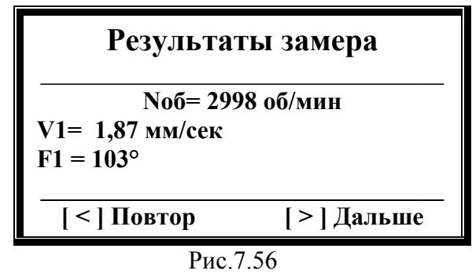  
  *Рис.7.56. Данные вибрации*  
  - Частота вращения  
  - СКЗ  
  - Фаза  

**Действия:**  
- **[ < ] Повтор** → повторить замер  
- **[ > ] Дальше** → переход к расчетам  

---

## Шаг 3: Расчет корректирующего груза
- **Отображение:**  
  Аналогично Рис.7.44 (параметры в граммах/процентах)  

- **Последующие шаги:**  
  Дублируют процесс первичной балансировки:  
  - Установка груза  
  - Проверочные замеры  
  - Сохранение результатов  

> **Внимание!**  
> Все требования к установке груза и направлению отсчета сохраняются (см. раздел 7.4.1.1).

---

# 7.4.2. Балансировка в двух плоскостях (динамическая)

## Активация режима
1. **Переход из главного меню (Рис.7.2):**  
   Нажмите **[ > ] (Баланс.)** → откроется меню выбора типа (Рис.7.33).  
2. **Выбор режима:**  
   Нажмите **[ > ] (Балансировка в 2 пл.)** → переход к меню первичной/повторной балансировки (Рис.7.57).  
3. **Возврат:**  
   **[Esc] Выход** → возврат в главное меню.

---

## Выбор типа балансировки
  
*Рис.7.57. Меню выбора режима*

### Варианты:
| Кнопка         | Режим                | Особенности                                                                 |
|----------------|----------------------|-----------------------------------------------------------------------------|
| **[ > ] Повторно** | Повторная балансировка | - Требуются сохраненные коэффициенты - 1 пуск машины                    |
| **[ < ] Первичная** | Первичная балансировка | - 3 пуска машины - Установка пробных грузов в плоскостях 1 и 2         |

> **ВНИМАНИЕ!** Для режима **Повторно**:  
> - Масса пробных грузов должна быть задана в **граммах**  
> - Пробные грузы должны совпадать с фазовой меткой по угловому положению  

---

## Подготовительные операции
1. **Установка датчиков:**  
   - **Вибродатчики:**  
     - Точки измерения → подключить к **Х1**, **Х2**  
   - **Датчик фазового угла:**  
     - Установить на корпус → подключить к **Х3**  
     - Нанести **контрастную метку** на ротор  

2. **Рекомендации:**  
   - См. требования к монтажу в **Приложении 1**  

---

### Процесс первичной балансировки
**Этапы:**  
1. **Пуск 1:** Измерение исходной вибрации  
2. **Пуск 2:** Установка пробного груза в плоскости 1  
3. **Пуск 3:** Установка пробного груза в плоскости 2  

**Цель:** Тарировка измерительной системы прибора.  

# 7.4.2.1. Первичная балансировка

## Общее описание
Программа первичной балансировки в 2-х плоскостях включает **7 основных этапов**.  
Первый шаг содержит последовательность действий по подготовке измерений.

---

## Шаг 1: Активация режима
**Пуск:** Из меню "Балансировка в 2 пл." (Рис.7.57) → нажмите **[ < ]**  
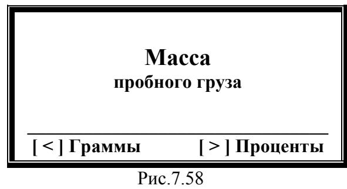  
*Рис.7.58. Выбор единиц измерения*

---

## Выбор формата данных
| Кнопка         | Действие                          | Результат               |
|----------------|-----------------------------------|-------------------------|
| **[ > ] Проценты** | Результаты в % от пробного груза | Автоматический переход к шагу 2 |
| **[ < ] Граммы**   | Ввод абсолютных значений         | Ручной ввод масс        |

---

## Ввод масс пробных грузов
### Для плоскости 1
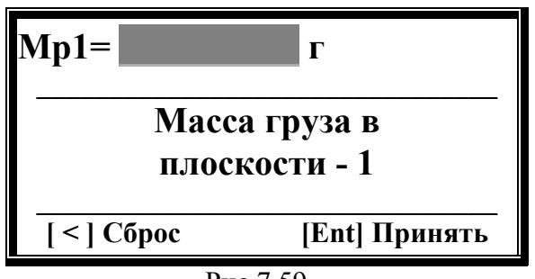  
*Рис.7.59. Ввод Мр1*

**Процедура:**  
1. Введите массу (г) через **цифровые клавиши**  
2. Курсор: `_` (начальная позиция)  
3. Подтвердите: **[Ent]**  
4. Сброс: **[ < ]**

---

### Для плоскости 2
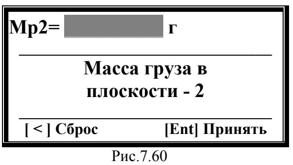  
*Рис.7.60. Ввод Мр2*

**Повторите:**  
- Ту же процедуру, что и для плоскости 1  
- Подтвердите: **[Ent]**

---

## Выбор формата вывода
  
*Рис.7.61. Формат отображения*

| Кнопка          | Действие                     |
|-----------------|------------------------------|
| **[ < ] Лопастная** | Настройка лопастного режима |
| **[ > ] Полярная**  | Стандартный вывод           |

---

## Настройка лопастного разложения
### Для плоскости 1
  
*Рис.7.62. Ввод Л1*

**Процедура:**  
1. Введите количество лопастей  
2. Подтвердите: **[Ent]**  
3. Сброс: **[ < ]**

---

### Для плоскости 2
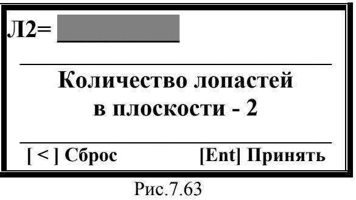  
*Рис.7.63. Ввод Л2*

**Повторите:**  
- Аналогичную процедуру для плоскости 2  
- Подтвердите: **[Ent]**

---

## Технические примечания
- Все введенные значения сохраняются в энергонезависимой памяти  
- Для отмены действий используйте **[Esc]** → возврат в меню  
- Нумерация лопастей начинается с места установки пробного груза

---

> **Критически важно!**  
> При использовании лопастного разложения:  
> - Убедитесь в правильности нумерации лопастей  
> - Направление отсчета ≡ направлению вращения ротора

---

## Переход к следующему этапу
После завершения всех настроек:  
- Автоматический переход к **Шагу 2** ("Пуск 1 без груза")  

## Шаг 2: Пуск-1 (без груза)
**Активация:**  
После завершения настроек отображается:  
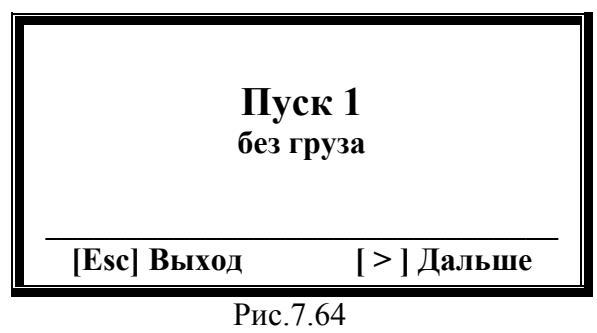  
*Рис.7.64. "Пуск 1 без груза"*

---

### Условия измерений
- Ротор **без пробных грузов**  
- Машина в исходном состоянии  

---

## Управление процессом
| Кнопка         | Действие                                  |
|----------------|-------------------------------------------|
| **[Esc] Выход** | Возврат в меню выбора типа балансировки  |
| **[ > ] Дальше** | Старт измерения вибрации                |

> **ВНИМАНИЕ!**  
> Перед запуском:  
> 1. Включите вращение ротора  
> 2. Убедитесь в стабильности рабочих оборотов  
> 3. Частота ≥ 100 об/мин  

---

## Процесс измерения
**Старт:** Нажмите **[ > ] (Дальше)**  
  
*Рис.7.65. Статус измерения*

**Параметры:**  
- Длительность: 2-10 сек (обратно частоте)  
- Контроль сигналов:  
  - Датчик фазового угла  
  - Частота вращения  

---

### Обработка ошибок
При возникновении:  
- Отсутствие сигнала датчика  
- Частота < 100 об/мин  

**Действия:**  
1. На экране появится предупреждение  
2. Устраните причину  
3. Нажмите указанную кнопку для продолжения  

---

## Результаты измерений
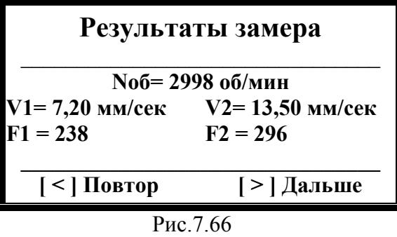  
*Рис.7.66. Данные вибрации*

**Отображаемые параметры:**  
- Частота вращения (об/мин)  
- СКЗ вибрации (мм/сек)  
- Фаза вибрации (°)  

---

## Действия после замера
| Кнопка         | Действие                                  |
|----------------|-------------------------------------------|
| **[ < ] Повтор** | Повторный замер                         |
| **[ > ] Дальше** | Переход к **Шагу 3** (Пуск 2 с грузом) |

---

## Технические примечания
- Все данные сохраняются автоматически  
- Для точности рекомендовано ≥3 стабильных замера  
- При критичных отклонениях – проверьте крепление датчиков  

---

> **Профессиональный совет:**  
> Перед переходом к следующему шагу:  
> - Зафиксируйте исходные параметры в журнале  
> - Сравните с паспортными значениями машины

## Шаг3: Пуск-2 (груз в плоскости 1)
**Активация:**  
После завершения первого замера отображается:  
  
*Рис.7.67. "Пуск 2. Груз в плоскости 1"*

---

### Условия измерений
- Пробный груз установлен в **плоскости 1**  
- Масса груза:  
  - Введена ранее в **[г]** 
  - Или условно 100%  

---

## Управление процессом
| Кнопка         | Действие                                  |
|----------------|-------------------------------------------|
| **[Esc] Выход** | Возврат в меню выбора типа балансировки  |
| **[ > ] Дальше** | Старт измерения вибрации                |

> **ВНИМАНИЕ!**  
> Перед запуском:  
> 1. **Остановите ротор**  
> 2. Установите пробный груз в плоскости 1  
> 3. Запустите вращение → выйти на рабочий режим  
> 4. Выбор массы пробного груза и его установка на ротор рассмотрены в **Приложения 1**  

---

## Процесс измерения
**Старт:** Нажмите **[ > ] (Дальше)**   
- *Статус измерения: "Идет измерение!" (Рис.7.65. аналогичен предыдущему шагу)*

**Параметры:**  
- Длительность: 2-10 сек  
- Контроль сигналов:  
  - Корректное подключение датчиков  
  - Стабильность частоты  

---

## Результаты измерений
  
*Рис.7.68. Данные после второго пуска*

**Отображаемые параметры:**  
- Частота вращения (об/мин)  
- СКЗ вибрации (мм/сек)  
- Фаза вибрации (°)  

---

## Действия после замера
| Кнопка         | Действие                                  |
|----------------|-------------------------------------------|
| **[ < ] Повтор** | Повторный замер                         |
| **[ > ] Дальше** | Переход к **Шагу 4** (Пуск 3 - с грузом) |

---

## Технические примечания
- Сравните результаты с данными первого пуска  
- При аномалиях → проверьте крепление груза  
- Рекомендуемая погрешность установки груза: ≤1°  

---

> **Профессиональный совет:**  
> Для сложных механизмов:  
> - Используйте лазерный нивелир для точной установки  
> - Делайте фото расположения грузов для архива

## Шаг4: Пуск-3 (груз в плоскости 2)
**Активация:**  
После завершения второго замера отображается:  
  
*Рис.7.69. "Пуск 3. Груз в плоскости 2"*

---

### Условия измерений
- Пробный груз установлен в **плоскости 2**  
- Масса груза:  
  - Предварительно введена (в г)  
  - Или условно 100%  

---

## Управление процессом
| Кнопка         | Действие                                  |
|----------------|-------------------------------------------|
| **[Esc] Выход** | Возврат в меню выбора типа балансировки  |
| **[ > ] Дальше** | Старт измерения вибрации                |

> **ВНИМАНИЕ!**  
> Перед запуском:  
> 1. **Остановите ротор**  
> 2. Снимите груз из плоскости 1  
> 3. Установите пробный груз в плоскости 2  
> 4. Запустите вращение → выйти на рабочий режим  
> 5. Следуйте рекомендациям из **Приложения 1**  

---

## Процесс измерения
**Старт:** Нажмите **[ > ] (Дальше)**  
- *Статус измерения: "Идет измерение!" (Рис.7.65. аналогичен предыдущему шагу)*

**Параметры:**  
- Длительность: 2-10 сек  
- Контроль сигналов:  
  - Исправность датчиков  
  - Стабильность частоты вращения  

---

## Результаты измерений
  
*Рис.7.70. Данные после третьего пуска*

**Отображаемые параметры:**  
- Частота вращения (об/мин)  
- СКЗ вибрации (мм/сек)  
- Фаза вибрации (°)  

---

## Действия после замера
| Кнопка         | Действие                                  |
|----------------|-------------------------------------------|
| **[ < ] Повтор** | Повторный замер                         |
| **[ > ] Дальше** | Переход к **Шагу 5** (Расчет грузов)    |

---

## Технические примечания
- Сравните данные всех трех пусков  
- При отклонениях >20% → проверьте точность установки грузов  
- Рекомендуемый допуск по массе: ±0.5 г  

---

> **Профессиональный совет:**  
> Для повышения точности:  
> - Используйте цифровые весы для взвешивания грузов  
> - Проводите калибровку датчиков перед серией замеров  
> - Фиксируйте результаты в протоколе испытаний

## Шаг5: Расчет грузов 
### В граммах
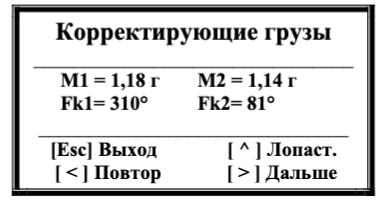  
*Рис.7.71. Параметры в граммах*

**Отображаемые данные:**  
| Позиция         | Содержание                 |
|-----------------|----------------------------|
| Строка 2        | Масса груза (г)            |
| Строка 3        | Угол установки (°)         |
| Нижняя строка    | **[ > ] Дальше** - продолжение |

---

### В процентах
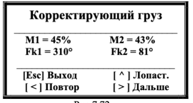  
*Рис.7.72. Параметры в процентах*

**Особенности:**  
- Масса выражена в % от пробного груза  
- Угол идентичен варианту в граммах  

---

## Лопастное разложение грузов
**Активация:**  
Нажмите **[ ^ ] (Лопастная)** → отобразится:  
  
*Рис.7.73. Разложение по лопастям*

**Формат данных:**  
- Лопасть Z[N]= [Масса]г  
- "н.д." - если не задано число лопастей  

> **ВНИМАНИЕ!**  
> - Нумерация лопастей начинается с места пробного груза  
> - Направление ≡ вращению ротора  

---

## Управление режимом
| Кнопка          | Действие                                  |
|-----------------|-------------------------------------------|
| **[ < ] Повтор** | Повтор 4-го шага (Пуск 3)               |
| **[Esc] Выход**  | Возврат в меню выбора типа балансировки  |
| **[ ^ ] Лопастная**| Переключение формата отображения       |

---

## Подготовка к установке грузов
> **КРИТИЧЕСКИ ВАЖНО!**  
> 1. Снимите все пробные грузы  
> 2. Установите корректирующие грузы:  
>    - Отсчет угла → от места пробного груза  
>    - Направление → сонаправлено вращению ротора  
> 3. Зафиксируйте грузы согласно техрегламенту  

---

##  Переход к проверке
- Нажмите **[ > ] (Дальше)** → переход к **Шагу 6** (Проверка балансировки)  

---

### Технические примечания
- Для сложных роторов используйте шаблоны установки  
- Рекомендуемый момент затяжки креплений: 15-20 Н·м  
- При работе с лопастями учитывайте аэродинамику  

---

> **Профессиональный совет:**  
> - Перед установкой выполните статическую проверку грузов  
> - Используйте цветовую маркировку для разных плоскостей  
> - Ведите журнал балансировок с привязкой к серийным номерам

## Шаг6: Проверка балансировки
**Активация:**  
После установки корректирующих грузов отображается:  
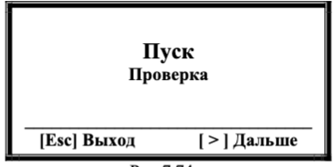  
*Рис.7.74. Меню проверки*

---

### Управление процессом
| Кнопка         | Действие                                  |
|----------------|-------------------------------------------|
| **[Esc] Выход** | Завершение без проверки → Возврат в меню |
| **[ > ] Дальше** | Старт проверочного замера               |

---

## Процедура проверки
> **ВНИМАНИЕ!**  
> Перед запуском:  
> - Включите ротор → выйти на рабочие обороты  
> - Проверьте надежность крепления грузов  

**Старт:** Нажмите **[ > ] (Дальше)**  
- *Рис.7.65. Статус "Идёт измерение"*

**Длительность:** 2-10 сек  

---

## Результаты проверки
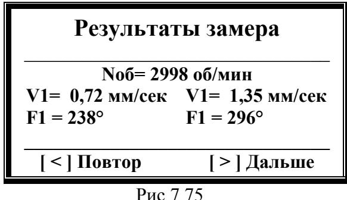  
*Рис.7.75. Данные после балансировки*

**Отображаемые параметры:**  
- Частота вращения (об/мин)  
- СКЗ вибрации (мм/сек)  
- Фаза вибрации (°)  

**Оценка эффективности:**  
- СКЗ должна снизиться ≥70% от исходного значения  
- Фаза стабильна (±5°)  

---

## Действия после проверки
| Кнопка         | Действие                                  |
|----------------|-------------------------------------------|
| **[ < ] Повтор** | Повторный замер                         |
| **[ > ] Дальше** | Переход к **Шагу 7** (Финализация)      |

---

## Технические рекомендации
- При отклонениях >30% → повторите балансировку  
- Используйте спектральный анализ для углубленной диагностики  
- Допустимая остаточная вибрация: ≤2.8 мм/сек (ISO 10816-3)  

---

> **Профессиональный совет:**  
> - Проводите проверку при разных режимах работы  
> - Сравнивайте данные с паспортными характеристиками агрегата  

## Шаг 7: Финализация процесса балансировки
**Активация:**  
После проверки результатов отображается:  
  
*Рис.7.76. Меню завершения*

---

### Управление процессом
| Кнопка          | Действие                                  |
|-----------------|-------------------------------------------|
| **[Esc] Выход**  | Завершение балансировки → Возврат в меню |
| **[ > ] Баланс.** | Продолжение коррекции                   |
| **[ < ] Коэфф.** | Работа с коэффициентами чувствительности |

---

## Работа с коэффициентами
**Просмотр параметров:**  
Нажмите **[ < ] (Коэфф.)** → откроется:  
  
*Рис.7.77. Коэффициенты чувствительности*

> **ВНИМАНИЕ!**  
> Для корректного использования коэффициентов:  
> - Масса пробных грузов должна быть в **граммах**  
> - Установка грузов ≡ плоскости фазовой метки  

---

## Сохранение коэффициентов
1. **Инициализация записи:**  
   Нажмите **[ > ] (Записать)** → отобразится:  
   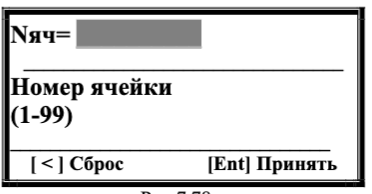  
   *Рис.7.78. Выбор ячейки памяти*  

2. **Ввод данных:**  
   - Номер ячейки: 1-99  
   - Подтвердите **[Ent]**  

3. **Подтверждение:**  
     
   *Рис.7.79. Статус "Записано"*  

---

## Технические ограничения
- Максимальное количество профилей: 99  
- Перезапись данных: разрешена  
- Формат хранения: энергонезависимая память  

---

## Рекомендации
- Резервируйте ячейки 90-99 для критически важных машин  
- Перед записью проверяйте актуальность коэффициентов  

---

> **Профессиональный совет:**  
> - Используйте QR-кодирование для быстрой идентификации записей  
> - Ведите цифровой журнал с привязкой ячеек к серийным номерам агрегатов  
> - Проводите аудит коэффициентов раз в 6 месяцев

# 7.4.1.2. Повторная балансировка

## Условия выполнения
- **Требование:**  
  В памяти прибора должны быть сохранены коэффициенты балансировочной чувствительности для данной машины

- **Особенности процесса:**  
  - Требуется **1 пуск** машины (без пробных грузов)  
  - Используются ранее сохраненные параметры из памяти

---

## Подготовка к работе
1. **Установка датчиков:**  
   - Вибродатчики → те же точки, что и при первичной балансировке  
   - Датчик фазового угла → исходное положение  
2. **Маркировка ротора:**  
   - Контрастная метка в месте первичной установки

---

## Процесс балансировки
### Шаг 1: Выбор сохраненных параметров
1. **Запуск режима:**  
   В меню "Балансировка в 2 пл." (Рис.7.57) → **[ > ] (Повторно)**  
     
   *Рис.7.80. Выбор ячейки памяти*

2. **Ввод данных:**  
   - Номер ячейки: **1-99** (цифровые клавиши)  
   - Подтверждение: **[Ent]**  
   - Сброс: **[ < ]**

---

### Шаг 2: Подтверждение параметров
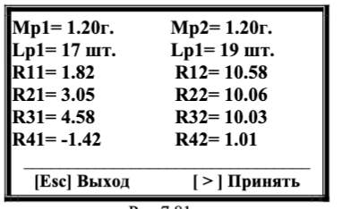  
*Рис.7.81. Параметры балансировки*

**Содержимое ячейки:**  
| Параметр                | Значение          |
|-------------------------|-------------------|
| Масса пробных грузов    | [г] или "—"       |
| Число лопастей          | [шт] или "—"      |
| Коэффициенты R11-R42    | [расчетные значения] |

**Действия:**  
- **[Esc] Выход** → выбор другой ячейки  
- **[ > ] Принять** → переход к измерениям  

---

### Шаг 3: Измерение вибрации
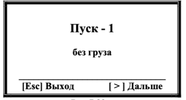  
*Рис.7.82. "Пуск-1 без груза"*

> **ВНИМАНИЕ!**  
> Перед стартом:  
> - Запустите ротор → рабочий режим  
> - Частота ≥ 100 об/мин  

**Процедура:**  
1. Нажмите **[ > ] (Дальше)** → начало замера  
2. Статус измерения:  "Идёт измерение"*

---

### Шаг 4: Результаты измерений
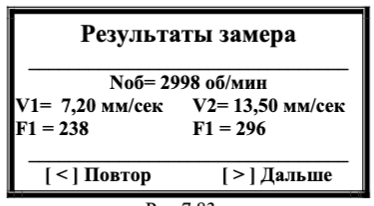  
*Рис.7.83. Данные вибрации*

**Действия:**  
- **[ < ] Повтор** → повторный замер  
- **[ > ] Дальше** → расчет корректирующих грузов  

---

### Шаг 5: Расчет параметров
  
*Рис.7.84. Результаты в граммах*

**Отображаемые данные:**  
- Массы корректирующих грузов  
- Углы установки  
- Варианты отображения:  
  - Полярные координаты  
  - Лопастное разложение  

---

## Особенности процесса
- **Повторное использование параметров:**  
  Все шаги после расчета дублируют логику первичной балансировки (см. раздел 7.4.2.1)

- **Рекомендации:**  
  - Сверяйте коэффициенты перед использованием  
  - При изменении конструкции ротора → выполните первичную балансировку заново

---

> **Профессиональный совет:**  
> - Создавайте резервные копии важных профилей  
> - Используйте префиксы в нумерации ячеек для разных типов машин  
> - Проводите периодическую проверку сохраненных коэффициентов

# 8. ОБЩИЕ УКАЗАНИЯ ПО ЭКСПЛУАТАЦИИ И ТЕХНИЧЕСКОМУ ОБСЛУЖИВАНИЮ

## 8.1. Внешний осмотр перед началом работы
Проверке подлежат:
- **Комплектность прибора** согласно разделу 3 "Состав изделия и комплект поставки"
- **Отсутствие повреждений**:
  - Корпус измерительного блока и компьютера
  - Кабели и датчики
  - Другие комплектующие
- **Состояние контактов**:
  - Отсутствие загрязнений/окисления в разъемах
  - Легкость соединения компонентов

---

## 8.2. Требования к электропитанию
- **Не рекомендуется** подключать зарядное устройство к сетям с:
  - Резкими скачками напряжения
  - Помехами в электросети

---

## 8.3. Климатические условия
Должны соответствовать требованиям:
- П. 2.15 (параметры эксплуатации)
- П. 9.4 (условия хранения)

---

## 8.4. Техническое обслуживание

### Таблица 8.1. Виды и периодичность ТО
| Вид обслуживания                   | Периодичность     | Исполнитель                                   |
|------------------------------------|-------------------|-----------------------------------------------|
| Плановое (ТО-1)                    | Ежемесячно        | Оператор прибора                              |
| Внеплановое                        | При неисправности | Оператор/представитель ООО "Кинематика"      |

---

### 8.4.1. Плановое ТО (ТО-1)
1. **Внешний осмотр** всех компонентов
2. **Очистка**:
   - Датчиков вибрации
   - Соединительных кабелей
   - Разъемов
   - Измерительного блока
3. **Промывка**:
   - Разъемов и оптических частей датчика фазового угла 
   *Технология: марля + этиловый спирт (ГОСТ 18300-72)*
4. **Протирка кабелей** 
   *Технология: марля + бензин Б-70 (ГОСТ 1012-77)*

---

### 8.4.2. Внеплановое ТО
Выполняется при обнаружении неисправностей:
- Устранение дефектов
- Замена компонентов
- Повтор всех работ ТО-1 при необходимости

---

### Таблица 8.2. Нормы расхода материалов
| № | Материал                         | ГОСТ         | ТО-1       | Годовая норма |
|---|-----------------------------------|--------------|------------|---------------|
| 1 | Спирт этиловый технический       | ГОСТ 18300-72| 0.05 л     | 0.6 л         |
| 2 | Бензин Б-70                      | ГОСТ 1012-77 | 0.10 л     | 1.20 л        |
| 3 | Марля медицинская                | ГОСТ 9412-77 | 5 дм       | 60 дм         |

---

> **Примечание:** Все работы с химическими веществами должны проводиться в хорошо проветриваемых помещениях с использованием СИЗ.

# 9. ПРАВИЛА ТРАНСПОРТИРОВАНИЯ И ХРАНЕНИЯ

---

## 9.1. Упаковка для транспортировки
- **Компоненты для укладки:**  
  Прибор + комплектующие + документация  
- **Специальная сумка/чемодан**  

---

## 9.2. Почтовые пересылки  
- **Требования:**  
  - Жесткий ящик для упаковки сумки  
  - Упаковочный лист на верхней поверхности  
  - Предупредительные знаки:  
    *На двух боковых стенках ящика (конкретные знаки не указаны в исходном тексте)*  

---

## 9.3. Условия хранения  
- **Место:** Стеллаж в спецзоне  
- **Требования:**  
  - Защита от влаги и пыли  
  - Запрещено:  
    - Установка посторонних предметов сверху  
    - Механические нагрузки  

---

## 9.4. Климатические параметры  
| Параметр              | Значение                  |
|-----------------------|---------------------------|
| Температура воздуха   | От **+4°С** до **+45°С**  |
| Влажность (при 30°С)  | ≤ **90%**                 |

---

## 9.5. Консервационное обслуживание  
- **Периодичность включения:**  
  Не реже **1 раза в 3 месяца**  
- **Цели:**  
  - Тренировка электронных компонентов  
  - Подзарядка аккумуляторов  

---

# 10. КАЛИБРОВКА ПРИБОРА  

## 10.1. Нормативная база  
- **Документ:**  
  Методика поверки «Ар-Баланс 2» **КИН 71.00.00.000 МП**  

---

## 10.2. Требования  
- **Периодичность:**  
  Не реже **1 раза в 2 года**  
- **Организации:**  
  Аккредитованные **Ростехрегулированием**  

---

### Технические примечания:  
- Калибровка выполняется с использованием эталонного оборудования  
- Результаты заносятся в журнал поверок  
- Действительность подтверждается штампом в паспорте прибора  

---

> **Внимание!** Работа с неквалифицированным прибором может привести к погрешностям измерений.

# ПРИЛОЖЕНИЕ 1  
## БАЛАНСИРОВКА МЕХАНИЗМОВ В ЭКСПЛУАТАЦИОННЫХ УСЛОВИЯХ  
*(справочные рекомендации)*  

---

## П.1.1. Общие требования  
- Балансировка допускается **только** для:  
  ✓ Технически исправных механизмов  
  ✓ Надёжно закреплённых на штатных фундаментах  
- **Запрещено** для механизмов с:  
  ✗ Изношенными/повреждёнными подшипниками  
  ✗ Загрязнениями на роторе, влияющими на балансировку  

---

## П.1.2. Особенности установки  
**Стандартная практика:**  
- Балансировка на месте эксплуатации  

**Исключения (резонансные случаи):**  
- Различие результатов измерений >10-20% между пусками  
- **Действия при резонансе:**  
  1. Изменить скорость вращения  
  2. При невозможности - использовать упругие опоры  

---

## П.1.3. Типы балансировки  

#### Статическая (1 плоскость)  
**Применение:**  
- Узкие дискообразные роторы без осевых биений  
- **Примеры:**  
  - Шлифовальные круги  
  - Шкивы ременных передач  
  - Дисковые маховики  
  - Зубчатые колеса  
  - Муфты  
  - Патроны токарных станков  
  - Узкие вентиляторы  

#### Динамическая (2 плоскости)  
**Применение:**  
- Длинные двухопорные роторы  
- **Примеры:**  
  - Роторы электродвигателей/генераторов  
  - Роторы компрессоров и насосов  
  - Рабочие колеса турбин  
  - Широкие шлифовальные круги  
  - Шпиндели  
  - Валы мукомольных машин  

---

## П.1.4. Точки измерений и коррекции  

#### Для 1 плоскости  

*Рис.П1.1. Выбор точки измерения и плоскости коррекции  
при балансировке в одной плоскости*
[Рис.П1.1. Схема для 1 плоскости]  

#### Для 2 плоскостей  
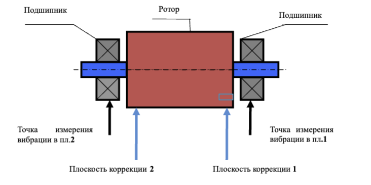

*Рис. П.1.2. Выбор точек измерения и плоскостей коррекции при балансировке в двух плоскостях межопорного ротора*

*Рис. П.1.3. Выбор точек измерения и плоскостей коррекции при 
балансировке в двух плоскостях консольного ротора*

**Требования:**  
- 2 точки измерения  
- Плоскости коррекции максимально близко к точкам измерений  
- Максимальное расстояние между плоскостями коррекции  

---

## П.1.5. Расчёт пробного груза  

#### Формула  
$$
M_п = \frac{K \cdot M_р}{R_п \cdot (N/100)^2}
$$  

**Где:**  

| Параметр | Описание                          | Единицы измерения |
|----------|-----------------------------------|-------------------|
| \(M_п\)  | Масса пробного груза              | г                 |
| \(M_р\)  | Масса ротора                      | г                 |
| \(R_п\)  | Радиус установки груза            | см                |
| \(N\)    | Скорость вращения                 | об/мин            |
| \(K\)    | Коэффициент жёсткости опор (1-5)  | -                 |

**Критерии эффективности:**  
- Изменение амплитуды: **>20-30%**  
- Фазовый сдвиг: **>20-30°**  

**Рекомендации:**  
- Установка в том же сечении, что и фазовая метка  
- Избегать малых изменений → риск погрешности  

---

> **Важно!** Все схемы приведены условно. Для точной настройки используйте документацию производителя оборудования.

 
## П.1.6. Выбор радиуса установки корректирующего груза  
**Основное правило:**  
Корректирующие грузы устанавливаются на тот же радиус, что и пробные.  

**Формула пересчёта массы при смене радиуса:**  
$$
M'_к = M_к \cdot \frac{R}{R'} \quad \text{(П.1.1)}
$$  

**Где:**  
| Параметр | Описание                          | Единицы измерения |  
|----------|-----------------------------------|-------------------|  
| \(M'_к\) | Скорректированная масса груза    | г                 |  
| \(M_к\)  | Расчётная масса груза            | г                 |  
| \(R\)    | Радиус установки пробного груза  | мм                |  
| \(R'\)   | Фактический радиус установки     | мм                |  

---

## П.1.7. Выбор частоты (скорости) вращения ротора  
**Рекомендации:**  
- Балансировка на установившейся рабочей скорости  
- Для регулируемых приводов: максимальная рабочая скорость  

> **ВНИМАНИЕ!**  
> Избегайте резонансных диапазонов (см. п.П.1.2)  

---

## П.1.8. Особенности установки датчиков  

#### а) Датчик вибрации  
**Способы крепления:**  
- Резьбовая шпилька (жёсткое крепление)  
- Магнитная присоска  
- Переходный штырь (ручной прижим)  
- Непосредственный контакт с опорой (ручной прижим)  

#### б) Датчик фазового угла  
**Требования:**  
- **Крепление:** магнитная стойка/струбцина  
- **Ориентация:** перпендикулярно поверхности ротора  
- **Зазор:** 50-500 мм (согласно документации)  

**Метка для отсчёта фазы:**  
- Материал: катафотная лента из комплекта  
- Альтернативы: шпоночные пазы, отверстия, головки болтов  

**Расчёт ширины метки:**  
$$
L \geq \frac{N \cdot R}{30000} \geq 1 - 1.5 \, \text{см} \quad \text{(П.1.2)}
$$  

**Где:**  
| Параметр | Описание                  | Единицы измерения |  
|----------|---------------------------|-------------------|  
| \(L\)    | Минимальная ширина метки  | см                |  
| \(N\)    | Скорость вращения         | об/мин            |  
| \(R\)    | Радиус установки метки    | см                |  

**Рекомендации:**  
- Минимум: 1-1.5 см даже при расчёте <1 см  
- Для роторов с R <10 мм: экспериментальная проверка  

> **ВНИМАНИЕ!**  
> Защищайте датчик от:  
> - Прямых солнечных лучей  
> - Яркого искусственного освещения  
> - Отражений на метке/фотодиоде  

---

*Все формулы действительны при температуре (20±5)°C. Для нестандартных условий требуется коррекция коэффициентов.*

## П.1.9. Дополнительные рекомендации по проведению балансировки

### **Предварительные измерения:**
- **Обязательный шаг:** Проведите измерения в режиме виброметра (см. раздел 7.3)
- **Анализ результатов:**  
  - Сравните суммарную вибрацию (V1s/V2s) с оборотной составляющей (V1o/V2o)

---

### **Решения по результатам анализа**
#### Случай 1: Дисбаланс ротора
- **Условие:**  
  V1s(V2s) ≈ V1o(V2o)
- **Действие:**  
  Перейти к балансировке ротора (см. раздел 7.4)

#### Случай 2: Другие неисправности
- **Условие:**  
  V1s(V2s) ≫ V1o(V2o)
- **Действия:**  
  - Проверить подшипники  
  - Убедиться в надежности крепления  
  - Исключить задевание ротора  
  - Проверить соосность узлов

---

### **Контроль стабильности измерений**
- **Допустимые отклонения:** ≤10-15%  
- **При превышении:**  
  - Проверить резонансные явления  
  - Установить на упругие опоры (см. п.П.1.2)

---

### Проверка статического дисбаланса
**Для горизонтальных роторов:**  
1. Поверните ротор на **90°**  
2. Если возвращается → **статический дисбаланс**  
3. Установите пробный груз:  
   - Расположение: верхняя точка средней части  
   - Масса: подбирать до полной неподвижности ротора  

---

## П.1.10. Критерии сбалансированности по ГОСТ ИСО 10816-1-97

### Таблица П.1. Допустимые уровни вибрации (СКЗ)
| Класс | Хорошо   | Допустимо | Еще допустимо | Недопустимо |
|-------|----------|------------|----------------|-------------|
| 1     | <0.7     | 0.7-1.8    | 1.8-4.5        | >4.5        |
| 2     | <1.1     | 1.1-2.8    | 2.8-7.1        | >7.1        |
| 3     | <1.8     | 1.8-4.5    | 4.5-11         | >11         |
| 4     | <2.8     | 2.8-7.1    | 7.1-18         | >18         |

---

## Классификация машин
- **Класс 1:**  
  Малые машины на жестких фундаментах (≤15 кВт)
  
- **Класс 2:**  
  Средние машины без отдельных фундаментов (15-75 кВт)  

- **Класс 3:**  
  Крупное оборудование на жестких фундаментах (>300 кВт)  

- **Класс 4:**  
  Крупное оборудование на облегченных фундаментах (>300 кВт)

---

