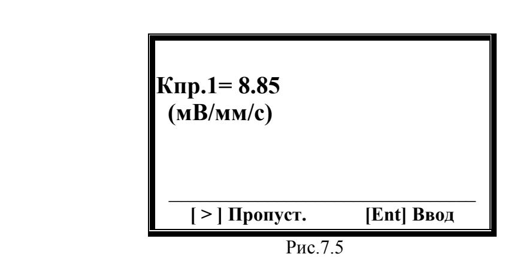
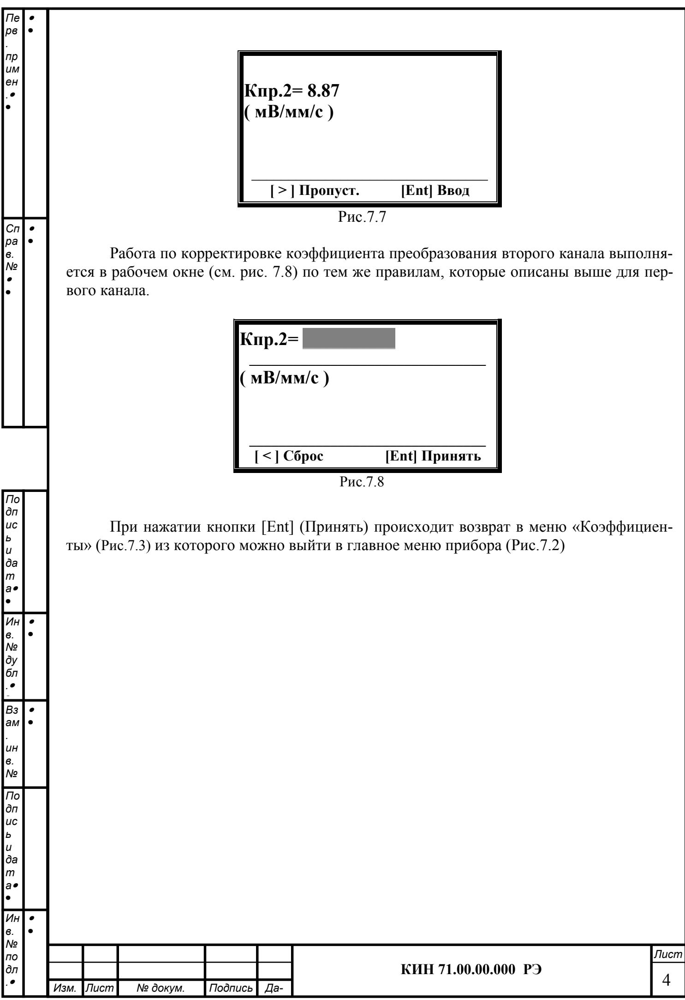
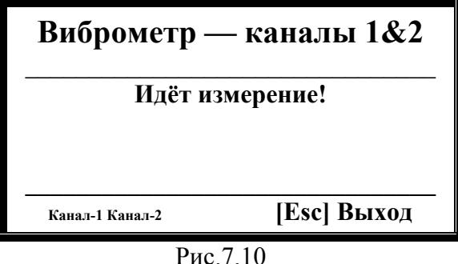
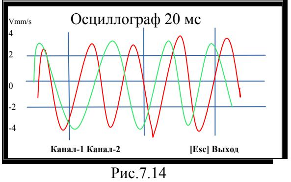
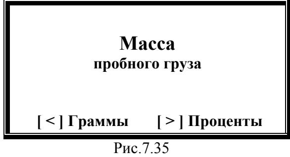
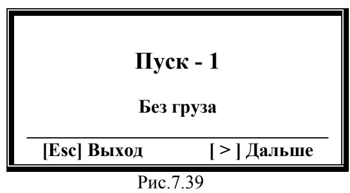
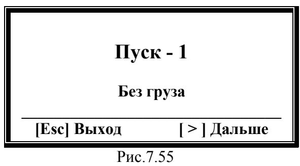
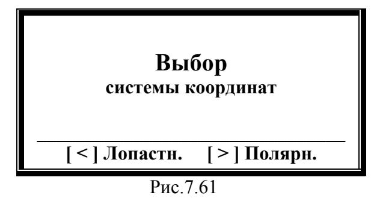
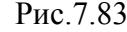

| Пе рв   |                                                  |                                      |                                                                   |                                        |         |    |                                                                  |                   |              |  |  |  |
|------------|-----------------------------------------------------|--------------------------------------|-------------------------------------------------------------------|----------------------------------------|---------|----|------------------------------------------------------------------|-------------------|--------------|--|--|--|
| пр им   |                                                     | СОДЕРЖАНИЕ Лист                   |                                                                   |                                        |         |    |                                                                  |                   |              |  |  |  |
| ен      |                                                     | 1. Назначение                        |                                                                   |                                        |         |    |                                                                  |                   |              |  |  |  |
|            |                                                     |                                      |                                                                   | 2. Технические характеристики          |         |    |                                                                  |                   |              |  |  |  |
|            |                                                     |                                      |                                                                   | 3. Состав изделия и комплект поставки  |         |    |                                                                  |                   |              |  |  |  |
|            |                                                     |                                      |                                                                   | 4. Устройство и принцип работы прибора |         |    |                                                                  |                   |              |  |  |  |
|            |                                                     |                                      |                                                                   | 5. Указания мер безопасности           |         |    |                                                                  |                   |              |  |  |  |
|            |                                                     |                                      | 6. Подготовка прибора к работе                                    |                                        |         |    |                                                                  |                   |              |  |  |  |
| Сп ра   |                                                  |                                      | 7. Работа с прибором                                              |                                        |         |    |                                                                  |                   |              |  |  |  |
| в. №    |                                                     |                                      | 7.1. Включение прибора и использование клавиатуры для выбора      |                                        |         |    |                                                                  |                   |              |  |  |  |
|         |                                                     | режима работы                        |                                                                   |                                        |         |    |                                                                  |                   |              |  |  |  |
|            |                                                     |                                      | 7.2. Ввод или коррекция коэффициентов преобразования датчиков     |                                        |         |    |                                                                  |                   |              |  |  |  |
|            |                                                     |                                      | вибрации                                                          |                                        |         |    |                                                                  |                   |              |  |  |  |
|            |                                                     |                                      |                                                                   | 7.3. Работа в режиме «Виброметр»       |         |    |                                                                  |                   |              |  |  |  |
|            |                                                     |                                      |                                                                   | 7.3.1. Измерение Nоб, Vs, Vo, F        |         |    |                                                                  |                   |              |  |  |  |
|            |                                                     |                                      |                                                                   | 7.3.2. Осциллограф                     |         |    |                                                                  |                   |              |  |  |  |
|            |                                                     |                                      |                                                                   | 7.3.3. Спектральный анализ вибрации    |         |    |                                                                  |                   |              |  |  |  |
|            |                                                     | 7.3.4. Гармонический анализ вибрации |                                                                   |                                        |         |    |                                                                  |                   |              |  |  |  |
|            |                                                     |                                      | 7.3.5. Проверка вибрации на выбеге                                |                                        |         |    |                                                                  |                   |              |  |  |  |
| По дп   |                                                     |                                      |                                                                   |                                        |         |    | 7.3.6. Определение вибрационного отклика при ударном возбуждении |                   |              |  |  |  |
| ис ь    |                                                     |                                      |                                                                   |                                        |         |    | 7.3.7. Графики оборотной составляющей вибрации                   |                   |              |  |  |  |
| и да    |                                                     |                                      |                                                                   | 7.4. Балансировка                      |         |    |                                                                  |                   |              |  |  |  |
| т а  | 7.4.1. Балансировка в одной плоскости (статическая) |                                      |                                                                   |                                        |         |    |                                                                  |                   |              |  |  |  |
|            |                                                     |                                      | 7.4.2.                                                            |                                        |         |    | Балансировка в двух плоскостях (динамическая)                    |                   |              |  |  |  |
| Ин в.   |                                                  |                                      | 8. Общие указания по эксплуатации и техническому обслуживанию     |                                        |         |    |                                                                  |                   |              |  |  |  |
| № ду    |                                                     |                                      | прибора                                                           |                                        |         |    |                                                                  |                   |              |  |  |  |
| бл      |                                                     |                                      |                                                                   |                                        |         |    |                                                                  |                   |              |  |  |  |
|  Вз     |                                                     |                                      | 9. Правила транспортирования и хранения 10. Калибровка прибора |                                        |         |    |                                                                  |                   |              |  |  |  |
| ам         |                                                     |                                      |                                                                   |                                        |         |    |                                                                  |                   |              |  |  |  |
| ин в.   |                                                     |                                      |                                                                   | Приложение 1.                          |         |    |                                                                  |                   |              |  |  |  |
| №       |                                                     |                                      |                                                                   |                                        |         |    | Балансировка механизмов в эксплуатационных условиях              |                   |              |  |  |  |
| По дп   |                                                     |                                      |                                                                   | (справочные рекомендации)              |         |    |                                                                  |                   |              |  |  |  |
| ис ь    |                                                     |                                      |                                                                   |                                        |         |    |                                                                  |                   |              |  |  |  |
| и да    |                                                     |                                      |                                                                   |                                        |         |    |                                                                  |                   |              |  |  |  |
| т а  |                                                     |                                      |                                                                   |                                        |         |    | КИН71.00.00.000 РЭ                                               |                   |              |  |  |  |
|            |                                                     | Изм.                                 | Лист                                                              | № докум.                               | Подпись | Да |                                                                  |                   |              |  |  |  |
| Ин в.   |                                                  | Разраб. Провер.                   |                                                                   | Московских А.                          |         |    | Прибор для балансировки                                          | Лит. Лист 2 | Листов 59 |  |  |  |
| № по    |                                                     | Реценз.                              |                                                                   |                                        |         |    | "АрБаланс 2»                                                     |                   |              |  |  |  |
| дл   |                                                     | Н. Контр. Утверд.                 |                                                                   | Фельдман В                             |         |    | Руководство по эксплуатации                                      | ООО «Кинематика»  |              |  |  |  |

## 1. НАЗНАЧЕНИЕ

Прибор «АрБаланс 2» (далее по тексту «Прибор») является портативным балансировочным комплектом, предназначенным для балансировки в одной или двух плоскостях коррекции роторов, вращающихся в собственных подшипниках.

Прибор включает в себя: два датчика вибрации, датчик фазового угла, измерительно-вычислительный блок и комплект оснастки, необходимой для выполнения балансировки в полевых условиях. Прибор является автономным и не требует для работы подключения к компьютеру

Он может быть использован при проведении сборочных, монтажных и ремонтных работ с целью снижения динамических нагрузок, действующих на подшипниковые узлы машин вследствие их неуравновешенности. При этом существенно повышается ресурс работы машин и механизмов.

Использование прибора позволяет во многих случаях исключить потребность в специальных балансировочных станках, так как балансировка ротора может выполняться в его собственных подшипниках без разборки механизма.

При необходимости прибор может быть также использован в качестве измерительной системы балансировочного станка.

Весь процесс балансировки, включающий в себя измерение, обработку и вывод на индикацию информации о величине и месте установки корректирующих грузов, выполняется в автоматизированном режиме и не требует от пользователя дополнительных навыков и знаний, выходящих за рамки настоящей инструкции.

Помимо балансировки прибор дополнительно может использоваться как обычный виброметр, позволяющий осуществлять измерение среднего квадратического значения (СКЗ) суммарной вибрации, СКЗ оборотной составляющей вибрации и частоты вращения контролируемого ротора.

Кроме того, данный прибор позволяет выводить дисплей графики временной функции вибрации (режим осциллографа), спектры вибрации, графики вибрации на выбеге и при ударном возбуждении, что может быть полезным при динамических исследованиях и диагностировании технического состояния балансируемого механизма.

|  в.     |      |      |          |         |    |                     |      |  |  |  |  |
|------------|------|------|----------|---------|----|---------------------|------|--|--|--|--|
| № по    |      |      |          |         |    |                     | Лист |  |  |  |  |
| дл   | Изм. | Лист | № докум. | Подпись | Да | КИН 71.00.00.000 РЭ | 4    |  |  |  |  |

*Сп ра* 

*в. №* 

*По дп ис ь и да т а*

 *Ин в. № ду бл .*

 *Вз ам . ин в. №* 

*По дп ис ь и да т а*

*Пе рв . пр им ен .*

| Пе         |      |                                                                                              |                           |          |                                        |        |                                                                            |                                                            |   |  |  |
|------------|------|----------------------------------------------------------------------------------------------|---------------------------|----------|----------------------------------------|--------|----------------------------------------------------------------------------|------------------------------------------------------------|---|--|--|
| рв         |      |                                                                                              |                           |          |                                        |        |                                                                            |                                                            |   |  |  |
| пр         |      |                                                                                              |                           |          |                                        |        |                                                                            | 2. ТЕХНИЧЕСКИЕ ХАРАКТЕРИСТИКИ                              |   |  |  |
| им ен   |      |                                                                                              |                           |          |                                        |        | 2.1.Диапазон измерения среднего квадра                                     |                                                            |   |  |  |
|         |      |                                                                                              |                           |          |                                        |        | тического значения (СКЗ) виброскорости,                                    |                                                            |   |  |  |
|            |      | мм/сек                                                                                       |                           |          |                                        |        |                                                                            | от 0.2 до 50                                               |   |  |  |
|            |      |                                                                                              |                           |          |                                        |        | 2.2. Частотный диапазон измерения СКЗ                                      |                                                            |   |  |  |
|            |      |                                                                                              | виброскорости, Гц         |          |                                        |        |                                                                            | от 5 до 200 (500)                                          |   |  |  |
|            |      |                                                                                              | 2.3.Пределы               |          | допускаемой                            |        | абсолютной                                                                 |                                                            |   |  |  |
|            |      |                                                                                              |                           |          |                                        |        | погрешности измерения СКЗ виброско                                         | ±(0.1 + 0.1*Vи), где Vи – измеренное значение СКЗ    |   |  |  |
| Сп         |      |                                                                                              |                           |          |                                        |        | рости на базовой частоте (80 Гц) и в ра                                    |                                                            |   |  |  |
| ра в.   |      |                                                                                              |                           |          | бочем диапазоне частот, мм/сек         |        |                                                                            | виброскорости                                              |   |  |  |
| №          |      |                                                                                              |                           |          |                                        |        | 2.4. Число плоскостей коррекции при ба                                     |                                                            |   |  |  |
|         |      |                                                                                              | лансировке                |          |                                        |        |                                                                            | 1 или 2                                                    |   |  |  |
|            |      |                                                                                              |                           |          |                                        |        | 2.5. Диапазон измерения частоты враще                                      |                                                            |   |  |  |
|            |      |                                                                                              | ния, об/мин               |          |                                        |        |                                                                            | 300 - 30000                                             |   |  |  |
|            |      |                                                                                              |                           |          |                                        |        | 2.6. Пределы допускаемой абсолютной погрешности измерения частоты враще | ±(1 + 0.005*Nи),                                           |   |  |  |
|            |      |                                                                                              |                           |          | ния в рабочем диапазоне частот, об/мин |        |                                                                            | где Nи – измеренное значение частоты вращения ротора |   |  |  |
|            |      | 2.7.                                                                                         | Диапазон                  |          | измерения                              | сдвига | фазы                                                                       |                                                            |   |  |  |
|            |      |                                                                                              |                           |          | вибрации, угловых градусов             |        |                                                                            | от 0 до 360                                                |   |  |  |
|            |      |                                                                                              |                           |          |                                        |        | 2.8. Пределы допускаемой абсолютной                                        |                                                            |   |  |  |
|            |      |                                                                                              | погрешности               |          | измерения                              | сдвига | фазы                                                                       |                                                            |   |  |  |
|            |      |                                                                                              |                           |          | вибрации, угловых градусов             |        |                                                                            | ± 2                                                        |   |  |  |
| По         |      |                                                                                              |                           |          |                                        |        | 2.9.Габаритные размеры измерительного                                      |                                                            |   |  |  |
| дп ис   |      |                                                                                              | блока, мм, не более       |          |                                        |        |                                                                            | 240*130*45                                                 |   |  |  |
| ь и     |      |                                                                                              |                           |          |                                        |        | 2.10.Масса измерительного блока, кг, не                                    |                                                            |   |  |  |
| да         |      | более                                                                                        |                           |          |                                        |        |                                                                            | 0,8                                                        |   |  |  |
| т а  |      | 2.11.                                                                                        | Габаритные                |          | размеры                                |        | вибропрео                                                                  |                                                            |   |  |  |
|            |      |                                                                                              | бразователя, мм, не более |          |                                        |        |                                                                            | 25*25*20                                                   |   |  |  |
| Ин в.   |   |                                                                                              |                           |          |                                        |        | 2.12. Масса вибропреобразователя, кг, не                                   |                                                            |   |  |  |
| № ду    |      | более                                                                                        |                           |          |                                        |        |                                                                            | 0.04                                                       |   |  |  |
| бл         |      |                                                                                              | вого угла, мм, не более   |          |                                        |        | 2.13. Габаритные размеры датчика фазо                                      | 150*70*40                                                  |   |  |  |
|         |      |                                                                                              |                           |          |                                        |        | 2.14. Масса датчика фазового с кабелем,                                    |                                                            |   |  |  |
| Вз ам   |   |                                                                                              | кг, не более              |          |                                        |        |                                                                            | 0.3                                                        |   |  |  |
|            |      | 2.15. Условия эксплуатации:                                                                  |                           |          |                                        |        |                                                                            |                                                            |   |  |  |
| ин в.   |      | ▪ температура окружающего воздуха, °C                                                        |                           |          |                                        |        |                                                                            | от 1 до 35                                                 |   |  |  |
| №       |      |                                                                                              |                           |          |                                        |        |                                                                            |                                                            |   |  |  |
| По дп   |      | ▪ относительная влажность воздуха при температуре 25 °C, % ▪ атмосферное давление, кПа |                           |          |                                        |        |                                                                            | до 80                                                      |   |  |  |
| ис         |      |                                                                                              |                           |          |                                        |        |                                                                            | от 84 до 106.7                                             |   |  |  |
| ь и     |      |                                                                                              |                           |          |                                        |        | 2.16. Средняя наработка на отказ, час, не                                  |                                                            |   |  |  |
| да т    |      | менее                                                                                        |                           |          |                                        |        |                                                                            | 1000                                                       |   |  |  |
| а       |      |                                                                                              |                           |          |                                        |        | 2.17. Средний срок службы, лет, не менее                                   | 6                                                          |   |  |  |
|            |      |                                                                                              |                           |          |                                        |        |                                                                            |                                                            |   |  |  |
| Ин в.   |      |                                                                                              |                           |          |                                        |        |                                                                            |                                                            |   |  |  |
| № по    |      |                                                                                              |                           |          |                                        |        |                                                                            |                                                            |   |  |  |
| дл      |      |                                                                                              |                           |          |                                        |        |                                                                            | КИН 71.00.00.000 РЭ                                        | 4 |  |  |
|            |      | Изм. Лист                                                                                 |                           | № докум. | Подпись                                | Да     |                                                                            |                                                            |   |  |  |

*Пе рв . пр им ен .*

*Сп ра в. №* 

*По дп ис ь и да т а*

 *Ин в. № ду бл .*

 *Вз ам . ин в. №* 

*По дп ис ь и да т а*

 *Ин в.* 

Базовый комплект поставки прибора включает в себя измерительный блок, два датчика вибрации, датчик фазового угла и оснастку, необходимую пользователю для выполнения основных измерений.

#### Комплект поставки

| Обозначение         | Наименование                                                                                                            | Кол-во | Примечание |
|---------------------|-------------------------------------------------------------------------------------------------------------------------|--------|------------|
| КИН 71.00.00.000    | Блок измерительный                                                                                                      | 1      |            |
| DT 2234             | Тахометр лазерный (датчик фазового угла)                                                                             | 1      |            |
| AD 1                | Вибропреобразователь (на базе акселе рометра ADXL335)                                                                | 2      |            |
|                     | Штатив магнитный                                                                                                        | 1      |            |
|                     | Весы электронные                                                                                                        | 1      |            |
| 2234                | Блок сетевого питания + 8.4 В                                                                                        | 1      |            |
|                     | Чемодан (сумка) для транспортировки прибора                                                                          | 1      |            |
|                     | Документация                                                                                                            |        |            |
| КИН 71.00.00.000 РЭ | Прибор для балансировки механизмов «АрБаланс 2». Руководство по эксплуа тации. Поставляется на флэш-накопителе | 1      |            |
| КИН 71.00.00.000 П  | Прибор для балансировки механизмов «АрБаланс 2». Паспорт                                                             | 1      |            |
| DT                  | Тахометр лазерный. Этикетка                                                                                             | 1      |            |

| №  |      |      |          |         |    |                     |      |  |  |  |
|----|------|------|----------|---------|----|---------------------|------|--|--|--|
| по |      |      |          |         |    |                     | Лист |  |  |  |
| дл |      |      |          |         |    | КИН 71.00.00.000 РЭ |      |  |  |  |
|    | Изм. | Лист | № докум. | Подпись | Да |                     | 4    |  |  |  |

## 4. УСТРОЙСТВО И ПРИНЦИП РАБОТЫ ПРИБОРА

4.1. Изображение прибора представлено на рис. 4.1. Прибор (см. рис. 4.1) состоит из измерительного блока 1, двух датчиков вибрации 3 и 4, датчика фазового угла 2.

В комплект поставки прибора также включена оснастка, необходимая для проведения балансировки механизмов в полевых условиях, которая включает в себя:

- магниты, используемые для установки на объекте датчиков вибрации;
- магнитный штатив, используемый для установки датчика фазового угла;
- весы электронные, используемые для взвешивания пробных и корректирующих балансировочных грузов.

Корпус измерительного блока прибора выполнен из пластика ABS черного цвета.

На верхней (лицевой) крышке корпуса установлен графический дисплей, на который выводятся результаты измерений, а также дополнительная информация необходимая для функционирования прибора. Там же (несколько ниже дисплея) расположена клавиатура, при помощи которой осуществляется управление прибором.

В верхней части корпуса (см. рис. 4.1) расположены разъёмы Х1 и Х2, предназначенные для подключения датчиков вибрации, а также разъём Х3, используемый для подключения датчика фазового угла.

На правой боковой поверхности корпуса установлен выключатель питания, а на левой - разъём для подключения блока питания постоянного тока с питающим напряжением + 8,4 В, используемого при подзарядке аккумуляторов.

4.2. Функциональная схема прибора приведена на рис. 4.2.

Прибор включает в себя следующие конструктивные единицы: измерительный блок 1, датчик фазового угла 2, датчики вибрации 3 и 4.

 Как уже отмечалось выше, на лицевой панели измерительного блока установлены графический дисплей 5 и клавиатура 6. На корпусе измерительного блока также установлены выключатель питания прибора 7 и разъём 8, используемый для подключения внешнего блока питания 9, предназначенного для зарядки встроенного приборного аккумулятора.

Внутри корпуса измерительного блока установлены управляющая плата программируемого контроллера 10, к которому подключены аналого-цифровая коммутационная плата 11, дисплей 5 и встроенный блок аккумуляторного питания прибора 12 с контролером заряда-разряда аккумуляторных батарей.

Плата 11 обеспечивает нормирование сигналов с датчиков и подключение к контроллеру основных узлов прибора, для чего на ней смонтированы:

- интеграторы 13 и 14 сигналов датчиков вибрации по первому и второму измерительным входам;
- преобразователь 15 сигнала датчика фазового угла;
- карта внешней памяти 16 прибора;

*Пе рв . пр им ен .*

*Сп ра в. №* 

*По дп ис ь и да т а*

 *Ин в. № ду бл .*

 *Вз ам . ин в. №* 

*По дп ис ь и да т а*

 *Ин*

- разъём 17 для подключения клавиатуры;
- разъемы для подключения дисплея (на рис. Не показаны).

Принцип действия прибора основан на измерении механических колебаний, которые имеют место на корпусах машин при их работе.

Для преобразования механических колебаний в электрический сигнал используются датчики вибрации – акселерометры 4, 3. Для определения фазовых характеристик сигнала используется оптический лазерный датчик 2, работающий на отражение.

| в. № |      |      |          |         |    |                     |      |  |  |  |
|---------|------|------|----------|---------|----|---------------------|------|--|--|--|
| по      |      |      |          |         |    |                     | Лист |  |  |  |
| дл      |      |      |          |         |    | КИН 71.00.00.000 РЭ |      |  |  |  |
|      | Изм. | Лист | № докум. | Подпись | Да |                     | 4    |  |  |  |

Под воздействием механических колебаний на выходе датчика вибрации формируется электрический аналоговый сигнал пропорциональный виброускорению, который подается на соответствующий вход измерительного блока 1 прибора.

*Пе рв . пр им ен .*

*Сп ра в. №* 

*По дп ис ь и да т а*

 *Ин в. № ду бл .*

 *Вз ам . ин в. №* 

*По дп ис ь и да т а*

 *Ин*

Далее после преобразования (интегрирования, полосовой фильтрации) видоизмененный сигнал пропорциональный виброскорости поступает на соответствующий аналоговый вход программируемого контроллера 10, в котором преобразуется в цифровую форму и запоминается в его оперативном запоминающем устройстве (ОЗУ).

В случае необходимости измерения частоты вращения и/или фазовых характеристик вибрационного сигнала дополнительно используется импульсный сигнал, формируемый датчиком фазового угла, который после нормирования также подается на соответствующий аналоговый вход контроллера 10.

В контроллере 10 прибора производится предварительная цифровая обработка и запоминание аналоговых сигналов, поступающих с датчиков. После чего по заданной программе осуществляется дальнейшая обработка цифрового сигнала (фильтрация, интерполяция, Фурье – анализ, вычисление параметров балансировки и т.д.).

Полученные результаты ( численные значения амплитуды и фазы вибрации, частоты вращения и т.п.) выводятся на дисплей и запоминаются в соответствующих отделах памяти прибора.

В зависимости от выбранного режима балансировки (одна или две плоскости коррекции) последовательно выполняется соответствующее количество измерений вибрации объекта в исходном состоянии и после установки пробного груза, используемого для тарировки прибора.

По результатам измерений в цифровом виде осуществляется решение задачи балансировки, после чего на дисплей выводятся данные о величине и угле установки корректирующей массы.

Роль пользователя сводится при этом к установке пробных и корректирующих грузов на балансируемом роторе и нажатию по готовности соответствующих клавиш на клавиатуре компьютера (или виртуальных клавиш на дисплее).

Весь процесс балансировки, включающий в себя измерение, обработку сигнала и вычисление результата, выполняется в автоматизированном режиме по программам, находящимся в памяти прибора.

| в. № |      |      |          |         |    |                     |      |  |  |  |
|---------|------|------|----------|---------|----|---------------------|------|--|--|--|
| по      |      |      |          |         |    |                     | Лист |  |  |  |
| дл      |      |      |          |         |    | КИН 71.00.00.000 РЭ |      |  |  |  |
|      | Изм. | Лист | № докум. | Подпись | Да |                     | 4    |  |  |  |

| Пе рв                    |   |      |                                                                                               |                    |    |                                                                                                                                                                                                                                                                                                                                                                                                                                        |      |
|-----------------------------|------|------|-----------------------------------------------------------------------------------------------|--------------------|----|----------------------------------------------------------------------------------------------------------------------------------------------------------------------------------------------------------------------------------------------------------------------------------------------------------------------------------------------------------------------------------------------------------------------------------------|------|
| пр им                    |      |      |                                                                                               |                    |    | 5. УКАЗАНИЯ МЕР БЕЗОПАСНОСТИ                                                                                                                                                                                                                                                                                                                                                                                                           |      |
| ен                    |      |      | 1. Внимание! к сети 220 В.                                                                 | При зарядке        |    | прибора от сети 220В необходимо соблюдать правила электробезопасности. Не допускается проводить ремонт прибора при его подключении                                                                                                                                                                                                                                                                                                  |      |
|                             |      |      |                                                                                               | 6.                 |    | ПОДГОТОВКА ПРИБОРА К РАБОТЕ                                                                                                                                                                                                                                                                                                                                                                                                            |      |
| Сп ра в. №   |   |      | угла к разъему Х3 измерительного блока. 6.4. При необходимости зарядки время выполнения | рабочих измерений, |    | 6.1. Установить датчики на обследуемом или балансируемом механизме, (По дробная информация об установке датчиков дана в приложении 1). 6.2. Подключить датчики вибрации 4 и 3 к разъемам Х1 и Х2, а датчик фазового аккумуляторного блока прибора, проводимой во подключить прибор к блоку сетевого питания. Подключить блок питания к сети 220 В, 50 Гц. 6.5. Включить прибор и выбрать требуемый пункт меню. |      |
|                             |      |      |                                                                                               |                    |    |                                                                                                                                                                                                                                                                                                                                                                                                                                        |      |
|                             |      |      |                                                                                               |                    |    |                                                                                                                                                                                                                                                                                                                                                                                                                                        |      |
|                             |      |      |                                                                                               |                    |    |                                                                                                                                                                                                                                                                                                                                                                                                                                        |      |
| По                          |      |      |                                                                                               |                    |    |                                                                                                                                                                                                                                                                                                                                                                                                                                        |      |
| дп ис                    |      |      |                                                                                               |                    |    |                                                                                                                                                                                                                                                                                                                                                                                                                                        |      |
| ь и                      |      |      |                                                                                               |                    |    |                                                                                                                                                                                                                                                                                                                                                                                                                                        |      |
| да т                     |      |      |                                                                                               |                    |    |                                                                                                                                                                                                                                                                                                                                                                                                                                        |      |
| а                     |      |      |                                                                                               |                    |    |                                                                                                                                                                                                                                                                                                                                                                                                                                        |      |
| Ин в.                    |   |      |                                                                                               |                    |    |                                                                                                                                                                                                                                                                                                                                                                                                                                        |      |
| № ду                     |      |      |                                                                                               |                    |    |                                                                                                                                                                                                                                                                                                                                                                                                                                        |      |
| бл                       |      |      |                                                                                               |                    |    |                                                                                                                                                                                                                                                                                                                                                                                                                                        |      |
|  Вз                      |      |      |                                                                                               |                    |    |                                                                                                                                                                                                                                                                                                                                                                                                                                        |      |
| ам                          |      |      |                                                                                               |                    |    |                                                                                                                                                                                                                                                                                                                                                                                                                                        |      |
| ин в. №               |      |      |                                                                                               |                    |    |                                                                                                                                                                                                                                                                                                                                                                                                                                        |      |
|  По                      |      |      |                                                                                               |                    |    |                                                                                                                                                                                                                                                                                                                                                                                                                                        |      |
| дп ис                    |      |      |                                                                                               |                    |    |                                                                                                                                                                                                                                                                                                                                                                                                                                        |      |
| ь и                      |      |      |                                                                                               |                    |    |                                                                                                                                                                                                                                                                                                                                                                                                                                        |      |
| да т                     |      |      |                                                                                               |                    |    |                                                                                                                                                                                                                                                                                                                                                                                                                                        |      |
| а                     |      |      |                                                                                               |                    |    |                                                                                                                                                                                                                                                                                                                                                                                                                                        |      |
| Ин в.                    |   |      |                                                                                               |                    |    |                                                                                                                                                                                                                                                                                                                                                                                                                                        |      |
| № по                     |      |      |                                                                                               |                    |    |                                                                                                                                                                                                                                                                                                                                                                                                                                        | Лист |
| дл                       | Изм. | Лист | № докум.                                                                                      | Подпись            | Да | КИН 71.00.00.000 РЭ                                                                                                                                                                                                                                                                                                                                                                                                                    | 4    |

| Пе   • рв          |                                                               |
|-----------------------|---------------------------------------------------------------|
| пр UM ен . ● | Pas= Секретный пароль                                      |
|                       | [Ent] Принять [<  Сброс Рис.7.3                         |
| Сп •                  | ПЛА ПРОДОЛОШИЯ ПРОДМОТВО ИЛИ КОМПОКТИВОВИЧ ГООФФИЦИОЦТОВ ПРОД |

8.

No

По дп uc ь

u да m

a •

ду бл

. Вз

ам

ин

ഒ.

No

По дп uc ь U да m a •

Ин •

Ин • e. No

Для проведения просмотра или корректировки коэффициентов преобразования необходимо ввести пароль (цифровой код), который обеспечивает дополнительную защиту от несанкционированного вмешательства в настройку прибора.

Для данного прибора паролем является число 3.14, которое вводится с помощью цифровых клавиш клавиатуры с последующим нажатием клавиши [Ent] (Принять).

Для исправления ошибочно введенного цифрового кода используется клавиша [ < ] (Сброс), после нажатия которой можно повторить попытку ввода пароля. Внимание!

При вводе пароля или коэффициентов преобразования его дробная часть отделяется от целой части запятой (знаком « \* »).

После ввода правильного цифрового кода и нажатия клавиши [Ent] (Принять) на экране высвечивается надпись, подтверждающая возможность просмотра и корректировки коэффициентов преобразования (см. рис.7.4):

В этом случае при нажатии клавиши [Esc] (Выход) выполняется возврат в предыдущее меню.

При нажатии клавиши [>] (Дальше) на экране высвечивается надпись, позволяющая просмотреть существующий коэффициент преобразования датчика первого канала и при необходимости начать его корректировку (см. рис.7.5):

| 8. ല്ല |  |  |          |               |  |              |      |  |  |  |  |
|-----------|--|--|----------|---------------|--|--------------|------|--|--|--|--|
| по        |  |  |          |               |  |              | Пист |  |  |  |  |
| дл        |  |  |          |               |  | 00.00.000 РЭ |      |  |  |  |  |
|           |  |  | № докум. | Подпись   Да- |  |              | ব    |  |  |  |  |

Пе рв

пр um ен

Сп pa

e. No

По дп uc ь u

да m a •

Ин

e.

No ду

бл

.

Вз

ам

ин

‌‌‌‌‌‌‌‌‌‌‌‌‌‌‌‌‌‌‌‌‌‌‌‌‌‌‌‌‌‌‌‌‌‌‌‌‌‌‌‌‌‌‌‌‌‌‌‌‌‌‌‌‌‌‌‌‌‌‌‌‌‌‌‌‌‌‌‌‌‌‌‌‌‌‌‌‌‌‌‌‌‌‌‌‌‌‌‌‌‌‌‌‌‌‌‌‌‌‌‌‌‌‌‌‌‌‌‌‌‌‌‌‌‌‌‌‌‌‌‌‌‌‌‌‌‌‌‌‌‌‌‌‌‌‌‌‌‌‌‌‌‌‌‌‌‌‌‌‌‌‌‌‌‌‌‌‌‌‌‌‌‌‌‌‌‌‌‌‌‌‌‌‌ No

По дп UC ь U да m a •

.

При этом в первой строке приводится значение существующего коэффициента преобразования датчика, а нижней указаны обозначения клавиш, которые необходимо нажать для продолжения работы по программе.

При нажатии клавиши [ > ] (Пропустить) сохраняется введенный ранее коэффициент преобразования.

При нажатии клавиши [Ent] (Ввод) на дисплей выводится форма, при заполнении которой можно установить новое значение коэффициента преобразования (см. рис.7.6):

| Кпр.1=    |               |
|-----------|---------------|
| мВ/мм/с ) |               |
|           |               |
| <   Сброс | (Ent  Принять |

Рис.7.6

В первой строке указанной формы вводится новое значение коэффициента преобразования для первого измерительного канала прибора.

Курсор " " обозначает начальную позицию ввода. Для ввода коэффициента используются цифровые клавиши клавиатуры.

В нижней строке дисплея указано обозначение клавиши [Ent] (Принять), при нажатии которой в энергонезависимую память прибора заносится введённое значение коэффициента преобразования и клавиши | < | (Сброс), которую необходимо нажать, чтобы произвести исправления в случае ошибочного ввода коэффициента

После завершения ввода Кпр.1 и нажатия в данном рабочем окне клавиши [Ent] (Принять) на дисплей выводится хранящийся в памяти прибора коэффициент преобразования Кпр.2 второго измерительного канала вибрации (см. рис.7.7)

| 8. • No |  |          |               |                                                                                                                                                                                       |      |
|------------|--|----------|---------------|---------------------------------------------------------------------------------------------------------------------------------------------------------------------------------------|------|
| по         |  |          |               |                                                                                                                                                                                       | Пист |
| дл         |  |          |               | 1.00.0000000000000000000000000000000000000000000000000000000000000000000000000000000000000000000000000000000000000000000000000000000000000000000000000000000000000000000000000 кин |      |
|            |  | № докум. | Подпись   Да- |                                                                                                                                                                                       | ব    |

| le ലെ                                                                           |  |                                                                                                                                                                                                                                                                                                                                                                                                                 |  |  |  |  |  |  |  |  |
|------------------------------------------------------------------------------------|--|-----------------------------------------------------------------------------------------------------------------------------------------------------------------------------------------------------------------------------------------------------------------------------------------------------------------------------------------------------------------------------------------------------------------|--|--|--|--|--|--|--|--|
| p JM                                                                            |  | 7.3. Работа прибора в режиме «Виброметр».                                                                                                                                                                                                                                                                                                                                                                       |  |  |  |  |  |  |  |  |
| aH                                                                                 |  |                                                                                                                                                                                                                                                                                                                                                                                                                 |  |  |  |  |  |  |  |  |
|                                                                                    |  | Выход в меню «Измерения», в котором выполняются измерения различных па- раметров вибрации и частоты вращения, осуществляется из главного меню прибора                                                                                                                                                                                                                                                        |  |  |  |  |  |  |  |  |
|                                                                                    |  | (Рис.7.2) при нажатии кнопки   <   (Виброметр). Внешний вид меню представлен на                                                                                                                                                                                                                                                                                                                                 |  |  |  |  |  |  |  |  |
|                                                                                    |  | Рис.7.9.                                                                                                                                                                                                                                                                                                                                                                                                        |  |  |  |  |  |  |  |  |
|                                                                                    |  | Измерения                                                                                                                                                                                                                                                                                                                                                                                                       |  |  |  |  |  |  |  |  |
| 5                                                                                  |  | >   No6, Vs, Vo, F [0] Удар                                                                                                                                                                                                                                                                                                                                                                                  |  |  |  |  |  |  |  |  |
| a 3                                                                             |  | [ v   Спектр ^   Осциллограф                                                                                                                                                                                                                                                                                                                                                                                 |  |  |  |  |  |  |  |  |
| 16                                                                                 |  |                                                                                                                                                                                                                                                                                                                                                                                                                 |  |  |  |  |  |  |  |  |
|                                                                                    |  | #   Гармон. ( *   Выбег                                                                                                                                                                                                                                                                                                                                                                                      |  |  |  |  |  |  |  |  |
|                                                                                    |  | <   Оборотн. [Esc] Выход                                                                                                                                                                                                                                                                                                                                                                                     |  |  |  |  |  |  |  |  |
|                                                                                    |  | Рис.7.9                                                                                                                                                                                                                                                                                                                                                                                                         |  |  |  |  |  |  |  |  |
|                                                                                    |  |                                                                                                                                                                                                                                                                                                                                                                                                                 |  |  |  |  |  |  |  |  |
|                                                                                    |  | В данном меню указаны 8 кнопок клавиатуры, при нажатии на которые происхо- дит переход в различные режимы измерения и анализа вибрации, в том числе:                                                                                                                                                                                                                                                         |  |  |  |  |  |  |  |  |
|                                                                                    |  | - [ > ] No6, Vs, Vo, F - циклическое измерение частоты вращения, СКЗ вибрации,                                                                                                                                                                                                                                                                                                                                  |  |  |  |  |  |  |  |  |
|                                                                                    |  | оборотной составляющей и фазы вибрации (подробности см. в разделе 7.3.1);                                                                                                                                                                                                                                                                                                                                       |  |  |  |  |  |  |  |  |
|                                                                                    |  | - [ ^ ] Осциллограф- циклическое отображение временной функции вибросигнала в на заданном промежутке времени (подробности см. в разделе 7.3.2);                                                                                                                                                                                                                                                              |  |  |  |  |  |  |  |  |
| 10                                                                                 |  | -   v   Спектр- спектральный анализ вибросигнала (подробности см. в разделе 7.3.3);                                                                                                                                                                                                                                                                                                                             |  |  |  |  |  |  |  |  |
| IC                                                                                 |  | - [ # ] Гармон. - гармонический анализ вибросигнала (подробности см. в разделе                                                                                                                                                                                                                                                                                                                                  |  |  |  |  |  |  |  |  |
|                                                                                    |  | 7.3.4); - [ *   Выбег - определение собственных частот механизма на выбеге (подробности                                                                                                                                                                                                                                                                                                                      |  |  |  |  |  |  |  |  |
| da n                                                                            |  | см. в разделе 7.3.5)                                                                                                                                                                                                                                                                                                                                                                                            |  |  |  |  |  |  |  |  |
| 90                                                                                 |  | - [ 0 ] Удар - определение собственных частот механизма методом ударного воз-                                                                                                                                                                                                                                                                                                                                   |  |  |  |  |  |  |  |  |
| Ин                                                                                 |  | буждения (подробности см. в разделе 7.3.6) -   <   Оборотн. - циклическое отображение оборотной составляющей вибросигнала                                                                                                                                                                                                                                                                                    |  |  |  |  |  |  |  |  |
| 3. No                                                                           |  | в графическом виде (подробности см. в разделе 7.3.7)                                                                                                                                                                                                                                                                                                                                                            |  |  |  |  |  |  |  |  |
| y - [Esc] Выход - возвращение на исходную заставку прибора (см. рис. 7.1). 5 |  |                                                                                                                                                                                                                                                                                                                                                                                                                 |  |  |  |  |  |  |  |  |
|                                                                                    |  | Перед началом работы в режиме «Виброметр» необходимо установить датчики                                                                                                                                                                                                                                                                                                                                         |  |  |  |  |  |  |  |  |
| 33 am                                                                           |  | вибрации на корпусе машины в выбранных точках измерения и подключить их соответ-                                                                                                                                                                                                                                                                                                                                |  |  |  |  |  |  |  |  |
| ЛН                                                                                 |  | ственно к входам X1 и X2 измерительного блока.                                                                                                                                                                                                                                                                                                                                                                  |  |  |  |  |  |  |  |  |
| 3. No                                                                           |  | Фотоэлектрический датчик фазового угла необходимо подключить к входу ХЗ измерительного блока. Кроме того, при использовании этого датчика на обследуемый ротор необходимо нанести специальную катафотную метку, имеющую отражающую способность, контрастную по отношению к отражающей способности поверхности ро- тора. Рекомендации по установке и настройка датчиков приведены в приложении 1. |  |  |  |  |  |  |  |  |
| lo                                                                                 |  |                                                                                                                                                                                                                                                                                                                                                                                                                 |  |  |  |  |  |  |  |  |
| 07 IC                                                                           |  |                                                                                                                                                                                                                                                                                                                                                                                                                 |  |  |  |  |  |  |  |  |
|                                                                                    |  |                                                                                                                                                                                                                                                                                                                                                                                                                 |  |  |  |  |  |  |  |  |
| da 8                                                                            |  |                                                                                                                                                                                                                                                                                                                                                                                                                 |  |  |  |  |  |  |  |  |
| 90                                                                                 |  |                                                                                                                                                                                                                                                                                                                                                                                                                 |  |  |  |  |  |  |  |  |
| Ин                                                                                 |  |                                                                                                                                                                                                                                                                                                                                                                                                                 |  |  |  |  |  |  |  |  |
| 3. 9                                                                            |  |                                                                                                                                                                                                                                                                                                                                                                                                                 |  |  |  |  |  |  |  |  |
| 70 дл                                                                           |  | Лист КИН 71.00.00.000 РЭ                                                                                                                                                                                                                                                                                                                                                                                     |  |  |  |  |  |  |  |  |

Изм. Лист

## 7.3.1. Режим измерения Noб, Vs, Vo, F

Пе рв

пр

UM

ен

Сп pa e. No

По

дп

uc ь u

да m

a •

No ду бл . Вз ам

ин ‌‌‌‌‌‌‌‌‌‌‌‌‌‌‌‌‌‌‌‌‌‌‌‌‌‌‌‌‌‌‌‌‌‌‌‌‌‌‌‌‌‌‌‌‌‌‌‌‌‌‌‌‌‌‌‌‌‌‌‌‌‌‌‌‌‌‌‌‌‌‌‌‌‌‌‌‌‌‌‌‌‌‌‌‌‌‌‌‌‌‌‌‌‌‌‌‌‌‌‌‌‌‌‌‌‌‌‌‌‌‌‌‌‌‌‌‌‌‌‌‌‌‌‌‌‌‌‌‌‌‌‌‌‌‌‌‌‌‌‌‌‌‌‌‌‌‌‌‌‌‌‌‌‌‌‌‌‌‌‌‌‌‌‌‌‌‌‌‌‌‌‌‌ No По дп

UC ь

U да

m a •

Ин • в. No ПО дл

Ин • ല്ലാത്തിലെ അവലംബം അവലംബം അവലംബം അവലംബം അവലംബം അവലംബം അവലംബം അവലംബം അവലംബം അവലംബം അവലംബം അവലംബം അവലംബം അവലംബം അവലംബം അവലംബം അവലംബം അവലംബം അവലംബം അവലംബം അവ

Для выхода в данный режим в меню «Измерение» используется кнопка | > | .

При выполнении указанного режима производится циклическое измерение частоты вращения, СКЗ, оборотной составляющей и фазы вибрации, которые отображаются на дисплее в цифровом виде. Внешний вид окна при начале измерения изображен на Рис.7.10.

После завершения первого цикла измерения на дисплей прибора периодически начинают выводиться результаты измерения, в том числе: величины СКЗ суммарной вибрации (V1s, V2s), величины СК3 (V1o, V2o) и фазы (F1, F2) 1-й гармоники оборотной составляющей вибрации, а также частота вращения ротора №об (см. Рис.7.11).

В случае, если к прибору не подключен датчик фазового угла, данные о частоте вращения, оборотной составляющей и фазе на дисплей не выводятся (см. Рис.7.12).

| Виброметр - каналы 1&2 №6= () об/мин |                 |  |  |  |  |  |
|-----------------------------------------|-----------------|--|--|--|--|--|
| Vs1=3.25мм/сек                          | Vs2=2.19мм/сек  |  |  |  |  |  |
| V01= Н.Д.мм/сек                         | V02= Н.Д.мм/сек |  |  |  |  |  |
| F1= H.J.                                | F1= H.J.        |  |  |  |  |  |
| Канал-1 Канал-2                         | Esc Выход       |  |  |  |  |  |

Для выхода из данного режима и возврата в меню «Измерение» (Рис.7.9.) служит кнопка [Esc] (Выход).

|  |       |          |               | КИН 71.00.000  РЭ |   |  |  |
|--|-------|----------|---------------|-------------------|---|--|--|
|  | Vism. | № докум. | Подпись   Да- |                   | ব |  |  |

 Для начала работы в данном режиме в меню «Измерения» (см. рис. 7.9) следует нажать кнопку [ ^ ], после чего на дисплей прибора начинают выводиться графики временной функции вибросигнала по первому и второму измерительным каналам.

*Пе рв . пр им ен .*

*Сп ра в. №* 

*По дп ис ь и да т а*

 *Ин в. № ду бл .*

 *Вз ам . ин в. №* 

*По дп ис ь и да т а*

 *Ин*

Перед началом работы в данном режиме в соответствующем меню (см. рис. 7.13) с помощью нужной кнопки клавиатуры необходимо выбрать интересующий пользователя период измерения.

| Период измерения                                      |               |  |  |  |  |  |  |  |
|-------------------------------------------------------|---------------|--|--|--|--|--|--|--|
| [ 1 ] 125 мс                                       | [ 5 ] 8 мс |  |  |  |  |  |  |  |
| ________________________________ [ 2 ] 62,5 мс  | [ 6 ] 4 мс    |  |  |  |  |  |  |  |
| ________________________________ [ 3 ] 32.2 мс     | [ 7 ] 2 мс |  |  |  |  |  |  |  |
| __ ______________________________ [ 4 ] 16,1 мс | [Esc] Выход   |  |  |  |  |  |  |  |

| Рис.7.13 |  |  |
|----------|--|--|
|          |  |  |

 После выбора нужного периода измерения на экране появляется графическое изображение временной функции суммарной вибрации по первому (красный цвет) и второму (зелёный цвет) измерительным каналам (см. рис. 7.14).

На указанных графиках по оси Х откладывается время, а по оси У - амплитуда виброскорости в мм/сек.

Данное изображение будет периодически обновляться - до нажатия кнопки [Esc] (Выход), после чего на экране вновь появится меню «Измерения» Рис.7.9.

#### 7.3.3. Режим измерения спектра вибрации

 Для начала работы в данном режиме в меню «Измерения» (см. рис. 7.9) следует нажать кнопку [ v ], после чего на дисплее прибора появляется меню выбора частотного диапазона анализа (см. рис. 7.15).

В данном меню следует выбрать частотный диапазон, на котором предполагается проводить измерения. Для этого нужно нажать соответствующую кнопку на клавиатуре и выбрать соответствующий диапазон измерения (64 Гц, 128 Гц, 320 Гц или 640 Гц).

| в. № |      |      |          |         |    |                     |      |  |  |
|---------|------|------|----------|---------|----|---------------------|------|--|--|
| по      |      |      |          |         |    |                     | Лист |  |  |
| дл      |      |      |          |         |    | КИН 71.00.00.000 РЭ |      |  |  |
|      | Изм. | Лист | № докум. | Подпись | Да |                     | 4    |  |  |

Данное изображение будет периодически обновляться - до нажатия кнопки [Esc]. (Выход), после чего на экране появится таблица, содержащая значения составляющих спектра вибрации, определённых в заданном частотном диапазоне для обоих каналов измерения (см. рис.7.18).

| Спектр 320 Hz                                                                                                                                                                                                                                            |                                                                                                                                                                                                                                                                           |                                                                                                                                                                                                                                                                              |                                                                                                                                                                                                                                                                              |  |  |  |  |  |  |
|-------------------------------------------------------------------------------------------------------------------------------------------------------------------------------------------------------------------------------------------------------------|---------------------------------------------------------------------------------------------------------------------------------------------------------------------------------------------------------------------------------------------------------------------------|------------------------------------------------------------------------------------------------------------------------------------------------------------------------------------------------------------------------------------------------------------------------------|------------------------------------------------------------------------------------------------------------------------------------------------------------------------------------------------------------------------------------------------------------------------------|--|--|--|--|--|--|
| F,Hz Vmm/s Vmm/s                                                                                                                                                                                                                                            | F,Hz Vmm/s Vmm/s                                                                                                                                                                                                                                                          | F,Hz Vmm/s Vmm/s                                                                                                                                                                                                                                                             | F,Hz Vmm/s Vmm/s                                                                                                                                                                                                                                                             |  |  |  |  |  |  |
| 5 0.02 0.01 10 0.01 0.00 15 0.00 0.02 20 0.01 0.01 25 0.03 0.01 30 0.02 0.00 35 0.00 0.00 40 0.00 0.02 45 0.45 0.49 50 2.95 3.01 55 0.46 0.39 60 0.01 0.00 65 0.00 0.01 70 0.02 0.03 75 0.01 0.01 80 0.00 0.00 | 85 0.01 0.01 90 0.02 0.00 95 0.03 0.00 100 0.01 0.01 105 0.01 0.03 110 0.02 0.01 115 0.01 0.00 120 0.00 0.02 125 0.03 0.00 130 0.01 0.01 135 0.00 0.00 140 0.02 0.00 145 0.00 0.03 150 0.01 0.00 155 0.00 0.01 160 0.03 0.00 | 165 0.01 0.00 170 0.00 0.02 175 0.01 0.00 180 0.00 0.00 185 0.00 0.01 190 0.02 0.00 195 0.01 0.00 200 0.02 0.03 205 0.01 0.02 210 0.00 0.00 215 0.00 0.00 220 0.02 0.00 225 0.01 0.00 230 0.00 0.03 235 0.03 0.00 240 0.00 0.01 | 245 0.01 0.03 250 0.00 0.00 255 0.02 0.00 260 0.00 0.00 265 0.00 0.01 270 0.03 0.00 275 0.00 0.00 280 0.00 0.01 285 0.01 0.00 290 0.03 0.02 295 0.01 0.01 300 0.00 0.03 205 0.03 0.00 310 0.02 0.01 315 0.01 0.02 320 0.01 0.01 |  |  |  |  |  |  |
| [ < ] Измерить                                                                                                                                                                                                                                              |                                                                                                                                                                                                                                                                           | Канал-1 Канал-2                                                                                                                                                                                                                                                              | [Esc] Выход                                                                                                                                                                                                                                                                  |  |  |  |  |  |  |

Рис.7.18

Далее пользователь, нажав кнопку [ < ] (Измерить), может вернуться к измерениям, или нажав кнопку [Esc] (Выход), выйти из этого режима, вернувшись в меню «Измерения» (Рис.7.9).

## 7.3.4. Гармонический анализ Внимание!

При работе в данном режиме помимо датчиков вибрации необходимо использовать датчик фазового угла, обеспечивающий синхронизацию процесса измерения с частотой вращения ротора машины, на который настроен датчик.

Измерение начинается сразу после выбора данного режима в меню «Измерения» при нажатии кнопки [ # ] (Гармон.) (см. рис.7.9). Об этом свидетельствует появление на дисплее надписи «Идет измерение» (см. рис. 7.19).

|  | Идёт измерение ! |  |
|--|------------------|--|
|  |                  |  |
|  |                  |  |
|  |                  |  |
|  |                  |  |

Рис.7.19

После завершения процесса измерения, на экране появляются графики спектра гармонических составляющих вибрации по двум каналам. При этом вибрация, измеренная по первому каналу, отображается красным, а по второму – зелёным цветом. (см. рис. 7.20).

|  |      |      |          |         |    |                     | Лист |  |  |
|--|------|------|----------|---------|----|---------------------|------|--|--|
|  |      |      |          |         |    | КИН 71.00.00.000 РЭ |      |  |  |
|  | Изм. | Лист | № докум. | Подпись | Да |                     | 4    |  |  |

#### *По дп ис ь и да т а Ин в. № ду бл . Вз ам . ин в. № По дп ис ь и да т а Ин в. № по дл .*

*Пе рв . пр им ен .*

*Сп ра в. №* 

На графике спектра гармоник по оси Х откладывается номер гармоники, а по оси У - амплитуда виброскорости в мм/сек.

*Пе рв . пр им ен .*

*Сп ра в. №* 

*По дп ис ь и да т а*

 *Ин в. № ду бл .*

 *Вз ам . ин в. №* 

*По дп ис ь и да т а*

Данное изображение будет периодически обновляться - до нажатия кнопки [Esc] (Выход), после чего на экране появится таблица, содержащая значения СКЗ виброскорости по обоим каналам, определённые для каждой гармонической составляющей (см. рис.7.21).

|                                                                                                                                                                                                                                                                                | Nоб= 2998 об/мин                                                                                                                                                                                                                                                       |                                                                                                                                                                                                                                                                              |                                                                                                                                                                                                                                                                              |  |  |  |  |  |  |  |  |
|--------------------------------------------------------------------------------------------------------------------------------------------------------------------------------------------------------------------------------------------------------------------------------|---------------------------------------------------------------------------------------------------------------------------------------------------------------------------------------------------------------------------------------------------------------------------|------------------------------------------------------------------------------------------------------------------------------------------------------------------------------------------------------------------------------------------------------------------------------|------------------------------------------------------------------------------------------------------------------------------------------------------------------------------------------------------------------------------------------------------------------------------|--|--|--|--|--|--|--|--|
| F,Hz Vmm/s Vmm/s                                                                                                                                                                                                                                                               | F,Hz Vmm/s Vmm/s                                                                                                                                                                                                                                                          | F,Hz Vmm/s Vmm/s                                                                                                                                                                                                                                                             | F,Hz Vmm/s Vmm/s                                                                                                                                                                                                                                                             |  |  |  |  |  |  |  |  |
| 1 0.02 0.01 2 0.01 0.00 3 0.00 0.02 4 0.01 0.01 5 0.03 0.01 6 0.02 0.00 7 0.00 0.00 8 0.00 0.02 9 0.45 0.49 10 2.95 3.01 11 0.46 0.39 12 0.01 0.00 13 0.00 0.01 14 0.02 0.03 15 0.01 0.01 16 0.00 0.00 | 85 0.01 0.01 90 0.02 0.00 95 0.03 0.00 100 0.01 0.01 105 0.01 0.03 110 0.02 0.01 115 0.01 0.00 120 0.00 0.02 125 0.03 0.00 130 0.01 0.01 135 0.00 0.00 140 0.02 0.00 145 0.00 0.03 150 0.01 0.00 155 0.00 0.01 160 0.03 0.00 | 165 0.01 0.00 170 0.00 0.02 175 0.01 0.00 180 0.00 0.00 185 0.00 0.01 190 0.02 0.00 195 0.01 0.00 200 0.02 0.03 205 0.01 0.02 210 0.00 0.00 215 0.00 0.00 220 0.02 0.00 225 0.01 0.00 230 0.00 0.03 235 0.03 0.00 240 0.00 0.01 | 245 0.01 0.03 250 0.00 0.00 255 0.02 0.00 260 0.00 0.00 265 0.00 0.01 270 0.03 0.00 275 0.00 0.00 280 0.00 0.01 285 0.01 0.00 290 0.03 0.02 295 0.01 0.01 300 0.00 0.03 205 0.03 0.00 310 0.02 0.01 315 0.01 0.02 320 0.01 0.01 |  |  |  |  |  |  |  |  |
| [ < ] Измерить                                                                                                                                                                                                                                                                 |                                                                                                                                                                                                                                                                           | Канал-1 Канал-2                                                                                                                                                                                                                                                              | [Esc] Выход                                                                                                                                                                                                                                                                  |  |  |  |  |  |  |  |  |

Далее пользователь может, нажав кнопку [ < ] (Измерить), повторить измерение гармонического спектра (см. рис. 7.19) или, нажав кнопку [Esc] (Выход), завершить измерение и вернуться в меню «Измерения» (см. рис.7.9).

## 7.3.5. Определение собственных частот колебаний механизма на выбеге Внимание!

При работе в данном режиме необходимо использовать датчик фазового угла, обеспечивающий синхронизацию процесса измерения с частотой вращения ротора машины, на который настроен датчик.

Для включения данного режима в меню «Измерения» необходимо нажать кнопку [ \* ], после чего на дисплее появляется заставка «Выбег. Определение собственных частот (см. рис.7.22).

| в. № |      |      |          |         |    |                     |      |
|---------|------|------|----------|---------|----|---------------------|------|
| по      |      |      |          |         |    |                     | Лист |
| дл      |      |      |          |         |    | КИН 71.00.00.000 РЭ |      |
|      | Изм. | Лист | № докум. | Подпись | Да |                     | 4    |

Максимальное значение СКЗ виброскорости на выбеге, обычно соответствующее наиболее мощному резонансу проверяемого механизма, выделяется на графике вертикальной линией лилового цвета с указанием соответствующей ей частоты вращения в об/мин.

*Пе рв . пр им ен .*

*Сп ра в. №* 

*По дп ис ь и да т а*

 *Ин в. № ду бл .*

 *Вз ам . ин в. №* 

*По дп ис ь и да т а*

 *Ин в.* 

 При необходимости пользователь может повторить измерение, нажав кнопку [ < ] (Повтор), или вывести в табличном виде значения 5-ти основных резонансных частот механизма, нажав кнопку [ > ] (Таблица). Пример выводимой таблицы резонансов приведён на рис. 7.25.

| Резонансы    |       |                 |  |  |  |
|--------------|-------|-----------------|--|--|--|
| N, об/мин    | F, Hz | Vs              |  |  |  |
| 1450         | 24,2  | 28.1            |  |  |  |
| 750          | 12,5  | 15.1            |  |  |  |
| 0            | 0     | 0               |  |  |  |
| 0            | 0     | 0               |  |  |  |
| 0            | 0     | 0               |  |  |  |
| [ < ] Повтор |       | [ Esc ] Выход . |  |  |  |

Рис.7.25

## 7.3.6. Определение собственных частот колебаний механизма методом ударного возбуждения.

 Данный режим позволяет определять собственные частоты колебаний элементов конструкции машины, которые проявляются как вибрационная реакция (отклик) на их ударное возбуждение.

 Для запуска этого режима в меню «Измерения» необходимо нажать кнопку [ 0 ] (Удар) , после чего на дисплее появляется меню «Частотный диапазон» (см.рис.7.26), позволяющее выбрать интересующий пользователя диапазон измерения ударной вибрации.

| Частотный диапазон |             |  |  |
|--------------------|-------------|--|--|
| [ 1 ] 64 Гц     |             |  |  |
| [ 2 ] 128 Гц       |             |  |  |
| [ 3 ] 320 Гц       |             |  |  |
| [ 4 ] 640 Гц       | [Esc] Выход |  |  |

#### Рис.7.26

Выбор частотного диапазона производится путём нажатия на клавиатуре прибора одной из указанных в меню цифровых кнопок, что позволяет задать соответствующий диапазон измерения (64 Гц, 128 Гц, 320 Гц или 640 Гц).

После выбора диапазона измерения на дисплее прибора появляется следующее меню «Порог срабатывания» (см. рис. 7.27).

В этом меню указаны цифровые кнопки клавиатуры, использование которых позволяет устанавливать порог срабатывания, изменяющийся в диапазоне от 0.1 до 1 мм/сек.

| №  |      |      |          |         |    |                     |      |
|----|------|------|----------|---------|----|---------------------|------|
| по |      |      |          |         |    |                     | Лист |
| дл |      |      |          |         |    | КИН 71.00.00.000 РЭ |      |
|    | Изм. | Лист | № докум. | Подпись | Да |                     | 4    |

| [ 1 ] 0.1 мм/сек | [ 4 ] 0.4 мм/сек                                     |
|------------------|------------------------------------------------------|
| [ 2 ] 0.2 мм/сек | ________________________________ [ 5 ] 0.5 мм/сек |
| [ 3 ] 0.3 мм/сек | ________________________________ [ 6 ] 1.0 мм/сек |

*Пе рв . пр им ен .*

*Сп ра в. №* 

*По дп ис ь и да т а*

 *Ин в. № ду бл .*

 *Вз ам . ин в. №* 

*По дп ис ь и да т а*

 *Ин в. № по дл .*

Рис.7.27

 При нажатии одной из этих кнопок на дисплее прибора появляется рабочее окно «Ожидание удара» (см. рис. 7.28), в котором производится циклический контроль СКЗ вибрации по первому измерительному каналу и его сравнение с пороговым значением.

> Ожидание удара Используется канал 1

 Порог срабатывания Vs1 = 0.5 мм/с Измеренное значение Vs1 = 0.34 мм/с

[Esc] Выход .

 Для запуска процесса определения собственной частоты колебаний пользователь должен произвести ударное возбуждение исследуемой конструкции, которое будет зафиксировано прибором.

 В случае превышения измеренным значением ударной вибрации выбранного ранее порога срабатывания на дисплее прибора (см. рис. 7.29) появляется график спектра затухающих колебаний, по которому можно определить собственную частоту (или ряд частот) исследуемого элемента конструкции.

Рис.7.29

 Подробная расшифровка этого графика производится при нажатии кнопки [Esc] (Выход), после чего на дисплей прибора выводится таблица (см. рис. 7.30), содержащая распечатку основных составляющих спектра затухающих колебаний, анализ которой позволяет с достаточной точностью определить собственные частоты исследуемой конструкции.

|      |      |          |         |    |                     | Лист |
|------|------|----------|---------|----|---------------------|------|
|      |      |          |         |    | КИН 71.00.00.000 РЭ |      |
| Изм. | Лист | № докум. | Подпись | Да |                     | 4    |

#### 7.4. Балансиpовка

*Пе рв . пр им ен .*

*Сп ра в. №* 

*По дп ис ь и да т а*

 *Ин в. № ду бл .*

 *Вз ам . ин в. №* 

*По дп ис ь и да т а*

 *Ин в.* 

Переход к работе в режиме "Балансировка " выполняется из исходной заставки прибора (см. рис.7.2) при нажатии клавиши [ > ] (Баланс.). После этого на экране появляется рабочее меню «Выбор типа балансировки» (см. рис.7.33), в котором пользователь может выбрать интересующий его вариант балансировки.

В частности, при нажатии кнопки [ < ] возможен переход к выполнению балансировки в 1-й плоскости, а при нажатии кнопки [ > ] может быть выполнена балансировка в 2-х плоскостях.

Из этого меню при использовании кнопки [Esc] (Выход) так же возможен возврат в главное меню прибора (см. рис.7.2).

#### 7.4.1. Балансировка в 1-й плоскости (статическая)

 Как уже отмечалось выше, при нажатии в меню «Выбор типа балансировки» кнопки [ < ] выполняется переход в режим балансировки в 1-й плоскости, о чём свидетельствует появление соответствующей заставки (см. рис. 7.34) на дисплее прибора.

| Балансировка в 1 пл.                              |                |  |
|---------------------------------------------------|----------------|--|
| _______________________________ [ < ] Первичн. | [ > ] Повторн. |  |
| Рис.7.34                                          |                |  |

Для продолжения работы в данном режиме, пользователю следует выбрать вариант балансировки — первичная или повторная.

При нажатии клавиши [ > ] (Повторная) балансировка может выполняться для ранее отбалансированной машины, при условии, что для неё уже определены и занесены в память прибора масса пробного груза и коэффициенты балансировочной чувствительности.

В этом случае для определения массы и места установки корректирующего груза, необходимого для компенсации дисбаланса, требуется всего один пуск ротора балансируемой машины.

| №    |      |      |          |         |    |                     |      |  |
|------|------|------|----------|---------|----|---------------------|------|--|
| по   |      |      |          |         |    |                     | Лист |  |
| дл   |      |      |          |         |    | КИН 71.00.00.000 РЭ |      |  |
|   | Изм. | Лист | № докум. | Подпись | Да |                     | 4    |  |

Внимание! При необходимости использования в дальнейшей работе режима «Повторно» перед выполнением Пуска 1 при первоначальной балансировке масса пробного груза должна обязательно задаваться в граммах (см. раздел 7.4.1.2).

Кроме того, при использовании этого режима место установки пробного груза должно обязательно совпадать с плоскостью установки метки, используемой для отсчета фазового угла.

При нажатии клавиши [ < ] (Первичная) выполняется первоначальная балансировка в 1-й плоскости, требующая проведения двух пусков машины, необходимых для тарировки измерительной системы прибора. При этом во время первого пуска определяется исходная вибрация машины. Второй пуск машины выполняется после установки на ротор пробного груза, с помощью которого производится тарировка прибора.

Перед началом выполнения работы по балансировке в 1-й плоскости необходимо провести следующие подготовительные операции.

Установить датчик вибрации на корпусе машины в выбранной точке измерения и подключить его соответственно к входу 1, а лазерный датчик фазового угла - к входу 3 измерительно-вычислительного блока. Кроме того, для использования этого датчика на доступную поверхность ротора машины необходимо нанести специальную метку, имеющую отражающую способность контрастную по отношению к отражающей способности поверхности ротора.

Рекомендации по установке и настройка датчиков приведены в приложении 1.

## 7.4.1.1. Первичная балансировка

*Пе рв . пр им ен .*

*Сп ра в. №* 

*По дп ис ь и да т а*

 *Ин в. № ду бл .*

 *Вз ам . ин в. №* 

*По дп ис ь и да т а*

 *Ин в.* 

Программа первичной балансировки в 1-й плоскости может быть условно разбита на шесть основных шагов, которые будут рассмотрены ниже.

Первый шаг программы начинает выполняться из меню "Балансировка в 1-й плоскости" (см. рис.7.34) при нажатии клавиши [ < ] (Первичная).

После этого на дисплей прибора выводится заставка «Масса пробного груза» (см. рис. 7.35). На этом шаге в память прибора вводится информация, которая необходима для выполнения расчетов по результатам измерений. В частности, выбираются единицы измерения массы (граммы или проценты) и, в случае задания массы пробного груза в граммах, её величина вводится в память прибора.

 Для этого после нажатия на клавиатуре кнопки [ < ] (Граммы) на дисплее появляется заставка, используемая для ввода массы пробного груза в граммах (см. рис.7.36), а в случае нажатия кнопки [ > ] (Проценты) выполняется переход к следующей заставке (см. рис. 7.37), в которой производится выбор угловых координат, используемых при установке грузов на балансируемом роторе.

| №  |      |      |          |         |    |                     |      |  |  |
|----|------|------|----------|---------|----|---------------------|------|--|--|
| по |      |      |          |         |    |                     | Лист |  |  |
| дл |      |      |          |         |    | КИН 71.00.00.000 РЭ |      |  |  |
|    | Изм. | Лист | № докум. | Подпись | Да |                     | 4    |  |  |

*ра в. №* 

*По дп ис ь и да т а*

 *Ин в. № ду бл .*

 *Вз ам . ин в. №* 

*По дп ис ь и да т а*

 *Ин в. № по дл .*

Масса пробного груза вводится в граммах в первой строке указанной надписи. Курсор " \_ " обозначает начальную позицию ввода. Для ввода данных используются цифровые клавиши клавиатуры.

В нижней строке дисплея указано обозначение кнопки сброса [ < ], которую необходимо нажать, чтобы произвести исправления в случае ошибочного ввода массы, а так же указано обозначение кнопки [Ent] (Принять), при нажатии которой запоминается введенное значение Мр1. После чего на дисплее прибора появляется заставка, предлагающая принять решение о том, в каком виде выводить информацию о векторе корректирующего груза – в полярных координатах или при его разложении по лопастям (Рис.7.37).

При нажатии кнопки [ < ] (Лопастная ) на дисплее прибора высвечивается заставка, предлагающая пользователю ввести количество лопастей рабочего колеса машины, которые могут быть использованы для установки пробного и корректирующего грузов (см. рис.7.38).

Количество лопастей Л1 вводится в первой строке данной заставки. Курсор " \_ " обозначает начальную позицию ввода. Для ввода числа лопастей используются цифровые кнопки клавиатуры прибора.

В нижней строке этой заставки указано обозначение кнопки [ < ] (Сброс), которую необходимо нажать, чтобы произвести исправления в случае ошибочного ввода числа лопастей, и кнопки [Ent] (Принять), при нажатии которой запоминается введенное значение и осуществляется переход к выполнению следующего - второго шага программы балансировки в 1-й плоскости.

При этом на дисплее прибора появляется следующая заставка «Пуск — 1. Без груза» (см. рис.7.39), которая указывает, что при выполнении первого пуска машины производится измерение ее вибрации в исходном состоянии, то есть без установки пробного груза.

В нижней строке этой заставки приведено обозначение клавиши [Esc] (Выход), при нажатии которой выполняется возврат в меню «Выбор типа балансировки» (см. рис.7.33), и обозначение клавиши [ > ] (Дальше), которую необходимо нажать для начала измерения вибрации машины.

ВНИМАНИЕ! Перед началом измерения необходимо включить вращение ротора балансируемой машины (первый пуск) и убедиться, что она вышла на рабочий режим.

При нажатии клавиши [ > ] (Дальше) начинают выполняться замер вибрации и обработка результатов измерений, которые в зависимости от частоты вращения ротора длятся от 2 до 10 секунд. При этом во время выполнения замера на экране высвечивается заставка «Идёт измерение! Пожалуйста подождите» (Рис.7.40).

*Пе рв . пр им ен .*

*Сп ра в. №* 

*По дп ис ь и да т а*

*Изм. Лист № докум. Подпись Да-*

Внимание! В случае, когда при измерении отсутствует сигнал с датчика фазового угла (датчик не подключен к прибору или поврежден) или, когда частота вращения ротора меньше 100 об/мин, на ЖКИ высвечивается предупреждающая надпись и ссылка на клавишу, которую надо нажать после устранения причины ошибки для продолжения работы по программе.

Пе рв

пр

um

ен

Сп ·

pa ସ No

По

дп uc ん u да

m a •

Ин • e.

No ду

бл .

Вз

ам

ин

ഒ. №

По дп

uc

да

m a •

Ин в. No по дл

ь U

После завершения замера на дисплей прибора выводятся результаты измерения (частота вращения ротора, СКЗ и фаза оборотной вибрации), а также обозначение клавиш, которые можно использовать для продолжения работы по программе (Рис.7.41).

При нажатии клавиши [ < ] Повтор, можно вернуться к началу выполнения второго шага программы и повторить процесс измерения вибрации машины на первом пуске.

При нажатии клавиши | > ] Дальше, осуществляется переход к следующему - третьему шагу программы. При этом на дисплее прибора высвечивается заставка «Пуск -2. С грузом» (Рис.7.42).

В этом случае на дисплее прибора указывается, что измерение вибрации производится во время второго пуска машины, который должен выполняться после установки на её роторе пробного груза.

В нижней строке этой заставки указано обозначение клавиши [Esc] (Выход), при нажатии которой выполняется возврат в меню Выбор типа балансировки (Рис.7.33), а так же указано обозначение клавиши [ > ] (Дальше), которую необходимо нажать для начала измерения вибрации машины.

ВНИМАНИЕ! После появления на дисплее прибора заставки «Пуск 2 ...» следует остановить вращение ротора балансируемой машины и установить в плоскости коррекции пробный груз, масса которого, либо уже введена при подготовке к измерениям в память прибора, либо условно принимается в дальнейших расчетах за 100 %. После этого необходимо вновь включить вращение ротора ба-

|  |                                                                                                                                                                               |      |  | КИН 71.00.00.000  РЭ |   |  |  |
|--|-------------------------------------------------------------------------------------------------------------------------------------------------------------------------------|------|--|----------------------|---|--|--|
|  | ر الدارات المنتدى المنتدى المنتقل المنتقل المنتقل المنتقل المنتقل المنتقل المنتقل المنتقل المنتقل المنتقل المنتقل المنتقل المنتقل المنتقل المنتقل المنتقل المنتقل المنتقل الم | Пист |  |                      | t |  |  |

лансируемой машины (второй пуск) и убедиться, что она вышла на рабочий режим. Вопрос о выборе массы пробного груза и места его установки на роторе балансируемой подробно рассмотрен в приложении 1.

*Пе рв . пр им ен .*

*Сп ра в. №* 

*По дп ис ь и да т а*

 *Ин в. № ду бл .*

 *Вз ам . ин в. №* 

*По дп ис ь и да т а*

 *Ин в. № по дл .*

При нажатии клавиши [ > ] (Дальше) начинают выполняться замер вибрации и обработка результатов измерений, которые в зависимости от частоты вращения ротора длятся от 2 до 10 секунд. При этом, во время выполнения замера на дисплее высвечивается заставка «Идёт измерение! Пожалуйста подождите» (Рис.7.40).

После завершения замера на дисплей выводятся результаты измерения (частота вращения ротора, СКЗ и фаза вибрации), а также обозначение клавиш, которые можно использовать для продолжения работы по программе (Рис.7.43).

При нажатии клавиши [ < ] (Повтор) можно вернуться к началу выполнения третьего шага программы и повторить процесс измерения вибрации машины на втором пуске. При нажатии клавиши [ > ] (Дальше) осуществляется переход к следующему – четвертому шагу программы, на котором выполняется расчет и вывод на дисплей массы и угла установки на роторе корректирующего груза. Например, в случае выбора варианта вывода результатов расчета в граммах, может быть выведена следующая надпись: (Рис.7.44).

| Корректирующий груз                                        |               |  |  |  |  |  |
|------------------------------------------------------------|---------------|--|--|--|--|--|
| М1= 7,25гр. Fk1= 55° _______________________________ |               |  |  |  |  |  |
| [Esc] Выход ________________________________            | [ ^ ] Лопаст. |  |  |  |  |  |
| [ < ] Повтор [ > ] Дальше                               |               |  |  |  |  |  |
| Рис.7.44                                                   |               |  |  |  |  |  |

При этом результаты расчета (масса и угол установки корректирующего груза) выводятся во второй и третьей строках экрана. В нижней строке выводится обозначение клавиши - [ > ] Дальше, которую надо нажать для продолжения работы по программе.

Так же в нижней строке указано обозначение клавиши [ < ] (Повтор), при помощи которой можно вернуться к началу выполнения третьего шага программы и повторить процесс измерения вибрации машины на втором пуске.

Кроме того на экране есть обозначения клавиш [Esc] (Выход), при нажатии которой выполняется возврат в меню «Выбор типа балансировки» (Рис.7.33), и [ ^ ] (Ло-

| Изм. | Лист № докум. | Подпись | Да |
|------|------------------|---------|----|

пастная), нажав которую можно посмотреть результаты расчета характеристик вектора корректирующего груза, разложенного по лопастям рабочего колеса в плоскости коррекции. Например, в случае выбора варианта вывода результатов расчета с разложением грузапо лопастям в граммах, экран может выгладить следующим образом (Рис.7.45).

При этом в двух строках выводятся результаты разложения корректирующего груза по лопастям с указанием номеров лопастей и масс в граммах, которые необходимо на них установить. Если на этапе ввода исходных данных не было введено число лопастей, то вместо значений масс груза будет указано «н.д.» (нет данных).

После вывода результатов расчета характеристик корректирующих грузов, разложенных по лопастям, для продолжения работы по программе необходимо нажать клавишу [Esc] (Выход) и вернуться в заставку просмотра результатов расчёта параметров корректирующего груза в полярной системе координат (см. рис. 7.44), откуда может быть продолжена работа по программе балансировки в 1-й плоскости.

ВНИМАНИЕ! Лопасть рабочего колеса, условно принимаемая за первую, совпадает с местом установки пробного груза. Отсчет, указанного на дисплее номера лопасти, выполняется по направлению вращения ротора.

В случае выбора варианта вывода на дисплей результатов расчета в процентах надпись с результатами расчёта принимает следующий вид (см. рис.7.46).

| Корректирующий груз М1= 45% Fk1= 55° _______________________________ |               |  |  |  |  |
|-------------------------------------------------------------------------------|---------------|--|--|--|--|
| [Esc] Выход ________________________________                               | [ ^ ] Лопаст. |  |  |  |  |
| [ < ] Повтор                                                                  | [ > ] Дальше  |  |  |  |  |
| Рис.7.46                                                                      |               |  |  |  |  |

ВНИМАНИЕ! После завершения измерений на втором пуске необходимо снять с балансируемого ротора установленный на него пробный груз. Только после этого можно приступать к установке на роторе корректирующего груза. Отсчет угла установки на роторе корректирующего груза выполняется от места установки пробного груза. Направление отсчета угла совпадает с направлением вращения ротора.

|  |      |      |          |         |    |                     | Лист |  |  |  |
|--|------|------|----------|---------|----|---------------------|------|--|--|--|
|  |      |      |          |         |    | КИН 71.00.00.000 РЭ |      |  |  |  |
|  | Изм. | Лист | № докум. | Подпись | Да |                     | 4    |  |  |  |

*Пе рв . пр им ен .*

*Сп ра в. №* 

После установки на роторе корректирующего груза и нажатии клавиши [ > ] (Дальше) осуществляется переход к следующему - пятому шагу программы. Hа этом шаге проверяется эффективность выполненной балансировки.

В начале выполнения этого шага в первой строке экрана высвечивается заставка, указывающая, что на данном шаге выполняется проверка результатов балансировки. В нижней строке этой заставки выводятся обозначения клавиш, используемых для продолжения работы по балансировке (Рис.7.47).

В этом случае при нажатии клавиши [Esc] (Выход) принимается решение о завершении процесса балансировки без проверки и выполняется возврат в «Выбор типа балансировки» (см. рис.7.33).

Для выполнения проверки качества балансировки используется клавиша [ > ] (Дальше), при нажатии которой выполняется проверочный замер вибрации машины после установки на ее роторе корректирующего груза.

ВНИМАНИЕ! Перед началом измерения необходимо включить вращение ротора машины (проверочный пуск) и убедиться, что она вышла на рабочий режим.

В зависимости от частоты вращения ротора проверочный замер длится от 2 до 10 секунд. Во время выполнения замера на дисплей выводится заставка «Идёт измерение! Пожалуйста подождите» (см. рис. 7.40).

После завершения проверочного замера на дисплей выводятся результаты измерения (частота вращения ротора, СКЗ и фаза вибрации), а также обозначение клавиш, которые можно использовать для продолжения работы по программе (см. рис. 7.48).

При нажатии клавиши [ < ] (Повтор) можно выполнить повторное измерение вибрации машины после балансировки, а при нажатии клавиши [ > ] (Дальше) осуще-

|  |      |      |          |         |    |                     | Лист |
|--|------|------|----------|---------|----|---------------------|------|
|  |      |      |          |         |    | КИН 71.00.00.000 РЭ |      |
|  | Изм. | Лист | № докум. | Подпись | Да |                     | 4    |

*.*

*Пе рв . пр им ен .*

*Сп ра в. №* 

ствить переход к следующему – шестому шагу программы, на котором принимается решение о завершении или продолжении процесса балансировки.

При начале выполнения этого шага на дисплее прибора высвечивается заставка, предлагающая принять решение о том, как работать дальше (Рис.7.4.17).

В этом случае при нажатии клавиши [Esc] (Выход) процесс балансировки завершается и выполняется возврат в меню «Выбор типа балансировки» (Рис.7.33).

При нажатии клавиши [ > ] (Баланс.) операция по балансировке может быть продолжена. Это позволяет методом последовательных приближений скорректировать возможные погрешности, которые могут иметь место при взвешивании груза и его установке на балансируемом роторе.

В меню шестого шага программы («Как работать дальше») имеется также клавиша [ < ] (Коэфф.). При ее нажатии можно просмотреть на дисплее прибора коэффициенты чувствительности балансировки, полученные по результатам измерений для данной машины, а также, при необходимости, сохранить их в энергонезависимой памяти прибора.

При нажатии клавиши [ < ] (Коэфф.) на дисплей выводится заставка (см. рис. 7.50), содержащая следующие данные:

- массу пробного груза (если не вводилась — ставится прочерк);

- число лопастей (если не вводилось — ставится прочерк);

*Пе рв . пр им ен .*

*Сп ра в. №* 

*По дп ис ь и да т а*

 *Ин в. № ду бл .*

- расчетные величины коэффициентов балансировочной чувствительности R11 и R12, определенные по результатам первичной балансировки данной машины одной плоско сти.

Там же выводятся обозначения клавиш, которые можно использовать для продолжения работы по программе.

При нажатии клавиши [Esc] Выход процесс балансировки завершается и выполняется возврат в меню «Как работать дальше» (см. рис.7.49).

| Вз ам          |   |      |          |         |                                    |             |                                 |      |
|-------------------|------|------|----------|---------|------------------------------------|-------------|---------------------------------|------|
| ин в. №  |      |      |          |         | Mp1= 1.20 Lp1= 12 R11= 19.97 | г. шт.   | R12= - 5.11                  |      |
| По дп ис    |      |      |          |         |                                    |             | _______________________________ |      |
| ь                 |      |      |          |         |                                    | [Esc] Выход | [ > ] Записать                  |      |
| и                 |      |      |          |         |                                    |             |                                 |      |
| да т           |      |      |          |         |                                    | Рис.7.50    |                                 |      |
| а           |      |      |          |         |                                    |             |                                 |      |
| Ин в. №     |   |      |          |         |                                    |             |                                 |      |
| по                |      |      |          |         |                                    |             |                                 | Лист |
| дл                |      |      |          |         |                                    |             | КИН 71.00.00.000 РЭ             | 4    |
|                | Изм. | Лист | № докум. | Подпись | Да                                 |             |                                 |      |

Внимание! При использовании коэффициентов чувствительности в режиме повторной балансировки при проведении первичной балансировки масса пробного груза должна задаваться в граммах, а сам пробный груз должен быть совмещён с меткой.

Пе рв

пр

um

ен

Сп pa e. No

По

дп uc

ь

u да

m

a •

Ин e. No ду би . Вз ам

ин ‌‌‌‌‌‌‌‌‌‌‌‌‌‌‌‌‌‌‌‌‌‌‌‌‌‌‌‌‌‌‌‌‌‌‌‌‌‌‌‌‌‌‌‌‌‌‌‌‌‌‌‌‌‌‌‌‌‌‌‌‌‌‌‌‌‌‌‌‌‌‌‌‌‌‌‌‌‌‌‌‌‌‌‌‌‌‌‌‌‌‌‌‌‌‌‌‌‌‌‌‌‌‌‌‌‌‌‌‌‌‌‌‌‌‌‌‌‌‌‌‌‌‌‌‌‌‌‌‌‌‌‌‌‌‌‌‌‌‌‌‌‌‌‌‌‌‌‌‌‌‌‌‌‌‌‌‌‌‌‌‌‌‌‌‌‌‌‌‌‌‌‌‌ No

По дп

UC

да

m a •

Ин e. No ПО дл

ь U

Для использования в дальнейшей работе прибора информации, представленной на рис. 7.50, следует нажать кнопку [ > ] (Записать), после чего на дисплее прибора высвечивается заставка, предлагающая выбрать номер записи для хранения коэффициентов балансировочной чувствительности, определенных при первичной балансировке для машины (ротора) конкретного типа (см. рис.7.51).

| Ngy=                   |               |  |  |  |  |
|------------------------|---------------|--|--|--|--|
| Номер ячейки (1-99) |               |  |  |  |  |
| <   Сброс              | [Ent  Принять |  |  |  |  |
| Puc 7 51               |               |  |  |  |  |

Всего в память прибора в режиме балансировки в одной плоскости можно занести коэффициенты чувствительности для 99 машин (с 1-й по 99-ю).

Курсор " ", расположенный в первой строчке данной заставки, обозначает начальную позицию ввода. Для ввода номера ячейки используются цифровые клавиши клавиатуры прибора.

После ввода номера ячейки следует нажать клавишу [Ent] (Принять), после чего на экран будет выведена заставка «Записано», подтверждающая выполнение данной операции (см. рис. 7.52). Далее, через несколько секунд на дисплее вновь появится меню «Как работать дальше» (см. рис. 7.49), в котором пользователь может принять решение о продолжении или прекращении работы по балансировке машины.

| Записано ! |
|------------|
|------------|

Рис.7.52

# 7.4.1.2. Повторная балансировка.

Повторная балансировка может выполняться на машине, для которой ранее уже были определены и занесены в память прибора коэффициенты балансировочной чувствительности.

Условно процесс повторной балансировки разбивается на пять шагов, так как при его выполнении не требуется проведения замера вибрации машины с установленным на

|  |      |  |          |                |  | .00.00.000 РЭ |   |  |  |
|--|------|--|----------|----------------|--|---------------|---|--|--|
|  | 13M. |  | № докум. | " Подпись    . |  |               | て |  |  |

ее роторе пробным грузом. При этом для получения результата необходимо выполнить только один пуск машины.

Пе рв

пр

um

ен

Сп pa

e No

По

дп

uc L

u

да m

a •

No

ду бл . Вз ам

ин ‌‌‌‌‌‌‌‌‌‌‌‌‌‌‌‌‌‌‌‌‌‌‌‌‌‌‌‌‌‌‌‌‌‌‌‌‌‌‌‌‌‌‌‌‌‌‌‌‌‌‌‌‌‌‌‌‌‌‌‌‌‌‌‌‌‌‌‌‌‌‌‌‌‌‌‌‌‌‌‌‌‌‌‌‌‌‌‌‌‌‌‌‌‌‌‌‌‌‌‌‌‌‌‌‌‌‌‌‌‌‌‌‌‌‌‌‌‌‌‌‌‌‌‌‌‌‌‌‌‌‌‌‌‌‌‌‌‌‌‌‌‌‌‌‌‌‌‌‌‌‌‌‌‌‌‌‌‌‌‌‌‌‌‌‌‌‌‌‌‌‌‌‌ No По дп UC ь

U да m

a •

Ин • в. No пс дг

Ин « ല്ലാത്തിലെ അവലംബം അവലംബം അവലംബം അവലംബം അവലംബം അവലംബം അവലംബം അവലംബം അവലംബം അവലംബം അവലംബം അവലംബം അവലംബം അവലംബം അവലംബം അവലംബം അവലംബം അവലംബം അവലംബം അവലംബം അവ

Перед началом балансировки необходимо установить датчик вибрации и датчик фазового угла в тех же самых местах машины, которые использовались при выполнении первоначальной балансировки.

Повторная балансировка запускается из меню «Балансировка в 1-й пл.» (см. рис. 7.34) при нажатии клавиши [ > ] ( Повторно ), после чего начинает выполняться первый (подготовительный) шаг программы.

При этом на дисплее высвечивается заставка, предлагающая выбрать номер записи, в которой хранятся коэффициенты чувствительности, определенные для данного типа машины при проведении первоначальной балансировки (см. рис. 7.53).

| Ngy=                   |               |
|------------------------|---------------|
| Номер ячейки (1-99) |               |
| <   Сброс              | (Ent  Принять |
|                        | Dran 7 52     |

Puc. / . 3 3

В первой строке указанной заставки вводится интересующий пользователя номер ячейки. Курсор " " обозначает начальную позицию ввода номера ячейки. Для ввода номера используются цифровые клавиши клавиатуры.

В нижней строке заставки указано обозначение клавиши сброса [ < ], которую необходимо нажать, чтобы произвести исправления в случае ошибочного ввода номера ячейки. Там же приведено обозначение клавиши [Ent] (Принять), при нажатии которой осуществляется переход к нужной ячейке памяти, после чего на экран выводятся содержащиеся в ней данные (см. рис. 7.54), в том числе:

- масса пробного груза (если не вводилась - ставится прочерк);

- число лопастей (если не вводилось - ставится прочерк);

- расчетные величины коэффициентов балансировочной чувствительности R11 и R12 в одной плоскости, определенные для данной машины при первичной балансировке.

|                              | R12= - 5.11 | Mp1= 1.20г. Lp1= 17 шт. IR11= 19.97 |
|------------------------------|-------------|-------------------------------------------|
| [Esc] Выход   >   Принять |             |                                           |

Puc. / . 54

При нажатии кнопки [Esc] (Выход) выполняется возврат в предыдущее меню, где можно повторно выбрать другой номер записи.

|  |  |      |               |                     | lucm |
|--|--|------|---------------|---------------------|------|
|  |  |      |               | КИН 71.00.00.000 РЭ |      |
|  |  | Пист | Подпись   Да- |                     | t    |

При нажатии кнопки [ > ] (Принять) выполняется переход ко второму шагу программы, при начале выполнения которого на дисплее появляется заставка «Пуск-1. Без груза» (см. рис. 7.55).

В первых двух строках этой заставки указывается, что при выполнении первого пуска машины производится измерение ее вибрации в исходном состоянии, то есть без установки пробного груза.

В её нижней строке приведено обозначение кнопки [Esc] (Выход), при нажатии которой выполняется возврат в главное меню программы, а так же обозначение кнопки [ > ] (Дальше), которую необходимо нажать для начала измерения вибрации машины.

Внимание! Перед началом измерения необходимо включить вращение ротора балансируемой машины (первый пуск) и убедиться, что она вышла на рабочий режим.

При нажатии кнопки [ > ] (Дальше) начинают выполняться замер вибрации и обработка результатов измерений, которые в зависимости от частоты вращения ротора длятся от 2 до 10 секунд. При этом, во время выполнения замера на экране высвечивается заставка «Идёт измерение! Пожалуйста подождите» (см. рис.7.40).

После завершения замера на экран выводятся результаты измерения (частота вращения ротора, СКЗ и фаза вибрации), а также обозначение клавиш, которые можно использовать для продолжения работы по программе (см. рис. 7.56).

При нажатии кнопки [ < ] (Повтор), можно вернуться к началу выполнения второго шага программы и повторить процесс измерения вибрации машины на первом пуске.

При нажатии кнопки [ > ] (Дальше), осуществляется переход к следующему - третьему шагу программы. На этом шаге на дисплей прибора выводится результаты расчёта параметров корректирующего груза, аналогичные тем, которые выводится в начале

|      |      |          |         |    |                     | Лист |  |  |
|------|------|----------|---------|----|---------------------|------|--|--|
|      |      |          |         |    | КИН 71.00.00.000 РЭ |      |  |  |
| Изм. | Лист | № докум. | Подпись | Да |                     | 4    |  |  |

*Пе рв . пр им ен .*

*Сп ра в. №* 

| Пе                                               |      |                                    |      |          |   |                                                                                                   |      |          |           |                  |  |                                  |  |              |                       |
|--------------------------------------------------|------|------------------------------------|------|----------|---|---------------------------------------------------------------------------------------------------|------|----------|-----------|------------------|--|----------------------------------|--|--------------|-----------------------|
| рв пр им ен                       |      | выполнения рис.7.44). ренная | выше |          | в | четвертого Далее программа повторной балансировки выполняется так же, как и рассмот разделе | шага | 7.4.1.1. | программы | при программа |  | первоначальной первоначальной |  | балансировке | (см. балансировки. |
| Сп ра в. №                        |   |                                    |      |          |   |                                                                                                   |      |          |           |                  |  |                                  |  |              |                       |
|                                                  |      |                                    |      |          |   |                                                                                                   |      |          |           |                  |  |                                  |  |              |                       |
| По дп ис ь и да т а   |      |                                    |      |          |   |                                                                                                   |      |          |           |                  |  |                                  |  |              |                       |
| Ин в. № ду бл                  |   |                                    |      |          |   |                                                                                                   |      |          |           |                  |  |                                  |  |              |                       |
| Вз ам ин в. №                     |   |                                    |      |          |   |                                                                                                   |      |          |           |                  |  |                                  |  |              |                       |
| По дп ис ь и да т а   |      |                                    |      |          |   |                                                                                                   |      |          |           |                  |  |                                  |  |              |                       |
| Ин в. № по                              |   |                                    |      |          |   |                                                                                                   |      |          |           |                  |  |                                  |  |              | Лист                  |
| дл                                         | Изм. | Лист                               |      | № докум. |   | Подпись                                                                                           | Да   |          |           |                  |  | КИН 71.00.00.000 РЭ              |  |              | 4                     |

#### 7.4.2. Балансировка в двух плоскостях (динамическая).

*Пе рв . пр им ен .*

*Сп ра в. №* 

*По дп ис ь и да т а*

 *Ин в. № ду бл .*

 *Вз ам . ин в. №* 

*По дп ис ь и да т а*

 *Ин в. № по дл .*

Переход к работе в режиме "Балансировка в 2-х плоскостях" выполняется из главного меню прибора (Рис.7.2) при нажатии клавиши [ > ] (Баланс.). После этого на экране появляется рассмотренное выше меню «Выбор типа балансировки» (см. рис.7.33), в котором пользователю следует нажать кнопку [ > ] (Балансировка в 2 пл.).

Из этого меню так же возможен выход в исходную заставку прибора (см. рис. 7.2), который выполняется при помощи кнопки [Esc] Выход.

После перехода в режим балансировки в 2-х плоскостях, пользователю следует выбрать режим балансировки — первичная или повторная (см. рис. 7.57).

При нажатии клавиши [ > ] (Повторно) балансировка может выполняться для ранее отбалансированной машины, для которой определены и занесены в память прибора массы пробных грузов и коэффициенты балансировки, которые были определены ранее в режиме первичной балансировки. В этом случае для определения массы и места установки корректирующего груза, необходимого для компенсации дисбаланса, требуется всего один пуск ротора балансируемой машины.

Внимание! При необходимости использования в дальнейшей работе режима «Повторно» при проведении первичной балансировки перед выполнением Пуска 1 масса пробных грузов должна обязательно вводиться в граммах (см. раздел 7.4.2.1).

### Кроме того, при использовании режима «Повторно» угловое положение пробных грузов на роторе должно обязательно совпадать с угловым положением на роторе метки, используемой для отсчета фазового угла.

При нажатии клавиши [ < ] (Первичная) выполняется первоначальная балансировка в 2-х плоскостях, требующая проведения трех пусков машины, необходимых для тарировки измерительной системы прибора. При этом во время первого пуска определяется исходная вибрация машины. Второй пуск машины выполняется после установки на ротор пробного груза в плоскости 1. Третий пуск машины выполняется после установки на ротор пробного груза в плоскости 2. Установка пробных грузов в плоскостях коррекции 1 и 2 необходима для тарировки измерительной системы прибора.

Перед началом выполнения работы по балансировке в 2-х плоскостях необходимо выполнить следующие подготовительные операции.

Установить датчики вибрации на корпусе машины в выбранных точках измерения и подключить их соответственно к входам Х1 и Х2 измерительно-вычислительного блока.

Установить лазерный (фотоэлектрический) датчик фазового угла на корпусе машины и подключить его к входу Х3 измерительно-вычислительного блока. Кроме того, для использования этого датчика на доступную поверхность ротора машины необходи-

|      |      |          |         |    |                     | Лист |
|------|------|----------|---------|----|---------------------|------|
|      |      |          |         |    | КИН 71.00.00.000 РЭ |      |
| Изм. | Лист | № докум. | Подпись | Да |                     | 4    |

мо нанести специальную метку, имеющую отражающую способность контрастную по отношению к отражающей способности поверхности ротора.

Рекомендации по установке и настройка датчиков приведены в приложении 1.

## 7.4.2.1. Первичная балансировка.

Программа первичной балансировки в 2-х плоскостях условно разбита на семь основных шагов, которые будут рассмотрены ниже.

Первый шаг программы начинает выполняться из меню "Балансировка в 2 пл." (см. рис.7.57) при нажатии на клавиатуре прибора кнопки [ < ], после чего на дисплее высвечивается заставка, предлагающая выбрать единицы измерения массы пробного и корректирующего грузов - граммы или проценты (Рис.7.58):

При нажатия кнопки [ > ] (Проценты) осуществляется переход к выполнению второго шага программы балансировки в 1-й плоскости. При этом предполагается, что результаты всех дальнейших расчетов корректирующих масс будут выводится в процентах по отношению к известным массам пробных грузов.

Использование кнопки [ < ] (Граммы) обеспечивает возможность ввода в память прибора масс пробных грузов в граммах, что позволяет в дальнейшем выводить результаты расчета масс корректирующих грузов в этих единицах. После её нажатия на дисплее прибора высвечивается заставка, предлагающая ввести массу пробного груза Мр1 для плоскости 1 (см. рис.7.59).

Рис.7.59

Масса пробного груза для плоскости 1 вводится в граммах в первой строке указанной заставки. Курсор " \_ " обозначает начальную позицию ввода. Для ввода данных используются цифровые кнопки клавиатуры.

В нижней строке данной заставки указано обозначение клавиши [ < ] (Сброс), которую необходимо нажать, чтобы произвести исправления в случае ошибочного ввода массы, а так же указано обозначение клавиши [Ent] (Принять), при нажатии которой в

|      |      |          |         |    |                     | Лист |
|------|------|----------|---------|----|---------------------|------|
|      |      |          |         |    | КИН 71.00.00.000 РЭ |      |
| Изм. | Лист | № докум. | Подпись | Да |                     | 4    |

*Пе рв . пр им ен .*

*Сп ра в. №* 

память прибора заносится введенное ранее значение Мр1. После чего на дисплее высвечивается следующая заставка, предлагающая ввести массу пробного груза для плоскости 2 (см. рис.7.60).

*Пе рв . пр им ен .*

*Сп ра в. №* 

*По дп ис ь и да т а*

 *Ин в. № ду бл .*

 *Вз ам*

Масса пробного груза для плоскости 2 вводится в граммах в первой строке указанной заставки. Курсор " \_ " обозначает начальную позицию ввода. Для ввода данных используются цифровые кнопки клавиатуры.

В нижней строке указанной заставки приведено обозначение кнопки сброса [ < ] (Сброс), которую необходимо нажать, чтобы произвести исправления в случае ошибочного ввода массы, а так же указано обозначение клавиши [Ent] (Принять), при нажатии которой запоминается введенное значение Мр2. После чего на дисплее высвечивается следующая заставка, предлагающая принять решение о том, в каком виде выводить информацию о параметрах корректирующих грузов – в полярных координатах или при его разложении по лопастям (см. рис.7.61).

При нажатии кнопки [ < ] (Лопастная) на дисплее высвечивается заставка, предлагающая пользователю ввести количество лопастей рабочего колеса машины, для которого необходимо выполнить расчет в плоскости 1 (см. рис.7.62).

Количество лопастей Л1 вводится в первой строке экрана. Курсор " \_ " обозначает начальную позицию ввода. Для ввода числа лопастей используются цифровые кнопки клавиатуры прибора.

*Пе рв . пр им ен .*

*Сп ра в. №* 

*По дп ис ь и да т а*

 *Ин в. № ду бл .*

 *Вз ам . ин в. №* 

*По дп ис ь и да т а*

 *Ин в.* 

В нижней строке данной заставки приведено обозначение кнопки [ < ] (Сброс), которую необходимо нажать, чтобы произвести исправления в случае ошибочного ввода числа лопастей. Там же приведено обозначение клавиши [Ent] (Принять), при нажатии которой запоминается введенное значение и осуществляется переход к вводу количества лопастей в плоскости 2 (см. рис.7.63).

Количество лопастей Л2 вводится в первой строке экрана. Курсор " \_ " обозначает начальную позицию ввода. Для ввода числа лопастей используются цифровые кнопки клавиатуры прибора.

В нижней строке данной заставки приведено обозначение клавиши [ < ] (Сброс), которую необходимо нажать, чтобы произвести исправления в случае ошибочного ввода числа лопастей Л2. Там же приведено обозначение клавиши [Ent] (Принять), при нажатии которой запоминается введенное значение и осуществляется переход к выполнению следующего (второго) шага программы балансировки в 2-х плоскостях.

При этом, на экране высвечивается следующая заставка «Пуск 1 без груза» (см. рис.7.64).

В её первой строке указывается, что при выполнении первого пуска машины производится измерение ее вибрации в исходном состоянии, то есть без установки пробных грузов.

В нижней строке данной заставки приведено обозначение кнопки [Esc] (Выход), при нажатии которой выполняется возврат в меню Выбор типа балансировки (см. рис.7.33), а так же указано обозначение кнопки [ > ] (Дальше), которую необходимо нажать для начала измерения вибрации машины.

| №    |      |      |          |         |    |                     |      |
|------|------|------|----------|---------|----|---------------------|------|
| по   |      |      |          |         |    |                     | Лист |
| дл   |      |      |          |         |    | КИН 71.00.00.000 РЭ |      |
|   | Изм. | Лист | № докум. | Подпись | Да |                     | 4    |

ВНИМАНИЕ! Перед началом измерения необходимо включить вращение ротора балансируемой машины (первый пуск) и убедиться, что она вышла на рабочий режим.

*Пе рв . пр им ен .*

*Сп ра в. №* 

*По дп ис ь и да т а*

 *Ин в. № ду бл .*

 *Вз ам . ин в. №* 

*По дп ис ь и да т а*

 *Ин*

При нажатии кнопки [ > ] начинают выполняться замер вибрации и обработка результатов измерений, которые в зависимости от частоты вращения ротора длятся от 2 до 10 секунд. При этом во время выполнения замера на экране высвечивается заставка «Идёт измерение! Пожалуйста подождите» (см. рис.7.65).

Идёт измерение!

Пожалуйста подождите

Рис.7.65

Внимание! В случае, когда при измерении отсутствует сигнал с датчика фазового угла (датчик не подключен к прибору или поврежден), также, когда частота вращения ротора меньше 100 об/мин, на ЖКИ высвечивается предупреждающая надпись и обозначение кнопки, которую надо нажать после устранения причины ошибки для продолжения работы по программе.

После завершения замера на дисплей выводятся результаты измерения (частота вращения ротора, СКЗ и фаза вибрации), а также обозначение кнопок, которые можно использовать для продолжения работы по программе (см. рис.7.66).

При нажатии кнопки [ < ] (Повтор), можно вернуться к началу выполнения второго шага программы и повторить процесс измерения вибрации машины на первом пуске.

При нажатии кнопки [ > ] (Дальше), осуществляется переход к следующему - третьему шагу программы. При этом на дисплее высвечивается заставка «Пуск 2. Груз в плоскости 1» (см. рис. 7.67).

| в. № |      |      |          |         |    |                     |      |
|---------|------|------|----------|---------|----|---------------------|------|
| по      |      |      |          |         |    |                     | Лист |
| дл      |      |      |          |         |    | КИН 71.00.00.000 РЭ |      |
|      | Изм. | Лист | № докум. | Подпись | Да |                     | 4    |

*Пе рв . пр им ен .*

*Сп ра в. №* 

*По дп ис ь и да т а*

 *Ин в. № ду бл .*

 *Вз ам . ин в. №* 

*По дп ис ь и да т а*

 *Ин*

В этом случае в её первой строке указывается, что измерение вибрации производится во время второго пуска машины, который должен выполняться после установки на ее роторе пробного груза в плоскости 1.

В нижней строке указано обозначение кнопки [Esc] (Выход), при нажатии которой выполняется возврат в меню «Выбор типа балансировки» (см. рис.7.33), а так же обозначение кнопки [ > ] (Дальше), которую необходимо нажать для начала измерения вибрации машины на втором пуске.

ВНИМАНИЕ! После появления на дисплее прибора заставки «Пуск 2 …» следует остановить вращение ротора балансируемой машины и установить в плоскости коррекции 1 пробный груз, масса которого, либо уже введена при подготовке к измерениям в память прибора, либо условно принимается в дальнейших расчетах за 100 %. После этого необходимо вновь включить вращение ротора балансируемой машины (второй пуск) и убедиться, что она вышла на рабочий режим. Вопрос о выборе массы пробного груза и места его установки на роторе балансируемой подробно рассмотрен в приложении 1.

При нажатии кнопки клавиатуры [ > ] (Дальше) начинают выполняться замер вибрации и обработка результатов измерений, которые в зависимости от частоты вращения ротора длятся от 2 до 10 секунд. При этом во время выполнения замера на дисплее высвечивается заставка «Идёт измерение! Пожалуйста подождите» (см. рис.7.65).

После завершения замера на дисплей выводятся результаты измерения (частота вращения ротора, СКЗ и фаза вибрации), а также обозначение кнопок, которые можно использовать для продолжения работы по программе (см. рис.7.68).

| Результаты замера ________________________________ |
|-------------------------------------------------------|
| Nоб= 2998 об/мин                                      |
| V2= 9,20 мм/сек                                       |
| F2 = 347°                                          |
| ________________________________ [ > ] Дальше      |
|                                                       |

Рис.7.68

При нажатии кнопки [ < ] (Повтор) можно вернуться к началу выполнения третьего шага программы и повторить процесс измерения вибрации машины на втором пуске. При нажатии клавиши [ > ] (Дальше), осуществляется переход к следующему - чет-

| в. № |      |      |          |         |    |                     |      |
|---------|------|------|----------|---------|----|---------------------|------|
| по      |      |      |          |         |    |                     | Лист |
| дл      |      |      |          |         |    | КИН 71.00.00.000 РЭ |      |
|      | Изм. | Лист | № докум. | Подпись | Да |                     | 4    |

вертому шагу программы. При этом на дисплее появляется заставка «Пуск — 3. Груз в плоскости 2» (см. рис.7.69).

*Пе рв . пр им ен .*

*Сп ра в. №* 

*По дп ис ь и да т а*

 *Ин в. № ду*

В этом случае в первой строке заставки указывается, что измерение вибрации производится во время третьего пуска машины, который должен выполняться после установки на ее роторе пробного груза в плоскости 2.

В нижней строке указано обозначение кнопки [Esc] (Выход), при нажатии которой выполняется возврат в меню Выбор типа балансировки (см. рис.7.33), а так же указано обозначение кнопки [ > ] (Дальше), которую необходимо нажать для начала измерения вибрации машины.

ВНИМАНИЕ! После появления на дисплее заставки «Пуск 3 …» следует остановить вращение ротора балансируемой машины, снять пробный груз в плоскости 1 и установить в плоскости коррекции 2 пробный груз, масса которого, либо уже введена при подготовке к измерениям в память прибора, либо условно принимается в дальнейших расчетах за 100 %. После этого необходимо вновь включить вращение ротора балансируемой машины (третий пуск) и убедиться, что она вышла на рабочий режим. Вопрос о выборе массы пробного груза и места его установки на роторе балансируемой подробно рассмотрен в приложении 1.

При нажатии кнопки [ > ] (Дальше) начинают выполняться замер вибрации и обработка результатов измерений, которые в зависимости от частоты вращения ротора длятся от 2 до 10 секунд. При этом во время выполнения замера на дисплей выводится заставка «Идёт измерение! Пожалуйста подождите» (см. рис.7.65).

После завершения замера на дисплей выводятся результаты измерения (частота вращения ротора, СКЗ и фаза вибрации), а также обозначение кнопок, которые можно использовать для продолжения работы по программе (см. рис.7.70).

При нажатии кнопки | < | (Повтор) можно вернуться к началу выполнения четвертого шага программы и повторить процесс измерения вибрации машины на втором пуске. При нажатии кнопки | > | (Дальше) осуществляется переход к следующему - пятому шагу программы, на котором выполняется расчет и вывод на дисплей прибора масс и углов установки на роторе машины корректирующих груза. Например, в случае выбора варианта вывода результатов расчета в граммах может быть выведена следующая надпись (см. рис.7.71):

Пе рв

пр

um

ен

Сп pa e. No

По дп uc ь u да m a •

Ин e. No ду

бл .

Вз

ам

ин

ഒ.

№

По

дп uc

ь

U да

m a •

Ин в.

| Корректирующие грузы |               |  |  |  |  |
|----------------------|---------------|--|--|--|--|
| M1 = 1,18 г          | M2 = 1,14 г   |  |  |  |  |
| Fk1=310°             | Fk2=81°       |  |  |  |  |
| Esc   Выход          | [ ^   Лопаст. |  |  |  |  |
| [ <   Повтор         | >   Дальше    |  |  |  |  |

| Рис.7.71 |  |
|----------|--|
|----------|--|

При этом результаты расчета (массы и углы установки корректирующих грузов) выводятся во второй и третьей строках дисплея. А в его нижней строке выводится обозначение кнопки [ > ] (Дальше), которую надо нажать для продолжения работы по программе.

В случае выбора варианта выдачи результатов расчета в процентах, выводимая на ЖКИ надпись принимает следующий вид (см. рис.7.72).

| Корректирующий груз         |  |  |  |
|-----------------------------|--|--|--|
| M2 = 43% Fk2 = 81°       |  |  |  |
|                             |  |  |  |
| ^   Лопаст.   >   Дальше |  |  |  |
|                             |  |  |  |

Так же в нижней строке дисплея указано обозначение клавиши [ < ] (Повтор) при помощи которой можно вернуться к началу выполнения четвертого шага программы и повторить процесс измерения вибрации машины на третьем пуске.

Кроме того на дисплее есть обозначения кнопки [Esc] (Выход), при нажатии которой выполняется возврат в меню «Выбор типа балансировки» (Рис.7.33), и кнопки [ ^ ] (Лопастная), нажав которую можно посмотреть результаты расчета характеристик вектора корректирующего груза, разложенного по лопастям рабочего колеса для первой и второй плоскостей коррекции. Например, в случае выбора варианта вывода результатов расчета в граммах заставка на дисплее может выгладить следующим образом (см. рис. 7.73).

| શુ |  |  |          |               |  |                     |      |  |  |  |
|----|--|--|----------|---------------|--|---------------------|------|--|--|--|
| по |  |  |          |               |  |                     | lucm |  |  |  |
| дл |  |  |          |               |  | КИН 71.00.00.000 РЭ |      |  |  |  |
|    |  |  | № докум. | Подпись   Да- |  |                     | t    |  |  |  |

## Разбивка по лопастям

*Пе рв . пр им ен .*

*Сп ра в. №* 

*По дп ис ь и да т а*

 *Ин в. № ду бл*

$$\begin{array}{cc} \begin{array}{c} \text{Z15=0,435 r} \\ \text{Z16=0,765 r} \end{array} & \begin{array}{c} \text{Z 5=0,832 r} \\ \text{Z 6=0,318 r} \end{array} \\\\ \begin{array}{c} \text{[Esc] \textbf{Bыoŭ}} \end{array} \end{array}$$

Рис.7.73

При этом во второй и третьей строках заставки выводятся результаты разложения корректирующего груза по лопастям с указанием номеров лопастей и масс составляющих корректирующих грузов в граммах.

 Если на этапе ввода исходных данных не было введено число лопастей, то вместо значений масс груза будет указано «н.д.».

ВНИМАНИЕ! Лопасть рабочего колеса, условно принимаемая за первую, совпадает с местом установки пробного груза. Отсчет, указанного в надписи номера лопасти, выполняется по направлению вращения ротора.

После вывода результатов расчета характеристик корректирующих грузов для продолжения работы по программе необходимо нажать клавишу [Esc] (Выход) и вернуться в режим просмотра результатов расчёта корректирующих грузов в полярной системе координат (см. рис. 7.72), откуда может быть продолжена работа по программе.

ВНИМАНИЕ! Перед установкой на ротор корректирующих грузов необходимо снять с него, установленный ранее, пробный груз. Только после этого можно приступать к установке на роторе корректирующего груза. Отсчет угла установки на роторе корректирующего груза выполняется от места установки пробного груза. Направление отсчета угла совпадает с направлением вращения ротора.

После завершения установки на роторе корректирующих грузов при нажатии клавиши [ > ] (Дальше) осуществляется переход к следующему шестому шагу программы, на котором производится проверка эффективность выполненной балансировки.

В начале выполнения этого шага на дисплее в первой строке заставки высвечивается заставка, указывающая, что на данном шаге выполняется проверка результатов балансировки, а в нижней строке выводятся обозначения клавиш, используемых для продолжения работы по балансировке (см. рис. 7.74).

В этом случае при нажатии кнопки [Esc] (Выход) принимается решение о завершении процесса балансировки без проверки и выполняется возврат в «Выбор типа балансировки» (см. рис.7.33).

Для выполнения проверки качества балансировки используется кнопка [ > ] (Дальше), при нажатии которой выполняется замер вибрации машины после установки на ее роторе корректирующего груза.

ВНИМАНИЕ! Перед началом измерения необходимо включить вращение ротора машины (проверочный пуск) и убедиться, что машина вышла на рабочий режим.

В зависимости от частоты вращения ротора проверочный замер длится от 2 до 10 секунд. Во время выполнения замера на дисплее прибора высвечивается заставка «Идёт измерение! Пожалуйста подождите» (Рис.7.65).

После завершения замера на экран выводятся результаты измерения (частота вращения ротора, СКЗ и фаза вибрации), а также обозначение кнопок клавиатуры, которые можно использовать для продолжения работы по программе (см. рис. 7.75).

При нажатии кнопки [ < ] (Повтор) можно выполнить повторное измерение вибрации машины после балансировки.

При нажатии кнопки [ > ] (Дальше) осуществляется переход к следующему седьмому шагу программы, на котором принимается решение о завершении или продолжении процесса балансировки.

При начале выполнения этого шага на дисплее прибора появляется заставка, предлагающая принять решение о том, как работать дальше (см. рис 7.76).

В этом случае при нажатии кнопки [Esc] (Выход) процесс балансировки завершается и выполняется возврат в меню «Выбор типа балансировки» (Рис. 7.33).

При нажатии кнопки [ > ] (Баланс.) операция по балансировке может быть продолжена. Это позволяет методом последовательных приближений скорректировать

|  |  |                                                                                                                                                                                |               |                     | ucm |
|--|--|--------------------------------------------------------------------------------------------------------------------------------------------------------------------------------|---------------|---------------------|-----|
|  |  |                                                                                                                                                                                |               | КИН 71.00.00.000 РЭ |     |
|  |  | •••••••••••••••••••••••••••••••••••••••••••••••••••••••••••••••••••••••••••••••••••••••••••••••••••••••••••••••••••••••••••••••••••••••••••••••••••••••••••••••••••••••••••••• | Подпись   Да- |                     | て   |

Пе рв

пр

um

ен

Сп pa

e.

No

возможные погрешности, которые могут иметь место при взвешивании груза и его установке на балансируемом роторе.

*Пе рв . пр им ен .*

*Сп ра в. №* 

*По дп ис ь и да т а*

 *Ин в. № ду бл .*

 *Вз ам . ин в. №* 

*По дп ис ь и да т а*

 *Ин*

В меню седьмого шага программы (см. рис.7.76) также имеется кнопка [ < ] (Коэффициенты). При ее нажатии можно просмотреть на дисплее прибора (см. рис. 7.77) коэффициенты балансировочной чувствительности, полученные ранее по результатам измерений для машины данного типа.

Внимание! При использовании коэффициентов чувствительности массы пробных грузов должны задаваться граммах, а места их установки должны лежать в плоскости, проходящей через ось ротора и метку.

 Эти коэффициенты, при необходимости, могут быть сохранены в энергонезависимой памяти прибора при нажатии кнопки [ > ] (Записать).

При нажатии клавиши [Esc] (Выход) выполняется возврат в меню «Как работать дальше» (см. рис.7.76).

| Mp1= 1.20 г | Mp2= 1.40 г |
|----------------|----------------|
| Lp1= 17 шт.    | Lp2= 19 шт.    |
| R11= 1.82      | R12= 10.58     |
| R21= 3.05      | R22= 10.06     |
| R31= 4.58      | R32= 10.03     |
| R41= -1.42     | R42= 1.01      |
| [Esc] Выход    | [ > ] Записать |

Рис.7.77

Как уже отмечалось выше, для записи коэффициентов чувствительности в память прибора используется кнопка [ > ] (Записать). При её нажатии на дисплее появляется заставка (см. рис.7.78), предлагающая выбрать номер записи, которая будет использована для хранения указанных данных.

| Nяч= __________        | ________________________________ |  |
|------------------------|----------------------------------|--|
| Номер ячейки (1-99) | ________________________________ |  |
| [ < ] Сброс            | [Ent] Принять                    |  |
| Рис.7.78               |                                  |  |

Всего в память прибора в режиме балансировки в двух плоскостях можно занести коэффициенты балансировки для 99 машин (с 1-й по 99-ю). Курсор " \_ " обозначает начальную позицию ввода. Для ввода номера ячейки используются цифровые кнопки клавиатуры прибора.

Для ввода выбранного номера ячейки в память прибора следует нажать кнопку [Ent] (Принять), после чего на дисплей будет выведена заставка «Записано» (см. рис.7.79), подтверждающая выполнение данной операции.

| в. № |      |      |          |         |    |                     |      |  |  |  |  |  |
|---------|------|------|----------|---------|----|---------------------|------|--|--|--|--|--|
| по      |      |      |          |         |    |                     | Лист |  |  |  |  |  |
| дл      |      |      |          |         |    | КИН 71.00.00.000 РЭ |      |  |  |  |  |  |
|      | Изм. | Лист | № докум. | Подпись | Да |                     | 4    |  |  |  |  |  |

Рис 7 79

Эта заставка через несколько секунд автоматически сменится заставкой «Как работать дальше» (см. рис.7.76), в которой пользователь может принять решение о продолжении или прекращении работы по программе.

## 7.4.1.2. Повторная балансировка.

Пе рв

пр um ен

Сп

pa

ସ

No

По дп

uc

да

m

a •

ин ഒ. No По дп

uc

да

m a •

Ин • ല്ലാത്തിലെ അവലംബം അവലംബം അവലംബം അവലംബം അവലംബം അവലംബം അവലംബം അവലംബം അവലംബം അവലംബം അവലംബം അവലംബം അവലംബം അവലംബം അവലംബം അവലംബം അവലംബം അവലംബം അവലംബം അവലംബം അവ No ПО дл

ь U

Ин « ല്ലാത്തിലെ അവലംബം അവലംബം അവലംബം അവലംബം അവലംബം അവലംബം അവലംബം അവലംബം അവലംബം അവലംബം അവലംബം അവലംബം അവലംബം അവലംബം അവലംബം അവലംബം അവലംബം അവലംബം അവലംബം അവലംബം അവ No ду бл . Вз ам

L u

Повторная балансировка может выполняться на машине, для которой ранее уже были определены и занесены в память прибора коэффициенты балансировочной чувствительности.

Условно процесс повторной балансировки разбивается на пять шагов, так как при его выполнении не требуется проведения замеров вибрации машины с установленными на ее роторе пробными грузами. При этом для получения результата необходимо выполнить только один пуск машины.

Перед началом балансировки необходимо установить датчики вибрации и датчик фазового угла в тех же самых местах машины, которые использовались при выполнении первоначальной балансировки.

Повторная балансировка запускается из меню «Балансировка в 2 пл.» (Рис. 7.57) при нажатии клавиши | > ] (Повторно), после чего начинает выполняться первый (подготовительный) шаг программы.

При этом на дисплее появляется заставка, предлагающая выбрать номер записи, в которой хранятся коэффициенты, определенные для машины данного типа при проведении первоначальной балансировки (Рис. 7.80).

| Ngy=                   |             |
|------------------------|-------------|
| Номер ячейки (1-99) |             |
| <   Сброс              | Ent Принять |
|                        | Puc 7 80    |

В первой строке указанной заставки вводится интересующий пользователя номер ячейки. Курсор " " обозначает начальную позицию ввода номера ячейки. Для ввода номера используются цифровые клавиши клавиатуры.

В нижней строке заставки указано обозначение кнопки | < | (Сброс), которую необходимо нажать, чтобы произвести исправления в случае ошибочного ввода номера.

|  |          |          |          |               |  | КИН 71.00.00.000 РЭ |   |  |  |  |
|--|----------|----------|----------|---------------|--|---------------------|---|--|--|--|
|  | · VI3MI. | ﺍ ﺍﻟﻬﺎﻟﺎ | № докум. | Подпись   Да- |  |                     | ব |  |  |  |

| рв                                       |                                                                                                                                                                                                                                                                                                                                                                                                                                                                                                                                                                                                                                                                                                           |             |                                                                     |         |                          |                                                                                                                                                                                                                                                                                                       |      |  |  |  |  |
|------------------------------------------|-----------------------------------------------------------------------------------------------------------------------------------------------------------------------------------------------------------------------------------------------------------------------------------------------------------------------------------------------------------------------------------------------------------------------------------------------------------------------------------------------------------------------------------------------------------------------------------------------------------------------------------------------------------------------------------------------------------|-------------|---------------------------------------------------------------------|---------|--------------------------|-------------------------------------------------------------------------------------------------------------------------------------------------------------------------------------------------------------------------------------------------------------------------------------------------------|------|--|--|--|--|
| пр им ен   Сп ра в. |   Там же указано обозначение клавиши [Ent] (Принять), при нажатии которой на дисплей прибора выводится заставка, содержащая необходимые для проведения по вторной балансировки параметры, ранее определённые для машины конкретного типа (см. рис.7.81), в том числе: - массы пробных грузов, использованных в плоскостях 1 и 2 (если массы не заданы ставится прочерк); - число лопастей, заданных для плоскостей 1 и 2 (если числа лопастей не заданы ста- вится прочерк); - расчетные величины коэффициентов балансировочной чувствительности R11, R12, R21, R22, R31, R32, R41, R42, определенные для данной машины. |             |                                                                     |         |                          |                                                                                                                                                                                                                                                                                                       |      |  |  |  |  |
| №                                     |                                                                                                                                                                                                                                                                                                                                                                                                                                                                                                                                                                                                                                                                                                           |             |                                                                     |         | Mp1= 1.20г.              | Mp2= 1.20г.                                                                                                                                                                                                                                                                                           |      |  |  |  |  |
|                                          |                                                                                                                                                                                                                                                                                                                                                                                                                                                                                                                                                                                                                                                                                                           |             |                                                                     |         | Lp1= 17 шт. R11= 1.82 | Lp1= 19 шт. R12= 10.58                                                                                                                                                                                                                                                                             |      |  |  |  |  |
|                                          |                                                                                                                                                                                                                                                                                                                                                                                                                                                                                                                                                                                                                                                                                                           |             |                                                                     |         | R21= 3.05                | R22= 10.06                                                                                                                                                                                                                                                                                            |      |  |  |  |  |
|                                          |                                                                                                                                                                                                                                                                                                                                                                                                                                                                                                                                                                                                                                                                                                           |             |                                                                     |         | R31= 4.58                | R32= 10.03                                                                                                                                                                                                                                                                                            |      |  |  |  |  |
|                                          |                                                                                                                                                                                                                                                                                                                                                                                                                                                                                                                                                                                                                                                                                                           |             |                                                                     |         | R41= -1.42               | R42= 1.01                                                                                                                                                                                                                                                                                             |      |  |  |  |  |
|                                          |                                                                                                                                                                                                                                                                                                                                                                                                                                                                                                                                                                                                                                                                                                           |             |                                                                     |         |                          | ________________________________ [Esc] Выход [ > ] Принять                                                                                                                                                                                                                                      |      |  |  |  |  |
|                                          |                                                                                                                                                                                                                                                                                                                                                                                                                                                                                                                                                                                                                                                                                                           |             |                                                                     |         |                          | Рис.7.81                                                                                                                                                                                                                                                                                              |      |  |  |  |  |
| По дп                                 |                                                                                                                                                                                                                                                                                                                                                                                                                                                                                                                                                                                                                                                                                                           |             | При нажатии кнопки                                                  |         |                          | При нажатии в данной заставке кнопки [Esc] (Выход) выполняется возврат в предыдущее меню, где можно повторно выбрать другой номер записи. [ > ] (Принять) выполняется переход ко второму шагу про граммы, на что указывает появляющаяся на дисплее заставка «Пуск-1 без груза» (см. |      |  |  |  |  |
| ис ь                                  |                                                                                                                                                                                                                                                                                                                                                                                                                                                                                                                                                                                                                                                                                                           | рис. 7.82). |                                                                     |         |                          |                                                                                                                                                                                                                                                                                                       |      |  |  |  |  |
| и да                                  |                                                                                                                                                                                                                                                                                                                                                                                                                                                                                                                                                                                                                                                                                                           |             |                                                                     |         |                          |                                                                                                                                                                                                                                                                                                       |      |  |  |  |  |
| т а                                |                                                                                                                                                                                                                                                                                                                                                                                                                                                                                                                                                                                                                                                                                                           |             |                                                                     |         |                          |                                                                                                                                                                                                                                                                                                       |      |  |  |  |  |
|  Ин                                   |                                                                                                                                                                                                                                                                                                                                                                                                                                                                                                                                                                                                                                                                                                           |             |                                                                     |         |                          | Пуск - 1                                                                                                                                                                                                                                                                                        |      |  |  |  |  |
| в.                                       |                                                                                                                                                                                                                                                                                                                                                                                                                                                                                                                                                                                                                                                                                                           |             |                                                                     |         |                          | без груза                                                                                                                                                                                                                                                                                             |      |  |  |  |  |
| № ду                                  |                                                                                                                                                                                                                                                                                                                                                                                                                                                                                                                                                                                                                                                                                                           |             |                                                                     |         |                          |                                                                                                                                                                                                                                                                                                       |      |  |  |  |  |
| бл                                    |                                                                                                                                                                                                                                                                                                                                                                                                                                                                                                                                                                                                                                                                                                           |             |                                                                     |         |                          | ______________________________ [Esc] Выход [ > ] Дальше                                                                                                                                                                                                                                         |      |  |  |  |  |
|  Вз                                   |                                                                                                                                                                                                                                                                                                                                                                                                                                                                                                                                                                                                                                                                                                           |             |                                                                     |         |                          | Рис.7.82                                                                                                                                                                                                                                                                                              |      |  |  |  |  |
| ам                                       |                                                                                                                                                                                                                                                                                                                                                                                                                                                                                                                                                                                                                                                                                                           |             |                                                                     |         |                          |                                                                                                                                                                                                                                                                                                       |      |  |  |  |  |
| ин в.                                 |                                                                                                                                                                                                                                                                                                                                                                                                                                                                                                                                                                                                                                                                                                           |             | В первых двух строках этой заставки                                 |         |                          | указывается, что при выполнении первого                                                                                                                                                                                                                                                               |      |  |  |  |  |
| №  По                              |                                                                                                                                                                                                                                                                                                                                                                                                                                                                                                                                                                                                                                                                                                           |             | пуска машины производится измерение её установки пробного груза. |         |                          | вибрации в исходном состоянии, то есть без                                                                                                                                                                                                                                                            |      |  |  |  |  |
| дп                                       |                                                                                                                                                                                                                                                                                                                                                                                                                                                                                                                                                                                                                                                                                                           |             |                                                                     |         |                          | В нижней строке заставки указано обозначение кнопки [Esc] (Выход), при нажа                                                                                                                                                                                                                        |      |  |  |  |  |
| ис ь                                  |                                                                                                                                                                                                                                                                                                                                                                                                                                                                                                                                                                                                                                                                                                           |             |                                                                     |         |                          | тии которой выполняется возврат в главное меню программы, а так же обозначение                                                                                                                                                                                                                        |      |  |  |  |  |
| и да                                  |                                                                                                                                                                                                                                                                                                                                                                                                                                                                                                                                                                                                                                                                                                           |             |                                                                     |         |                          | кнопки [ > ] (Дальше), которую необходимо нажать для начала измерения вибрации                                                                                                                                                                                                                        |      |  |  |  |  |
| т а                                |                                                                                                                                                                                                                                                                                                                                                                                                                                                                                                                                                                                                                                                                                                           | машины.     |                                                                     |         |                          |                                                                                                                                                                                                                                                                                                       |      |  |  |  |  |
|                                          |                                                                                                                                                                                                                                                                                                                                                                                                                                                                                                                                                                                                                                                                                                           |             |                                                                     |         |                          |                                                                                                                                                                                                                                                                                                       |      |  |  |  |  |
| Ин в.                                 |                                                                                                                                                                                                                                                                                                                                                                                                                                                                                                                                                                                                                                                                                                        |             |                                                                     |         |                          |                                                                                                                                                                                                                                                                                                       |      |  |  |  |  |
| № по                                  |                                                                                                                                                                                                                                                                                                                                                                                                                                                                                                                                                                                                                                                                                                           |             |                                                                     |         |                          |                                                                                                                                                                                                                                                                                                       | Лист |  |  |  |  |
| дл                                    | Изм.                                                                                                                                                                                                                                                                                                                                                                                                                                                                                                                                                                                                                                                                                                      | Лист        | № докум.                                                            | Подпись | Да                       | КИН 71.00.00.000 РЭ                                                                                                                                                                                                                                                                                   | 4    |  |  |  |  |
|                                          |                                                                                                                                                                                                                                                                                                                                                                                                                                                                                                                                                                                                                                                                                                           |             |                                                                     |         |                          |                                                                                                                                                                                                                                                                                                       |      |  |  |  |  |

*Пе*

Внимание! Перед началом измерения необходимо включить вращение ротора балансируемой машины (первый пуск) и убедиться, что машина вышла на рабочий режим.

*Пе рв . пр им ен .*

*Сп ра в. №* 

*По дп ис ь и да т а*

 *Ин в. № ду бл .*

 *Вз ам . ин в. №* 

*По дп ис ь и да т а*

При нажатии кнопки [ > ] (Дальше) начинают выполняться замер вибрации и обработка результатов измерений, которые в зависимости от частоты вращения ротора длятся от 2 до 10 секунд. При этом во время выполнения замера на дисплее прибора высвечивается заставка «Идёт измерение! Пожалуйста подождите» (см. рис.7.65).

После завершения замера на дисплей выводятся результаты измерения (частота вращения ротора, СКЗ и фаза вибрации), а также обозначение кнопок, которые можно использовать для продолжения работы по программе (см. рис. 7.83).

При нажатии кнопки [ < ] (Повтор), можно вернуться к началу выполнения второго шага программы и повторить процесс измерения вибрации машины на первом пуске.

При нажатии кнопки [ > ] (Дальше), осуществляется переход к следующему - третьему шагу программы, на котором выполняется расчет и вывод на дисплей прибора масс и углов установки на роторе машины корректирующих груза.

 Например, в случае выбора варианта вывода результатов расчета в граммах может быть выведена следующая надпись (см. рис.7.84):

|              | Корректирующие грузы ________________________________ |
|--------------|----------------------------------------------------------|
| М1 = 1,18 г  | М2 = 1,14 г                                           |
| Fk1= 310°    | Fk2= 81°                                                 |
| [Esc] Выход  | _______________________________ [ ^ ] Лопаст.         |
| [ < ] Повтор | [ > ] Дальше                                             |
|              |                                                          |

Рис.7.84

Далее программа повторной балансировки выполняется так же, как описано выше в разделе 7.4.2.1 для первоначальной балансировки в 2-х плоскостях.

|   | Изм. | Лист | № докум. | Подпись | Да |                     | 4    |
|------|------|------|----------|---------|----|---------------------|------|
| дл   |      |      |          |         |    | КИН 71.00.00.000 РЭ |      |
| по   |      |      |          |         |    |                     | Лист |
| №    |      |      |          |         |    |                     |      |
| в.   |      |      |          |         |    |                     |      |
| Ин   |      |      |          |         |    |                     |      |

# 8. ОБЩИЕ УКАЗАНИЯ ПО ЭКСПЛУАТАЦИИ И ТЕХНИЧЕСКОМУ ОБСЛУЖИВАHИЮ

8.1. Перед началом работы необходимо провести внешний осмотр прибора, при выполнении которого необходимо проверить:

- комплектность прибора согласно разделу 3 "Состав изделия и комплект поставки";

- отсутствие механических повреждений корпуса измерительного блока и компьютера, кабелей, датчиков и других комплектующих изделий;

- отсутствие загрязнения и окисления контактов разъемов на приборе и кабелях и лег кость их соединения.

8.2. При эксплуатации прибора не рекомендуется включать его зарядное устройство в производственную электросеть, в которой могут возникать резкие скачки тока и напряжения, приводящие к помехам и сбоям в работе прибора.

8.3. Климатические условия эксплуатации и хранения прибора должны соответствовать требованиям п.п. 2.15 и 9.4 настоящей инструкции.

8.4. В процессе эксплуатации с целью обеспечения нормальной работы прибора и поддержания его в исправном состоянии необходимо проводить регламентные работы по техническому обслуживанию прибора.

Виды и периодичность технического обслуживания приведены в таблице 8.1.

Таблица 8.1

| Виды технического обслужи вания               | Периодичность проведения           | Кто выполняет                                                                 |  |  |
|--------------------------------------------------|------------------------------------|-------------------------------------------------------------------------------|--|--|
| 1. Плановое техническое об служивание (ТО 1)  | Ежемесячно                         | Оператор, работающий с при бором                                           |  |  |
| 2. Внеплановое техническое обслуживание | По возникновению неисправ ности | Оператор, работающий с при бором; представитель ООО "Кинематика". |  |  |

8.4.1. Плановое техническое обслуживание включает в себя следующие виды работ:

- внешний осмотр всех устройств прибора;

 - удаление пыли и грязи с датчиков вибрации, соединительных кабелей, разъемов и измерительного блока, компьютера;

 - промывку разъемов и оптических частей (светодиод-фотодиод) датчика фазового уг ла (очистку и промывку проводить марлей, смоченной в этиловом спирте);

- протирку кабелей (протирку выполнять марлей, смоченной в бензине).

 8.4.2. Внеплановое обслуживание производится при возникновении неисправности. Оно включает в себя работы, связанные с устранением неисправностей, заменой вышедших из строя комплектующих деталей, а также, при необходимости, все работы, по п. 8.4.1.

8.4.3. Перечень расходных материалов, необходимых для технического обслуживания, приведен в таблице 8.2.

Таблица 8.2

| №№   | Наименование и обозначение                       | ГОСТ, ТУ         | Нормы расхода материалов |     |                |  |
|------|--------------------------------------------------|------------------|--------------------------|-----|----------------|--|
| п.п. | материалов                                       | Материала        | ТО1                      | ТО2 | Итого в год |  |
| 1    | Спирт этиловый ректифицирован ный технический | ГОСТ 18300-72 | 0,05 л                   | -   | 0,6 л          |  |
| 2    | Бензин Б-70                                      | ГОСТ 1012-77     | 0,10 л                   | -   | 1,20 л         |  |
| 3    | Марля медицинская                                | ГОСТ 9412-77     | 5 дм                     | -   | 60 дм          |  |

# 9. ПРАВИЛА ТРАНСПОРТИРОВАНИЯ И ХРАНЕНИЯ

9.1. Для удобства транспортировки прибора, комплектующие изделия и документация укладываются в специальную сумку или чемодан.

9.2. При транспортировке по почте сумка (чемодан) с прибором, комплектующими и документацией должна быть упакована в жесткий ящик. На ящике сверху должен быть помещен упаковочный лист. На двух боковых стенках ящика должны быть нанесены предупредительные знаки:

9.3. Хранить прибор необходимо на стеллаже в специально отведенном для него месте, защищенном от попадания влаги и пыли. Не допускается устанавливать на прибор другие изделия или воздействие на него механических нагрузок.

9.4. Температура воздуха в помещении для хранения прибора допускается в пределах от +4 до +45°С, относительная влажность не более 90 % при температуре 30°С.

9.5. Прибор, находящийся на длительном хранении, рекомендуется включать не реже одного раза в три месяца для тренировки элементов и подзарядки аккумуляторов.

# 10. КАЛИБРОВКА ПРИБОРА

Калибровка прибора производится в соответствии с требованиями Методики поверки прибора для балансировки «Ар-Баланс 2» КИН 71.00.00.000 МП.

Периодическая калибровка должна проводиться не реже одного раза в 2 года организациями уполномоченными Ростехрегулированием.

|  |      |      |          |         |    |                     | Лист |
|--|------|------|----------|---------|----|---------------------|------|
|  |      |      |          |         |    | КИН 71.00.00.000 РЭ |      |
|  | Изм. | Лист | № докум. | Подпись | Да |                     | 4    |

#### *По дп ис ь и да т а Ин в. № ду бл . Вз ам . ин в. № По дп ис ь и да т а Ин в. № по дл .*

*Пе рв . пр им ен .*

*Сп ра в. №* 

*Изм. Лист № докум. Подпись Да-*

*.*

П.1.4. Выбор точек измерения и плоскостей коррекции.

*Пе рв . пр им ен .*

*.*

*.*

В качестве точек измерения вибрации выбирают преимущественно подшипниковые опоры или основания машин в плоскости опор.

При балансировке в одной плоскости достаточна одна точка измерения вибрации (см.рис.П1.1.).

*Изм. Лист № докум. Подпись Да-Лист* 4 КИН 71.00.00.000 РЭ *Пе рв . пр им ен . Сп ра в. № По дп ис ь и да т а Ин в. № ду бл . Вз ам . ин в. № По дп ис ь и да т а Ин в. № по дл .* В случае невозможности установки корректирующего груза на тот же радиус, на который был установлен пробный груз, расчетная масса корректирующего груза может быть пересчитана с учётом фактически возможного радиуса установки по формуле: М'к = Мк \* R / R' (П.1.1) где: Мк - расчётная масса корректирующего груза, г; М'к - масса корректирующего груза, г , скорректированная при невозможности его установки на радиусе установки пробного груза; R – радиус установки пробного груза, мм; R' – скорректированный радиус установки корректирующего груза, мм П.1.7. Выбор частоты (скорости) вращения ротора. Балансировку обычно проводят на установившейся рабочей скорости вращения ротора, которая не меняется от пуска к пуску. При этом в случае, когда применяется привод с возможностью изменения скорости, целесообразно выбирать наивысшую рабочую скорость вращения. Внимание! При выборе частоты вращения ротора при балансировке необходимо избегать попадания в диапазоны резонансов машины (см.п.П.1.2). П.1.8. Особенности установки датчиков. а) Датчик вибрации может устанавливаться в точке измерения при помощи: - резьбовой шпильки (жесткое крепление); - магнитной присоски; - переходного штыря (прижим рукой); - непосредственного контакта датчика с опорой (прижим рукой). б) Датчик фазового угла может устанавливаться на корпусе машины при помощи специального приспособления (например, магнитной стойки или струбцины) и должен быть ориентирован по нормали к цилиндрической или торцевой поверхности ротора. На поверхности ротора при помощи клейкой ленты наносится метка для отсчета фазового угла. В качестве метки могут также использоваться имеющиеся на отдельных роторах шпоночные пазы, отверстия, выступающие головки болтов и т.п. Для изготовления отражающей метки в комплект поставки прибора включены клейкая катафотная отражающая лента. Зазор между чувствительным элементом датчика и вращающейся поверхностью ротора должен устанавливаться в пределах 50 - 500 мм в зависимости от поставляемой модели датчика в соответствии с его технической документацией. Следует иметь в виду, что выбор ширины метки "L" зависит от частоты вращения ротора и радиуса установки метки. Ориентировочно она может быть рассчитана по формуле:

 N \* R L ≥ ≥ 1 – 1.5 см (П.1.2) 30000

> где: L - ширина метки (не менее), см N - скорость ротора, об/мин R - радиус установки метки, см

С учетом опыта практического применения рекомендуемая ширина метки не должна быть не меньше 1 - 1.5 см.

Для миниатюрных роторов с радиусом установки метки менее 10 мм рекомендуется использование более узкой метки. При этом желательно проведение экспериментальной проверки правильности выбора ширины метки.

#### Внимание!

*Пе рв . пр им ен .*

*Сп ра в. №* 

*По дп ис ь и да т а*

 *Ин в. № ду бл .*

 *Вз ам . ин в. №* 

*По дп ис ь и да т а*

 *Ин в.* 

 При использовании датчика фазового угла во избежание помех желательно избегать попадания прямых солнечных лучей или яркого искусственного освещения на отражающую метку и/или чувствительный элемент (фотодиод) датчика

#### П.1.9. Дополнительные рекомендации по проведению балансировки

 Перед проведением балансировки рекомендуется провести измерения в режиме виброметра (см. раздел.7.3).

 По результатам проверки вибрации в этом режиме можно сделать ряд выводов, позволяющих облегчить возможность достижения необходимого качества балансировки.

 Если величина суммарной вибрации V1s(V2s) примерно совпадает с величиной оборотной составляющей V1o(V2o), то можно предположить, что основной вклад в вибрацию механизма вносит дисбаланс ротора.

В этом случае можно перейти к балансировке ротора (см. раздел 7.4).

 Если величина суммарной вибрации V1s (V2s) значительно превышает оборотную составляющую V1o(V2o), рекомендуется провести обследование механизма – проверить состояние подшипников, надежность крепления на фундаменте, отсутствие задевания ротора за неподвижные части при вращении и т.д.

Также следует обратить внимание на стабильность показаний в режиме виброметра.

При нормальной работе механизма величины амплитуды и фазы вибрации не должны меняться более чем на 10-15% в процессе измерения.

В противном случае можно предположить, что механизм работает близко к области резонанса.

В этом случае, как уже отмечалось в пункте П.1.2, следует изменить условия установки машины на фундаменте (например, временно установив ее на упругие опоры).

 Перед проведением балансировки с использованием прибора, также полезно убедиться в отсутствии значительной величины статического дисбаланса балансируемого ротора.

| №  |      |      |          |         |    |                     |      |
|----|------|------|----------|---------|----|---------------------|------|
| по |      |      |          |         |    |                     | Лист |
| дл |      |      |          |         |    | КИН 71.00.00.000 РЭ |      |
|    | Изм. | Лист | № докум. | Подпись | Да |                     | 4    |

 Для этого (для роторов с горизонтальным расположением оси), можно вручную повернуть ротор на угол 90 градусов от текущего положения.

*Пе рв . пр им ен .*

*Сп ра в. №* 

 Если ротор статически разбалансирован, то он будет поворачиваться, чтобы вернуться в положение равновесия.

 После того как ротор займет положение равновесия, желательно установить уравновешивающий груз в верхней точке примерно в средней части ротора по длине.

 Массу груза следует подбирать таким образом, чтобы ротор оставался неподвижным в любом угловом положении.

 Подобная предварительная балансировка позволит уменьшить величину вибрации при первых пусках сильно несбалансированного ротора.

## П.1.10. Критерии сбалансированности механизмов по ГОСТ ИСО 10816-1-97 (стандарту ИСО 2372).

Предельные значения уровней вибрации, установленные для четырех классов машин, приведены в таблице П.1.

Таблица П.1

|                                                                                                              | *)                                                                                                                                                                                                                                                                                                                                                                                                                                                                                                                                                                                                                                                                                                                                  | Класс | ма       |  |         |    | Допустимые уровни вибрации, мм/сек СКЗ |                     |             |      |
|--------------------------------------------------------------------------------------------------------------|-------------------------------------------------------------------------------------------------------------------------------------------------------------------------------------------------------------------------------------------------------------------------------------------------------------------------------------------------------------------------------------------------------------------------------------------------------------------------------------------------------------------------------------------------------------------------------------------------------------------------------------------------------------------------------------------------------------------------------------|-------|----------|--|---------|----|----------------------------------------|---------------------|-------------|------|
|                                                                                                              |                                                                                                                                                                                                                                                                                                                                                                                                                                                                                                                                                                                                                                                                                                                                     | шины  |          |  | Хорошо  |    | Допустимо                              | Еще допустимо       | Недопустимо |      |
|                                                                                                              |                                                                                                                                                                                                                                                                                                                                                                                                                                                                                                                                                                                                                                                                                                                                     | 1     |          |  | < 0.7   |    | 0.7 - 1.8                           | 1.8 - 4.5        | > 4.5       |      |
|                                                                                                              |                                                                                                                                                                                                                                                                                                                                                                                                                                                                                                                                                                                                                                                                                                                                     | 2     |          |  | < 1.1   |    | 1.1 - 2.8                           | 2.8 - 7.1        | > 7.1       |      |
|                                                                                                              |                                                                                                                                                                                                                                                                                                                                                                                                                                                                                                                                                                                                                                                                                                                                     | 3     |          |  | < 1.8   |    | 1.8 - 4.5                           | 4.5 - 11         | > 11        |      |
| По                                                                                                           |                                                                                                                                                                                                                                                                                                                                                                                                                                                                                                                                                                                                                                                                                                                                     |       |          |  | < 2.8   |    | 2.8 - 7.1                           | 7.1 - 18         | > 18        |      |
| дп ис ь и да т а   Ин в. № ду бл   Вз ам ин в. № |     4 *) Примечание: - классу 1 соответствуют небольшие машины, установленные на жест ких фундаментах (аналог - электродвигатели мощностью до 15 - классу 2 соответствуют средние машины, установленные без отдель ных фундаментов (аналог - электродвигатели мощностью 15-75 а также приводные механизмы на отдельных фундаментах мощно стью до 300квт; - классу 3 соответствуют крупные машины, установленные на жестких фундаментах (аналог - электрооборудование мощностью свыше 300 квт); - классу 4 соответствуют крупные машины, установленные на фунда ментах облегченного типа (аналог - электрооборудование мощностью свыше 300 квт). |       |          |  |         |    |                                        |                     |             |      |
|  По дп ис ь и да т а                                                           |                                                                                                                                                                                                                                                                                                                                                                                                                                                                                                                                                                                                                                                                                                                                     |       |          |  |         |    |                                        |                     |             |      |
| Ин в. №                                                                                                |                                                                                                                                                                                                                                                                                                                                                                                                                                                                                                                                                                                                                                                                                                                                  |       |          |  |         |    |                                        |                     |             |      |
| по                                                                                                           |                                                                                                                                                                                                                                                                                                                                                                                                                                                                                                                                                                                                                                                                                                                                     |       |          |  |         |    |                                        |                     |             | Лист |
| дл                                                                                                        |                                                                                                                                                                                                                                                                                                                                                                                                                                                                                                                                                                                                                                                                                                                                     |       |          |  |         |    |                                        | КИН 71.00.00.000 РЭ |             | 4    |
|                                                                                                              | Изм.                                                                                                                                                                                                                                                                                                                                                                                                                                                                                                                                                                                                                                                                                                                                | Лист  | № докум. |  | Подпись | Да |                                        |                     |             |      |