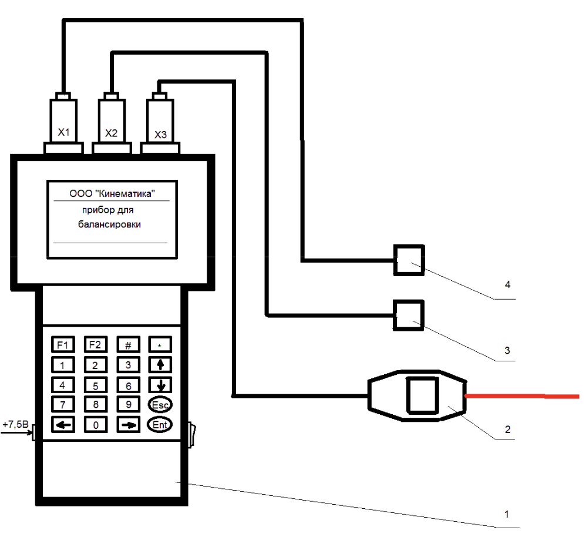
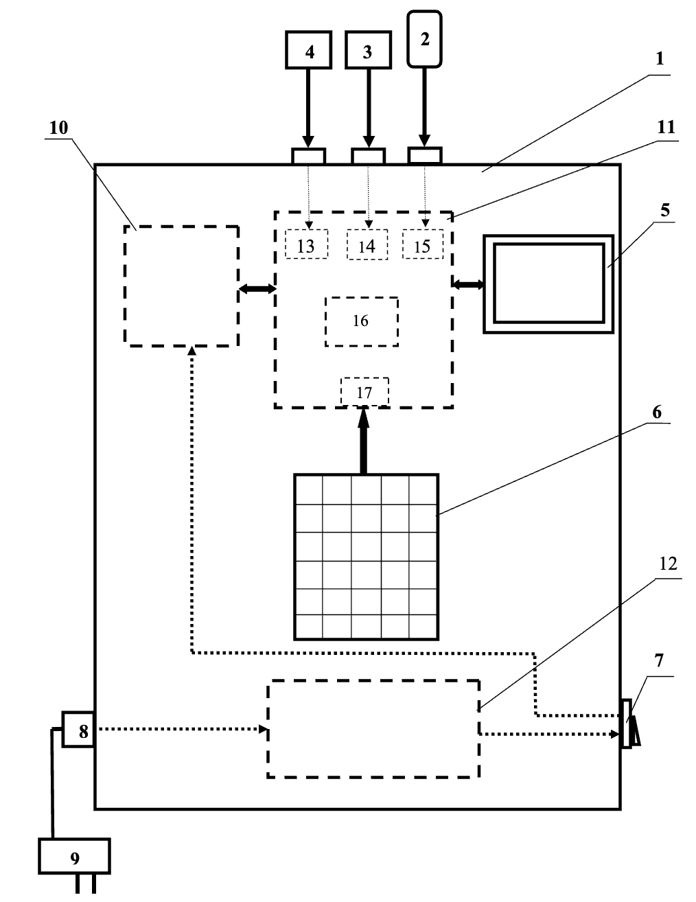

# **УСТРОЙСТВО И ПРИНЦИП РАБОТЫ ПРИБОРА**

## 4.1. Конструкция прибора

*Рис. 4.1. Прибор для балансировки в комплекте с датчиками*

Основные компоненты:  
- Измерительный блок (1)  
- Датчики вибрации (3, 4)  
- Датчик фазового угла (2)  

**Комплект оснастки для полевых условий:**  
- Магниты для крепления датчиков  
- Магнитный штатив для датчика фазового угла  
- Электронные весы для взвешивания грузов  

**Особенности конструкции:**  
- Корпус из черного ABS-пластика  
- Графический дисплей на лицевой панели  
- Управляющая клавиатура под дисплеем  

**Расположение разъёмов:**  
| Позиция       | Назначение                     |
|---------------|--------------------------------|
| Х1, Х2        | Подключение датчиков вибрации |
| Х3            | Подключение датчика фазы      |
| Правая сторона | Выключатель питания           |
| Левая сторона  | Разъём блока питания (+8.4 В) |

---

## 4.2. Функциональная схема

*Рис. 4.2. Функциональная схема прибора*

### Основные узлы:
1. **Измерительный блок (1):**  
   - Управляющая плата контроллера (10)  
   - Аналого-цифровая плата (11)  
   - Аккумуляторный блок (12) с контроллером заряда  

2. **Периферийные компоненты:**  
   - Дисплей (5)  
   - Клавиатура (6)  
   - Внешний блок питания (9)  

---

### Принцип работы
1. **Преобразование колебаний:**  
   - Акселерометры (3,4) → сигнал вибрации  
   - Лазерный датчик (2) → фазовые характеристики  

2. **Обработка сигналов:**  
   - Интегрирование и фильтрация  
   - АЦП-преобразование (контроллер 10)  
   - Цифровая обработка:  
     - Фильтрация  
     - Фурье-анализ  
     - Расчёт параметров балансировки  

3. **Отображение данных:**  
   - Амплитуда/фаза вибрации  
   - Частота вращения  
   - Результаты балансировки  

---

## Алгоритм балансировки
1. Измерение исходной вибрации  
2. Установка пробного груза  
3. Повторные измерения  
4. Автоматический расчёт корректирующей массы  
5. Вывод параметров на дисплей  

**Роль оператора:**  
- Монтаж пробных/корректирующих грузов  
- Управление через клавиатуру/дисплей  

---

> Все процессы выполняются автоматически по встроенным алгоритмам. Для работы достаточно следовать инструкциям на дисплее.