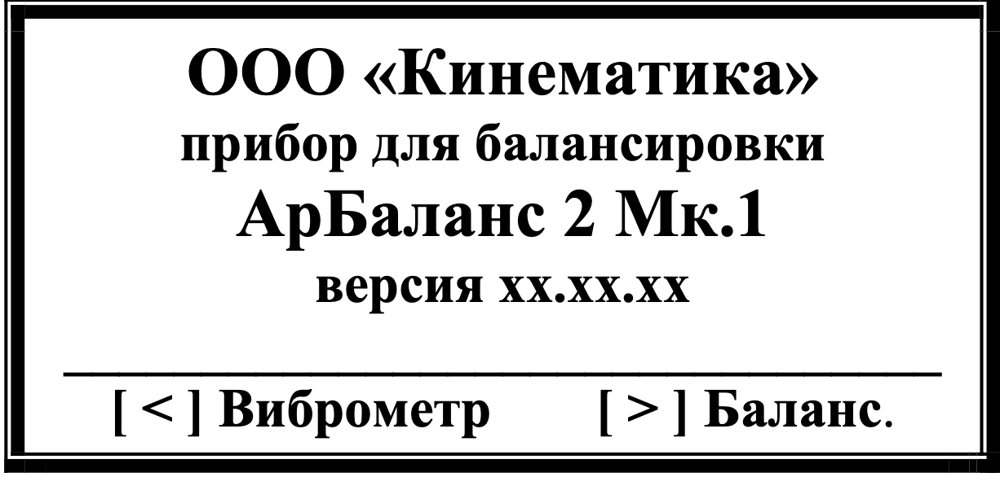

# 7.1. Включение прибора и использование клавиатуры для выбора режима работы

При запуске прибора на дисплее появляются служебные надписи - «Инициализация памяти», а затем «Инициализация прошла», указывающие, что программа загружена в память прибора и готова к работе (Рис.7.1.)

  
*Рис.7.1.*

Данные надписи высвечиваются на экране в течение нескольких секунд, после чего появляется исходная рабочая заставка, представленная на рис. 7.2.

  
*Рис.7.2.*

В нижней части экрана изображены управляющие клавиши **[ < ]** и **[ > ]**, с помощью которых можно выбрать один из двух главных режимов работы прибора:
- Режим измерения и анализа вибрации (подробности см. в разделе 7.3)
- Режим балансировки (подробности см. в разделах 7.4 и 7.5)

**Дополнительные функции:**  
Для ввода и корректировки коэффициентов преобразования датчиков вибрации используйте клавишу **[ # ]** (см. раздел 7.2).

---

