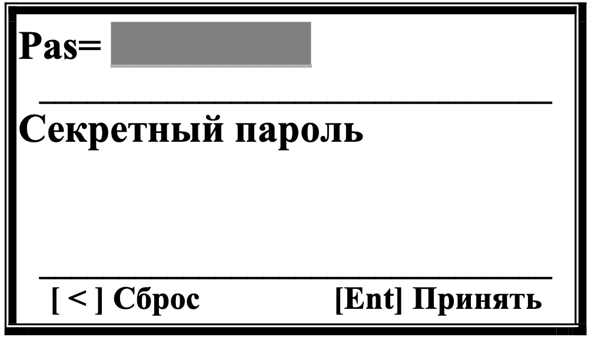
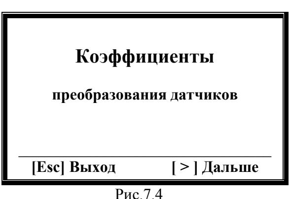
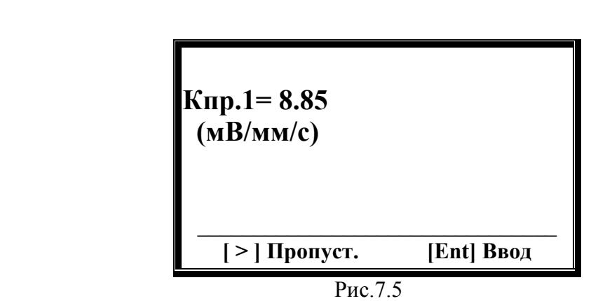
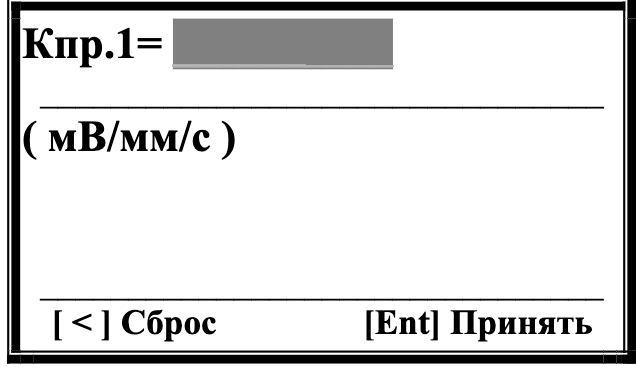
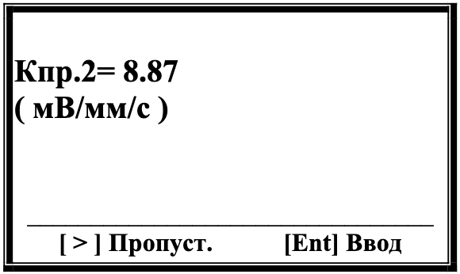

# 7.2. Ввод или корректировка коэффициентов преобразования датчиков вибрации

## Процедура ввода коэффициентов
1. Находясь в главном меню (рис.7.2), нажмите клавишу **[ # ]** → откроется окно «Секретный пароль» (рис.7.3).  
     
   *Рис.7.3.*

2. Введите пароль **3.14** (используя цифровые клавиши + **[Ent]**).  
   - Для исправления ошибок используйте **[ < ]** (Сброс).  
   - **Важно:** Дробная часть вводится через запятую (знак «*»).

3. После успешного ввода откроется меню корректировки коэффициентов (рис.7.4):  
     
   *Рис.7.4.*

## Корректировка коэффициентов
**Канал 1 (Кпр.1)**
- Нажмите **[ > ]** → отобразится текущий коэффициент (рис.7.5):  
    
  *Рис.7.5.*
  - **[ > ]** → сохранить текущее значение.  
  - **[Ent]** → ввести новое значение (рис.7.6):  
      
    *Рис.7.6.*  
    - Используйте цифровые клавиши для ввода → подтвердите **[Ent]**.
    - Для исправления ошибок используйте **[ < ]** (Сброс). 

**Канал 2 (Кпр.2)**
- После сохранения Кпр.1 откроется окно Кпр.2 (рис.7.7):  
    
  *Рис.7.7.*
- Процедура аналогична Кпр.1 (рис.7.8):  
    
  *Рис.7.8.*

**Возврат:** При нажатии кнопки **[Ent]** (Принять) происходит возврат в меню «Коэффициенты» (Рис.7.3) из которого можно выйти в главное меню прибора (Рис.7.2)

---

