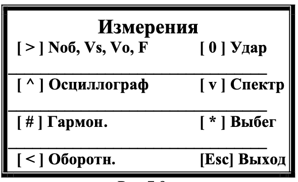

# 7.3. Работа прибора в режиме «Виброметр»

## Активация режима
Нажмите **[ < ]** в главном меню (рис.7.2) → откроется меню измерений (рис.7.9):  
  
*Рис.7.9.*

## Режимы работы
| Кнопка       | Функция                                                                 | Ссылка       |
|--------------|-------------------------------------------------------------------------|--------------|
| **[ > ]**    | Циклическое измерение (Nоб, Vs, Vo, F)                                  | Раздел 7.3.1 |
| **[ ^ ]**    | Осциллограф: временная функция вибросигнала                             | Раздел 7.3.2 |
| **[ v ]**    | Спектральный анализ                                                     | Раздел 7.3.3 |
| **[ # ]**    | Гармонический анализ                                                    | Раздел 7.3.4 |
| **[ * ]**    | Определение частот на выбеге                                            | Раздел 7.3.5 |
| **[ 0 ]**    | Метод ударного возбуждения                                              | Раздел 7.3.6 |
| **[ < ]**    | Графическое отображение оборотной составляющей                          | Раздел 7.3.7 |
| **[ Esc ]**  | Возврат к рис.7.1                                                       | —            |

---

## Подготовка к измерениям
**Подключение датчиков**:
1. **Датчики вибрации**  
   - Установите на корпус машины → подключите к **Х1**, **Х2**.
2. **Фотоэлектрический датчик**  
   - Подключите к **Х3** → нанесите катафотную метку на ротор
   - *Требование:* Нанесите на ротор катафотную метку с контрастной отражающей способностью.

> **Примечание:** Подробные рекомендации по настройке см. в **Приложении 1**.

