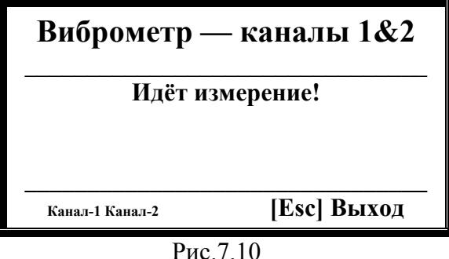
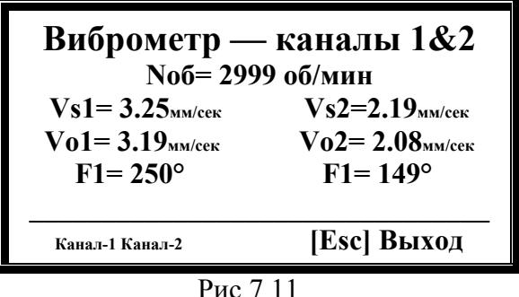
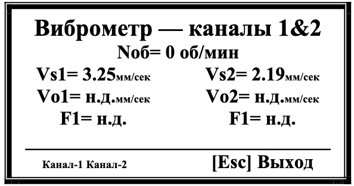

# 7.3.1. Режим измерения Noб, Vs, Vo, F

## **Активация режима:**  
Нажмите кнопку **| > |** в меню «Измерение».

## **Функционал:**  
- Циклическое измерение параметров:
  - Частота вращения (Noб)
  - СКЗ вибрации (Vs)
  - Оборотная составляющая (Vo)
  - Фаза вибрации (F)

---

## Процесс работы
1. **Начало измерений**  
     
   *Рис.7.10. Окно старта измерений*

2. **Результаты измерений**  
   После первого цикла на дисплее отображаются:  
   - СКЗ суммарной вибрации (V1s, V2s)  
   - СК3 оборотной составляющей (V1o, V2o)  
   - Фазы (F1, F2)  
   - Частота вращения (Noб)  
     
   *Рис.7.11. Вывод данных*

3. **Особый случай**  
   Если датчик фазового угла не подключен, Nоб = 0 об/мин:  
     
   *Рис.7.12. Отображение без датчика*

**Выход из режима:**  
Используйте кнопку **[Esc]** (Выход) → возврат в меню «Измерение» (Рис.7.9).

---

