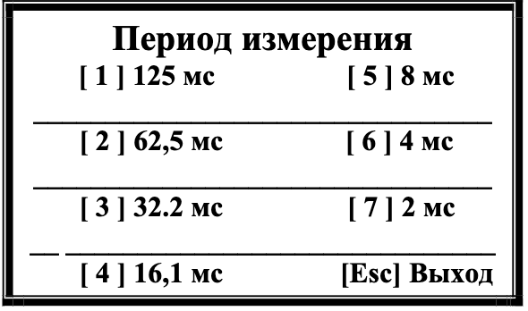
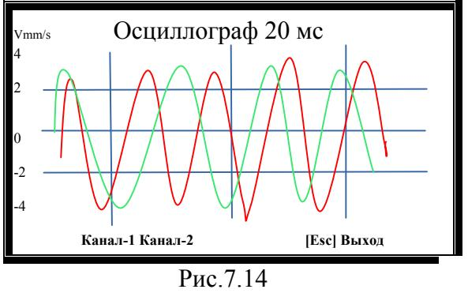

# 7.3.2. Режим осциллограф

**Активация режима:**  
Нажмите кнопку **[ ^ ]** в меню «Измерения» (Рис.7.9).

---

## Настройка измерений
1. **Выбор периода измерения**  
     
   *Рис.7.13. Меню выбора периода*

   - После  выбора  нужного  периода  измерения  на экране  появляется  **графическое изображение**  временной  функции 

1. **Графическое отображение**  
   - Временная функция вибросигнала:
     - Канал 1 (красный)
     - Канал 2 (зеленый)
   - Оси:
     - X: Время
     - Y: Амплитуда (мм/сек)  
     
   *Рис.7.14. Графики вибросигналов*

**Обновление данных:**  
Изображение обновляется до нажатия **[Esc]**.

---

