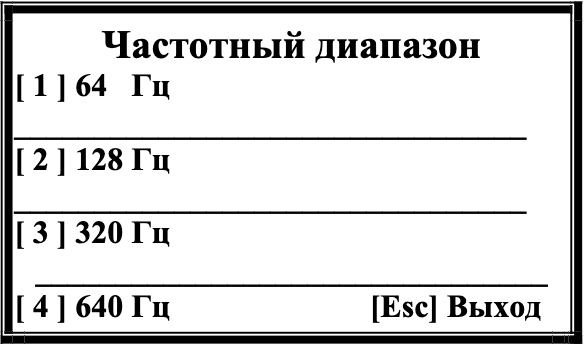
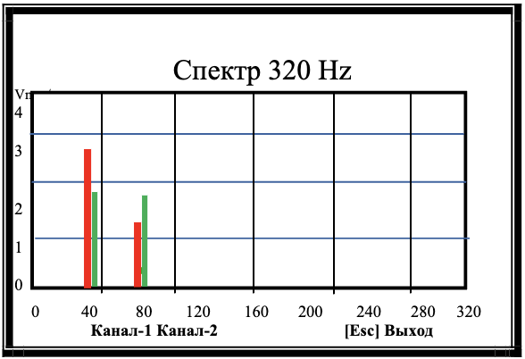
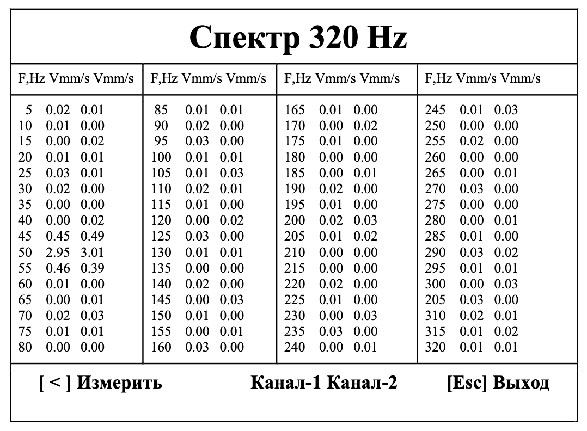

# 7.3.3. Режим измерения спектра вибрации

## **Активация режима:**  
Нажмите кнопку **[ v ]** в меню «Измерения».

---

## Процесс работы
1. **Выбор частотного диапазона**  
     
   *Рис.7.15. Меню выбора диапазона*  

   - Здесь [1],[2],.. - это соотвествующие кнопки на клавиатуре
  
   Доступные опции:
   | Диапазон | Полоса анализа |
   |----------|----------------|
   | 64 Гц    | 0.5 Гц         |
   | 128 Гц   | 1 Гц           |
   | 320 Гц   | 2.5 Гц         |
   | 640 Гц   | 5 Гц           |

2. **Процесс измерения**  
     
   *Рис.7.16. Статус "Идёт измерение"*

3. **Результаты спектрального анализа**  
     
   *Рис.7.17. Графики спектра вибрации*  
   - Канал 1: красный
   - Канал 2: зеленый
   - Оси:
     - X: Частота (Гц)
     - Y: СКЗ виброскорости (мм/сек)
   - Данное изображение будет периодически обновляться - до нажатия кнопки [Esc]. 
(Выход), после чего на экране появится таблица, содержащая значения составляющих 
спектра вибрации,  определённых в заданном частотном диапазоне  для  обоих  каналов измерения (см. рис.7.18).

4. **Таблица данных**  
   После нажатия **[Esc]**:  
     
   *Рис.7.18. Таблица спектральных составляющих*

---

## Управление режимом
- **[ < ] Измерить** → повторить замеры
- **[Esc] Выход** → возврат в меню «Измерения» (Рис.7.9)

