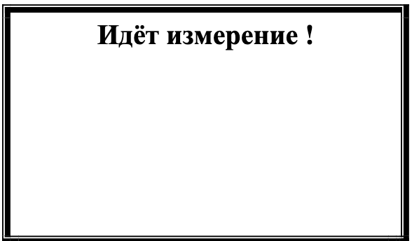
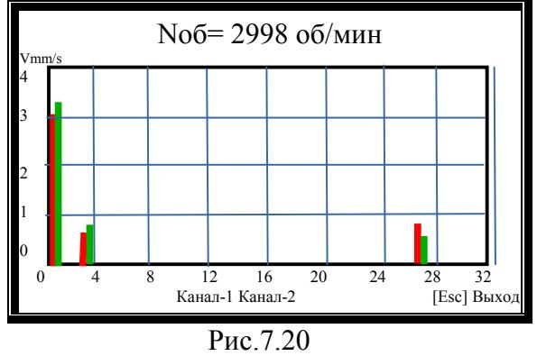
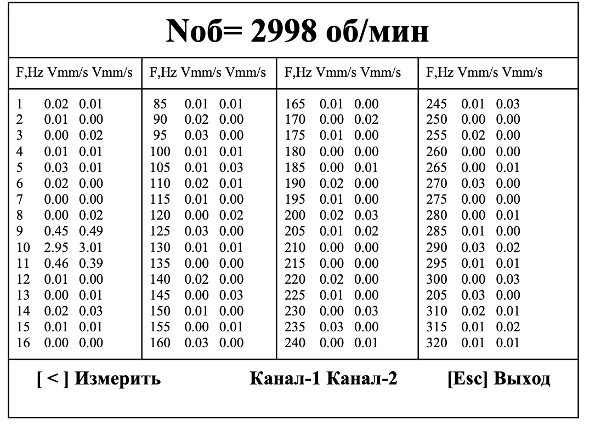

# 7.3.4. Гармонический анализ 

## Требование: 
> При работе в данном режиме помимо датчиков вибрации необходимо использовать датчик фазового угла, обеспечивающий синхронизацию процесса измерения с частотой вращения ротора машины, на который настроен датчик.

---

## Процесс работы
1. **Запуск режима:**  
   Нажмите кнопку **[ # ] (Гармон.)** в меню «Измерения» (Рис.7.9).

2. **Начало измерений:**  
   На дисплее появляется статус:  
     
   *Рис.7.19. Статус "Идет измерение"*

3. **Результаты анализа:**  
   После завершения измерений отображаются:
   - Графики спектра гармонических составляющих:
     - Канал 1: красный
     - Канал 2: зеленый  
       
     *Рис.7.20. Графики гармоник*  
     - Оси:
       - **X:** Номер гармоники
       - **Y:** Амплитуда виброскорости (мм/сек)

4. **Таблица данных:**  
   После нажатия **[Esc] (Выход)** выводится:  
     
   *Рис.7.21. Таблица значений СКЗ*

---

## Управление режимом
- **[ < ] Измерить** → повторить анализ
- **[Esc] Выход** → вернуться в меню «Измерения» (Рис.7.9)

---

