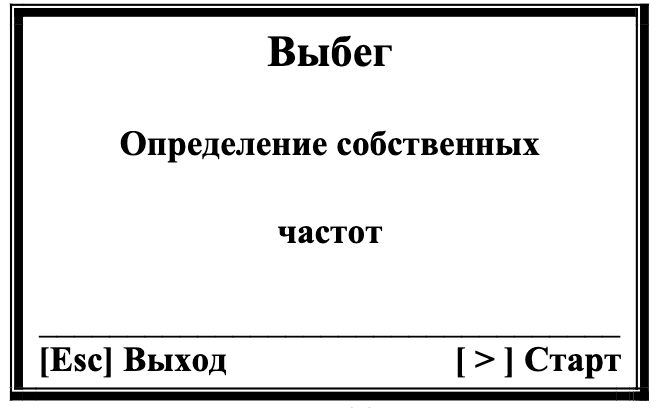
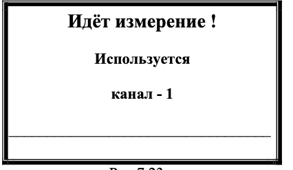
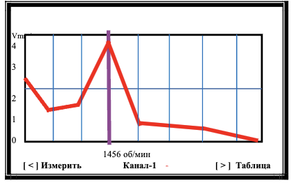
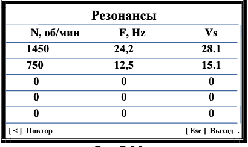

# 7.3.5. Определение собственных частот колебаний механизма на выбеге

## Требование: 
> Используйте датчик фазового угла для синхронизации измерений с частотой вращения ротора.

---

## Пошаговая инструкция
1. **Активация режима:**  
   Нажмите кнопку **[ * ]** в меню «Измерения» → откроется заставка:  
     
   *Рис.7.22. Окно запуска режима*

2. **Подготовка механизма:**  
   - Включите вращение проверяемого механизма
   - Убедитесь, что достигнута рабочая частота вращения
   - Выключите механизм

3. **Старт измерений:**  
   Нажмите **[ > ] (Старт)** → на дисплее появится:  
     
   *Рис.7.23. Статус измерений*

4. **Результаты:**  
   После остановки ротора отображается график:  
     
   *Рис.7.24. График вибрации при выбеге*  
   - **X:** Убывающая частота вращения (об/мин)
   - **Y:** СКЗ вибрации (мм/сек)
   - **Маркер:** Лиловый вертикальный штрих – максимальный резонанс

5. **Дополнительные опции:**  
   - **[ < ] Повтор** → повторить измерение
   - **[ > ] Таблица** → просмотр резонансных частот:  
       
     *Рис.7.25. Таблица резонансов*

---

### Особенности интерпретации:
- В таблице выводятся 5 основных резонансных частот механизма.
- Максимальное значение СКЗ соответствует наиболее мощному резонансу.

