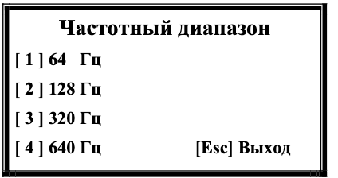
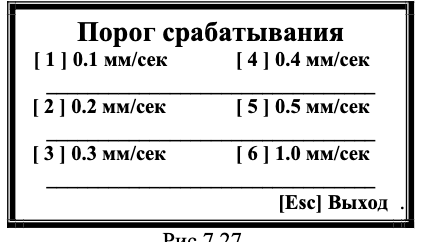
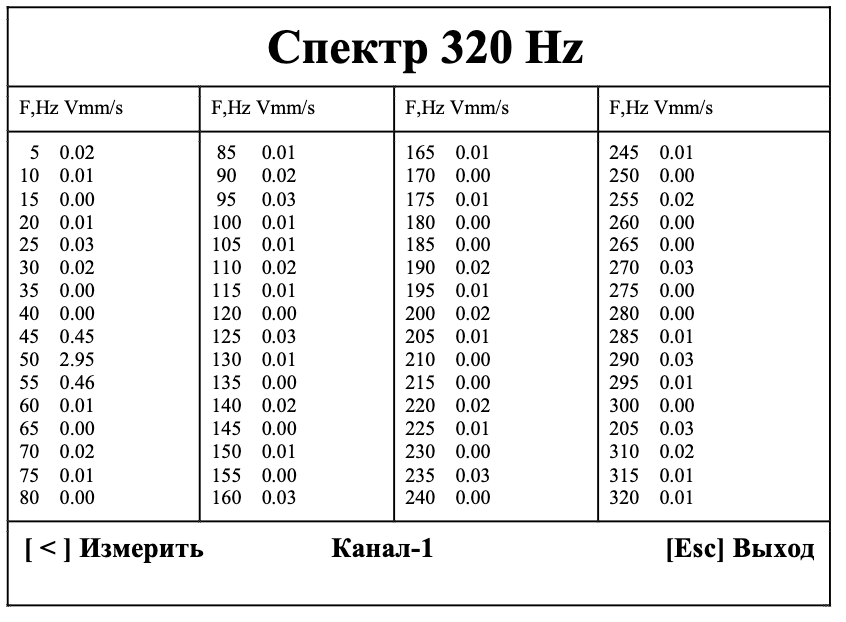

# 7.3.6. Определение собственных частот колебаний механизма методом ударного возбуждения

---

## Описание режима
Позволяет определить собственные частоты элементов конструкции по вибрационной реакции на ударное воздействие.

---

## Процесс работы
1. **Запуск режима:**  
   Нажмите кнопку **[ 0 ] (Удар)** в меню «Измерения».

2. **Выбор частотного диапазона:**  
     
   *Рис.7.26. Меню выбора диапазона*  
   - можно выьрать с помощью [1],[2],.. клавиш клавиатуры

3. **Настройка порога срабатывания:**  
     
   *Рис.7.27. Меню порога*  
   Установите значение от **0.1 до 1 мм/сек** 

4. **Ожидание удара:**  
     
   *Рис.7.28. Статус "Ожидание удара"*  
   - Прибор контролирует СКЗ вибрации по каналу 1
   - Произведите удар по конструкции для запуска измерений

5. **Анализ результатов:**  
   При превышении порога отображается спектр затухающих колебаний:  
     
   *Рис.7.29. График спектра*

6. **Расшифровка данных:**  
   Нажмите **[Esc] (Выход)** → выводится таблица спектральных составляющих:  
     
   *Рис.7.30. Таблица частот*

---

