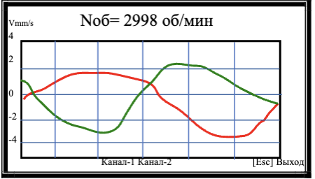

# 7.3.7. Графики оборотной составляющей вибрации

## Требование: 
> Используйте датчик фазового угла для синхронизации измерений с частотой вращения ротора.

---

## Процесс работы
1. **Активация режима:**  
   Нажмите **[ < ] (Оборотн.)** в меню «Измерения» (Рис.7.9).

2. **Измерение:**  
     
   *Рис.7.31. Статус "Идёт измерение"*

3. **Результаты:**  
   Графики временной функции оборотной составляющей:  
   - Канал 1: красный
   - Канал 2: зеленый  
     
   *Рис.7.32. Графики вибрации*

---

## Управление режимом
- **[Esc] (Выход)** → возврат в меню «Измерения» (Рис.7.9)

