# 7.4.1.1. Первичная балансировка

---

## Шаг 1: Выбор единиц измерения массы
1. **Активация режима:**  
   В меню "Балансировка в 1-й плоскости" → нажмите **[ < ] (Первичная)**  
   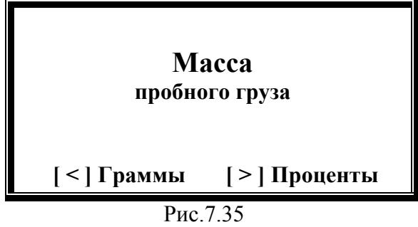  
   *Рис.7.35. Выбор единиц массы*

2. **Варианты:**  
   - **[ < ] Граммы** → ввод массы пробного груза (Рис.7.36):  
     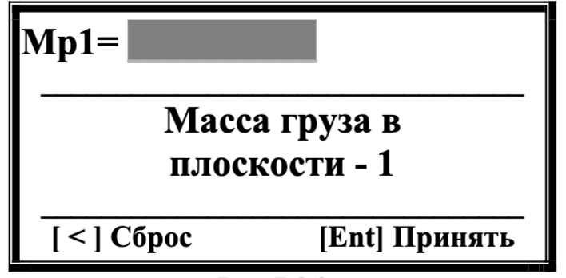  
     *Рис.7.36. Ввод массы в граммах* 

     - Используйте цифровые клавиши → подтвердите **[Ent]**
     - Используйте **[<]** для исправления значения массы.
   - **[ > ] Проценты** → переход к выбору угловых координат (Рис.7.37):  
     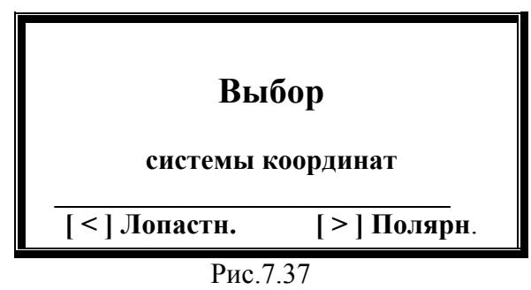  
     *Рис.7.37. Вывод результатов*

---

## Шаг 1* : Лопастной режим (опционально*)
1. **Активация:**  
   Нажмите **[ < ] (Лопастная)** → ввод числа лопастей (Рис.7.38):  
   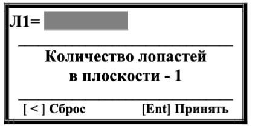  
   *Рис.7.38. Настройка лопастей*  

   - Введите количество лопастей рабочего колеса машины, которые могут быть использованы для установки пробного и корректирующего грузов → подтвердите **[Ent]**
   - Используйте **[<]** для исправления значения количества лопастей .

---

## Шаг 2: Первый пуск (без груза)
1. **Подготовка:**  
   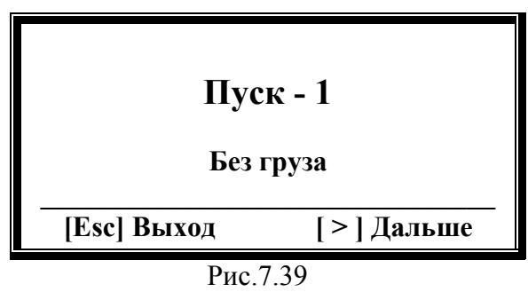  
   *Рис.7.39. Пуск 1*  
   - Убедитесь, что пробный груз **не установлен**
   - Запустите машину → нажмите **[ > ] (Дальше)**
  
   > **ВНИМАНИЕ!**  
   > Перед  началом  измерения  необходимо:
   > - включить  вращение 
   ротора балансируемой машины (первый пуск)  
   > - убедиться, что она вышла на рабочий режим. 

2. **Измерение:**  
     
   *Рис.7.40. Статус измерения*  
   - Длительность: 2-10 сек

   > **ВНИМАНИЕ!**  
   > При возникновении следующих условий:  
   > - Отсутствует сигнал с датчика фазового угла (**датчик не подключен** или **поврежден**)  
   > - Частота вращения ротора **менее 100 об/мин**  
   > 
   > На ЖК-дисплее прибора:  
   > 1. Отображается **предупреждающая надпись**  
   > 2. Указывается **клавиша для нажатия** после устранения неисправности  
   > 
   > **Действия:**  
   > 1. Устраните причину ошибки  
   > 2. Нажмите указанную клавишу → продолжите работу по программе

3. **Результаты:**  
   После завершения на дисплей выводятся:  
   - Частота вращения  
   - СКЗ вибрации  
   - Фаза оборотной составляющей  
   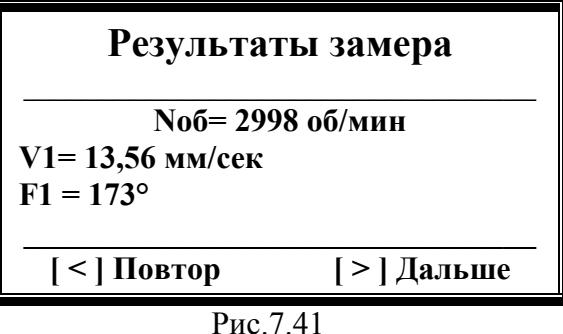  
   *Рис.7.41. Результаты первого пуска*  

### Действия после измерений
- **[ < ] Повтор** → повторить замер  
- **[ > ] Дальше** → переход к следующему шагу  

---

## Шаг 3: Второй пуск (с пробным грузом)

---

### Запуск измерений
- **Активация шага:**  
  После перехода от предыдущего этапа отображается:  
  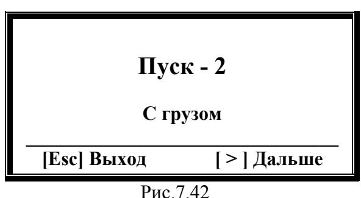  
  *Рис.7.42. Заставка "Пуск -2. С грузом"*

- **Условия измерений:**  
  - Пробный груз установлен на ротор  
  - Масса груза:  
    | Вариант               | Источник данных               |
    |-----------------------|--------------------------------|
    | Введена вручную       | Предварительные настройки     | 
    | Условно 100%          | Автоматический расчет         |

---

### Управление процессом
- **Кнопки управления:**  
  - **[Esc] (Выход)** → возврат в меню выбора балансировки (Рис.7.33)  
  - **[ > ] (Дальше)** → старт измерений  

> **ВНИМАНИЕ!**  
> Перед началом:  
> 1. Остановите ротор  
> 2. Установите пробный груз в плоскости коррекции  
> 3. Запустите машину → дождитесь выхода на рабочий режим  
> 
> *Рекомендации по выбору массы пробного груза см. в Приложении 1.*

---

### Процесс измерения
1. **Старт замеров:**  
   Нажмите **[ > ] (Дальше)** → начинается цикл измерений (2-10 сек):  
   - Статус измерения (аналогичен предыдущему шагу)

2. **Результаты:**  
   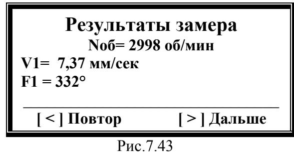  
   *Рис.7.43. Данные после 2-го пуска*  
   - Частота вращения (об/мин)  
   - СКЗ вибрации (мм/сек)  
   - Фаза вибрации (°) 

---

### Действия после измерений
- **[ < ] (Повтор)** → повторный замер (шаг 3)  
- **[ > ] (Дальше)** → переход к **шагу 4** (расчет корректирующего груза)  

---

#### Технические примечания:
- Время измерения зависит от частоты вращения (обратная зависимость)  
- Все данные сохраняются в энергонезависимой памяти прибора  
- Для точности соблюдайте последовательность: **остановка → монтаж груза → запуск**

## Шаг 4: Расчет корректирующего груза

### Отображение результатов в полярных координатах
После завершения измерений на экране отображается:  
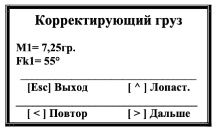  
*Рис.7.44. Параметры корректирующего груза*  

**Структура экрана:**  
| Позиция на экране | Содержание                |
|--------------------|---------------------------|
| Строка 2           | Масса груза (г)           |
| Строка 3           | Угол установки (градусы)  |
| Нижняя строка       | **[ > ] Дальше** - продолжить **[ < ] Повтор** - перезапуск шага 3 **[Esc]** - выход в меню **[ ^ ]** - лопастное разложение |

---

### Лопастное разложение 
- Результаты расчета характеристик вектора 
корректирующего груза, разложенного по лопастям рабочего колеса в плоскости коррекции. 
1. **Активация режима:**  
   Нажмите **[ ^ ] (Лопастная)** → переход к отображению:  
   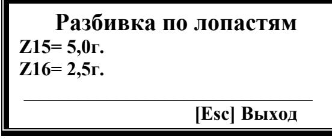  
   *Рис.7.45. Разложение по лопастям*

2. **Интерпретация данных:**  
   - Формат: `Лопасть Z[номер] = [масса] г`  
   - **н.д.** - отображается если не задано количество лопастей

> **ВНИМАНИЕ!**  
> - Нумерация лопастей начинается с места установки пробного груза  
> - Направление нумерации соответствует вращению ротора  

1. **Возврат к основным данным:**  
   Используйте **[Esc]** → возврат к Рис.7.44

---

### Отображение результатов в процентах
Альтернативный вариант представления:  
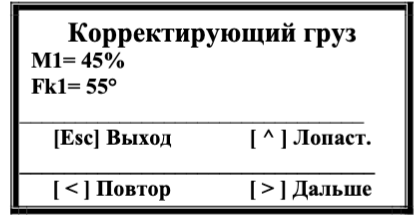  
*Рис.7.46. Результаты в процентах*  

**Особенности формата:**  
- Масса груза: % от массы пробного груза  
- Угол установки: идентичен варианту в граммах  

---

### Критичные требования перед установкой
> **! ВАЖНАЯ ПОСЛЕДОВАТЕЛЬНОСТЬ !**  
> 1. **Демонтируйте пробный груз**  
> 2. **Установите корректирующий груз:**  
>    - Начальная точка: место пробного груза  
>    - Направление: по вращению ротора  
>    - Масса/проценты: согласно расчетам  

---

### Переход к проверке балансировки
- Нажмите **[ > ] (Дальше)** → переход к **Шагу 5**  
- **Цель шага 5:** Проверка эффективности балансировки

## Шаг 5: Проверка эффективности балансировки

###  Запуск проверочного замера
- **Активация шага:**   
  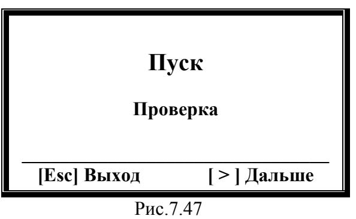  
  *Рис.7.47. Меню проверки*

- **Управление процессом:**  
  | Кнопка         | Действие                                   |
  |----------------|--------------------------------------------|
  | **[Esc] Выход**| Завершение без проверки → Возврат в меню  |
  | **[ > ] Дальше**| Старт проверочного замера                |

> **ВНИМАНИЕ!**  
> Перед началом:  
> - Включите раотающий режим машины  
> - Убедитесь в стабильности вращения  

---

###  Процесс измерения
1. **Старт проверки:**  
   Нажмите **[ > ] (Дальше)** → начинается замер (2-10 сек):  
   *Статус "Идёт измерение!" (Рис.7.40. )*

2. **Результаты:**  
   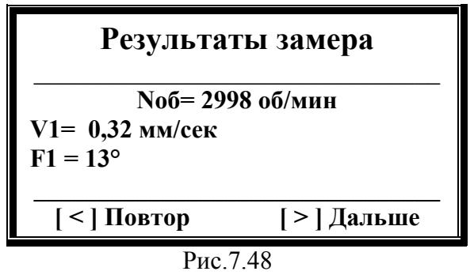  
   *Рис.7.48. Данные после балансировки*  
   - Частота вращения (об/мин)  
   - СКЗ вибрации (мм/сек)  
   - Фаза вибрации (°)

---

### Действия после проверки
- **[ < ] Повтор** → повторный замер вибрации  
- **[ > ] Дальше** → переход к **шагу 6** (финализация процесса)  

---

#### Технические примечания:
- Время измерения обратно пропорционально частоте вращения  
- Все данные сравниваются с исходными значениями до балансировки  
- Рекомендуется минимум 2 проверочных замера для контроля стабильности

## Шаг 6: Финализация процесса балансировки

###  Меню завершения
- **Активация шага:**  
  После проверочных замеров отображается:  
  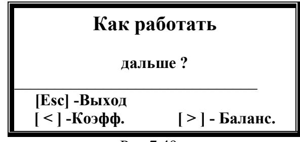  
  *Рис.7.49. Меню "Как работать дальше"*

**Варианты действий:**  
| Кнопка          | Действие                                      |
|-----------------|-----------------------------------------------|
| **[Esc] Выход** | Завершить балансировку → возврат в главное меню |
| **[ > ] Баланс.**| Продолжить коррекцию (последовательные приближения) |
| **[ < ] Коэфф.** | Просмотр/сохранение коэффициентов чувствительности |

---

### Работа с коэффициентами чувствительности
1. **Просмотр данных:**  
   Нажмите **[ < ] (Коэфф.)** → откроется:  
   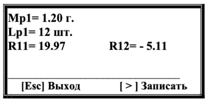  
   *Рис.7.50. Параметры балансировки*  

   **Отображаемые данные:**  
   - Масса пробного груза: [значение] или "—"  
   - Число лопастей: [значение] или "—"  
   - Коэффициенты:  
     - R11 = [значение]  
     - R12 = [значение]  

2. **Сохранение коэффициентов:**  
   > **ВНИМАНИЕ!** Для корректного сохранения:  
   > - Масса пробного груза должна быть введена в **граммах**  
   > - Пробный груз должен совпадать с фазовой меткой  

   Нажмите **[ > ] (Записать)** → выбор ячейки памяти:  
   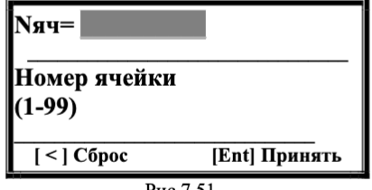  
   *Рис.7.51. Выбор номера записи*  

   **Параметры сохранения:**  
   - Доступные ячейки: 1-99  
   - Ввод номера: цифровые клавиши → подтвердить **[Ent]**  

3. **Подтверждение записи:**  
     
   *Рис.7.52. Статус "Записано"*  
   - Автоматический возврат в меню «Как работать дальше» через 2-3 сек.  

---

### Рекомендации
- Для критически важных машин сохраняйте коэффициенты в отдельные ячейки  
- При повторной балансировке используйте сохраненные параметры  
- Регулярно архивируйте данные через интерфейс прибора

