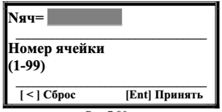
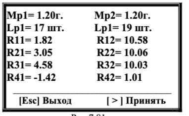
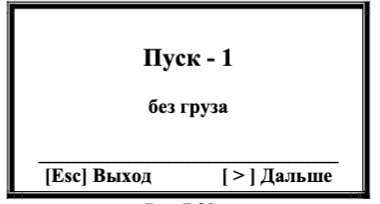
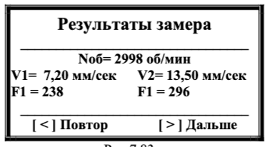
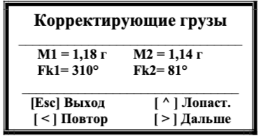

# 7.4.1.2. Повторная балансировка

## Условия выполнения
- **Требование:**  
  В памяти прибора должны быть сохранены коэффициенты балансировочной чувствительности для данной машины

- **Особенности процесса:**  
  - Требуется **1 пуск** машины (без пробных грузов)  
  - Используются ранее сохраненные параметры из памяти

---

## Подготовка к работе
1. **Установка датчиков:**  
   - Вибродатчики → те же точки, что и при первичной балансировке  
   - Датчик фазового угла → исходное положение  
2. **Маркировка ротора:**  
   - Контрастная метка в месте первичной установки

---

## Процесс балансировки
### Шаг 1: Выбор сохраненных параметров
1. **Запуск режима:**  
   В меню "Балансировка в 2 пл." (Рис.7.57) → **[ > ] (Повторно)**  
     
   *Рис.7.80. Выбор ячейки памяти*

2. **Ввод данных:**  
   - Номер ячейки: **1-99** (цифровые клавиши)  
   - Подтверждение: **[Ent]**  
   - Сброс: **[ < ]**

---

### Шаг 2: Подтверждение параметров
  
*Рис.7.81. Параметры балансировки*

**Содержимое ячейки:**  
| Параметр                | Значение          |
|-------------------------|-------------------|
| Масса пробных грузов    | [г] или "—"       |
| Число лопастей          | [шт] или "—"      |
| Коэффициенты R11-R42    | [расчетные значения] |

**Действия:**  
- **[Esc] Выход** → выбор другой ячейки  
- **[ > ] Принять** → переход к измерениям  

---

### Шаг 3: Измерение вибрации
  
*Рис.7.82. "Пуск-1 без груза"*

> **ВНИМАНИЕ!**  
> Перед стартом:  
> - Запустите ротор → рабочий режим  
> - Частота ≥ 100 об/мин  

**Процедура:**  
1. Нажмите **[ > ] (Дальше)** → начало замера  
2. Статус измерения:  "Идёт измерение"*

---

### Шаг 4: Результаты измерений
  
*Рис.7.83. Данные вибрации*

**Действия:**  
- **[ < ] Повтор** → повторный замер  
- **[ > ] Дальше** → расчет корректирующих грузов  

---

### Шаг 5: Расчет параметров
  
*Рис.7.84. Результаты в граммах*

**Отображаемые данные:**  
- Массы корректирующих грузов  
- Углы установки  
- Варианты отображения:  
  - Полярные координаты  
  - По лопастям   

---

## Особенности процесса
- **Повторное использование параметров:**  
  Все шаги после расчета дублируют логику первичной балансировки (см. раздел 7.4.2.1)

- **Рекомендации:**  
  - При изменении конструкции ротора → выполните первичную балансировку заново

---

> **Профессиональный совет:**  

