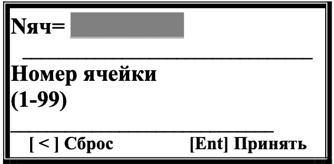
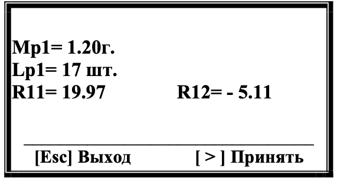
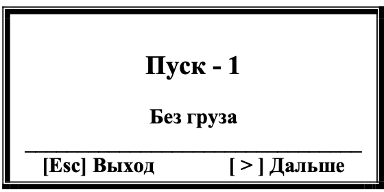
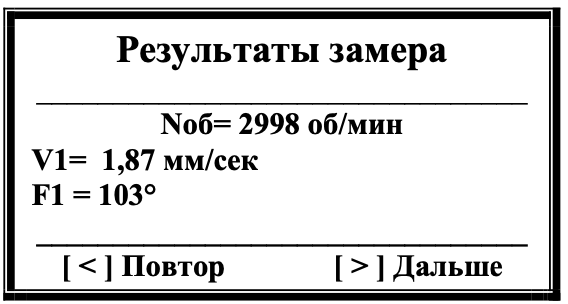

# 7.4.3 Повторная балансировка в одной плоскости  

## Условия выполнения  
- **Требование:**  
  В памяти прибора должны быть сохранены коэффициенты балансировочной чувствительности для данной машины  

- **Особенности процесса:**  
  - Требуется **1 пуск** машины (без пробных грузов)  
  - Используются ранее сохраненные параметры из памяти  

---  

**Подготовка к работе**
1. **Установка датчиков:**  
   - Вибродатчик → та же точка, что и при первичной балансировке  
   - Датчик фазового угла → исходное положение  

---  

## Процесс повторной балансировки в одной плоскости  
Процесс включает 5 шагов:  
  **Шаг 1: Выбор сохраненных параметров** – запуск режима «Повторно», ввод номера ячейки памяти (1-99).  

  **Шаг 2: Проверка параметров** – подтверждение данных из ячейки (масса пробного груза, число лопастей, коэффициенты R11-R12).  

  **Шаг 3: Измерение вибрации** – старт замера при работающем роторе.  

  **Шаг 4: Анализ результатов** – проверка данных вибрации, повторный замер при необходимости.  

  **Шаг 5: Расчет корректирующего груза** – определение массы и угла установки.  

### Шаг 1: Выбор сохраненных параметров  
1. **Запуск режима:**  
   В меню "Балансировка в 1-й пл." (Рис.7.34) → **[ > ] (Повторно)**  
     
   *Рис.7.53. Выбор ячейки памяти*  

2. **Ввод данных:**  
   - Номер ячейки: **1-99** (цифровые клавиши)  
   - Подтверждение: **[Ent]**  
   - Сброс: **[ < ]**  

---  

### Шаг 2: Проверка параметров  
  
*Рис.7.54. Параметры балансировки*  

**Содержимое ячейки:**  
| Параметр                | Значение          |  
|-------------------------|-------------------|  
| Масса пробного груза    | [г] или "—"       |  
| Число лопастей          | [шт] или "—"      |  
| Коэффициенты R11-R12    | [расчетные значения] |  

**Действия:**  
- **[Esc] Выход** → выбор другой ячейки  
- **[ > ] Принять** → переход к измерениям  

---  

### Шаг 3: Измерение вибрации  
  
*Рис.7.55. "Пуск-1. Без груза"*  

> **ВНИМАНИЕ!**  
> Перед стартом:  
> - Запустите ротор → рабочий режим  

**Процедура:**  
1. Нажмите **[ > ] (Дальше)** → начало замера  
2. Статус измерения: *"Идёт измерение! Пожалуйста подождите"*  

---  

### Шаг 4: Анализ результатов  
  
*Рис.7.56. Данные вибрации*  

**Действия:**  
- **[ < ] Повтор** → повторный замер  
- **[ > ] Дальше** → переход к расчету груза  

---  

### Шаг 5: Расчет корректирующего груза  
**Отображаемые данные:**  
- Масса корректирующего груза  
- Угол установки  
- Варианты отображения:  
  - Полярные координаты  
  - По лопастям  

---  

## Особенности процесса  
- **Повторное использование параметров:**  
  Все шаги после расчета дублируют логику первичной балансировки (см. раздел 7.4.2)

- **Рекомендации:**  
  - При изменении конструкции ротора → выполните первичную балансировку заново  

---  

> **Профессиональный совет:**  
> Для точности измерений убедитесь в отсутствии посторонних вибраций. Проверьте целостность метки на роторе перед началом работ.