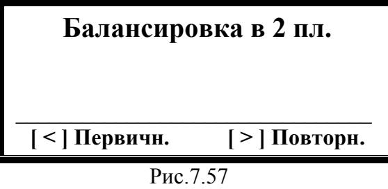

# 7.4.4 Балансировка в двух плоскостях (динамическая)

## Активация режима
1. **Переход из главного меню (Рис.7.2):**  
   Нажмите **[ > ] (Баланс.)** → откроется меню выбора типа (Рис.7.33).  
2. **Выбор режима:**  
   Нажмите **[ > ] (Балансировка в 2 пл.)** → переход к меню первичной/повторной балансировки (Рис.7.57).  
3. **Возврат:**  
   **[Esc] Выход** → возврат в главное меню.

---

## Выбор типа балансировки
  
*Рис.7.57. Меню выбора режима*

**Варианты:**
| Кнопка         | Режим                | Особенности                                                                 |
|----------------|----------------------|-----------------------------------------------------------------------------|
| **[ > ] Повторно** | Повторная балансировка | - Требуются сохраненные коэффициенты - 1 пуск машины                    |
| **[ < ] Первичная** | Первичная балансировка | - 3 пуска машины - Установка пробных грузов в плоскостях 1 и 2         |

> **ВНИМАНИЕ!** Для режима **Повторно**:  
> - Масса пробных грузов должна быть задана в **граммах**  
> - Пробные грузы должны совпадать с фазовой меткой по угловому положению  

---

## Подготовительные операции
1. **Установка датчиков:**  
   - **Вибродатчики:**  
     - Точки измерения → подключить к **Х1**, **Х2**  
   - **Датчик фазового угла:**  
     - Установить на корпус → подключить к **Х3**  
     - Нанести **контрастную метку** на ротор  

2. **Рекомендации:**  
   - См. требования к монтажу в **Приложении 1**  

---

### Процесс первичной балансировки
**Этапы:**  
1. **Пуск 1:** Измерение исходной вибрации  
2. **Пуск 2:** Установка пробного груза в плоскости 1  
3. **Пуск 3:** Установка пробного груза в плоскости 2  

**Цель:** Тарировка измерительной системы прибора.  

