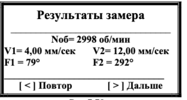

# 7.4.2.1. Первичная балансировка в двух плоскосятх

## Процесс первичной балансировки в двух плоскостях
Первичная балансировка в двух плоскостях состоит из семи шагов: 
**Шаг 1: Активация режима** и ввод данных Меню «Балансировка в 2 пл.» → выбор единиц (граммы/проценты). Ввод масс пробных грузов для плоскости 1 и 2. Опционально: настройка лопастного режима (число лопастей).

**Шаг 2: Пуск-1 (без груза)** Замер вибрации на роторе без грузов (≥100 об/мин).Фиксация параметров: частота, СКЗ, фаза.

**Шаг 3: Пуск-2 (груз в плоскости 1)** Установка пробного груза в плоскость 1 → повторный замер. Контроль стабильности данных.

**Шаг 4: Пуск-3 (груз в плоскости 2)** Перемещение груза в плоскость 2 → финальный замер. Допустимая погрешность массы: ±0.5 г.

**Шаг 5: Расчет корректирующих грузов** Определение массы и угла установки для обеих плоскостей. Форматы вывода: граммы, проценты лопастное разложение.

**Шаг 6: Проверка эффективности** Монтаж корректирующих грузов → проверочный пуск. Целевые показатели: Снижение СКЗ вибрации ≥70%. Стабильность фазы (±5°).

**Шаг 7: Финализация** Сохранение коэффициентов чувствительности в ячейки памяти (1-99). Завершение процесса или продолжение коррекции.

**Ключевые условия:**
Частота вращения ≥100 об/мин.
Точный монтаж грузов (погрешность ≤1°).
Контроль подключения датчиков вибрации.

---

### Шаг 1: Активация режима
**Пуск:** Из меню "Балансировка в 2 пл." (Рис.7.57) → нажмите **[ < ]**  
  
*Рис.7.58. Выбор единиц измерения*

---

**Выбор формата данных**
| Кнопка         | Действие                          | Результат               |
|----------------|-----------------------------------|-------------------------|
| **[ > ] Проценты** | Результаты в % от пробного груза | Автоматический переход к шагу 2 |
| **[ < ] Граммы**   | Ввод абсолютных значений         | Ручной ввод масс        |

---

#### Ввод масс пробных грузов
**Для плоскости 1**
  
*Рис.7.59. Ввод Мр1*

**Процедура:**  
1. Введите массу (г) через **цифровые клавиши**  
2. Курсор: `_` (начальная позиция)  
3. Подтвердите: **[Ent]**  
4. Сброс: **[ < ]**

---

**Для плоскости 2**
  
*Рис.7.60. Ввод Мр2*

**Повторите:**  
- Ту же процедуру, что и для плоскости 1  
- Подтвердите: **[Ent]**

---

**Выбор формата вывода**
  
*Рис.7.61. Формат отображения*

| Кнопка          | Действие                     |
|-----------------|------------------------------|
| **[ < ] Лопастная** | Настройка лопастного режима |
| **[ > ] Полярная**  | Стандартный вывод           |

---

#### Настройка лопастного разложения
**Для плоскости 1**
  
*Рис.7.62. Ввод Л1*

**Процедура:**  
1. Введите количество лопастей  
2. Подтвердите: **[Ent]**  
3. Сброс: **[ < ]**

---

**Для плоскости 2**
  
*Рис.7.63. Ввод Л2*

**Повторите:**  
- Аналогичную процедуру для плоскости 2  
- Подтвердите: **[Ent]**

---

#### Технические примечания
- Все введенные значения сохраняются в энергонезависимой памяти  
- Для отмены действий используйте **[Esc]** → возврат в меню  
- Нумерация лопастей начинается с места установки пробного груза

---

> **Критически важно!**  
> При использовании лопастного разложения:  
> - Убедитесь в правильности нумерации лопастей  
> - Направление отсчета ≡ направлению вращения ротора

---

**Переход к следующему этапу**
После завершения всех настроек:  
- Автоматический переход к **Шагу 2** ("Пуск 1 без груза")  

### Шаг 2: Пуск-1 (без груза)
**Активация:**  
После завершения настроек отображается:  
  
*Рис.7.64. "Пуск 1 без груза"*

---

**Условия измерений**
- Ротор **без пробных грузов**  
- Машина в исходном состоянии  

---

**Управление процессом**
| Кнопка         | Действие                                  |
|----------------|-------------------------------------------|
| **[Esc] Выход** | Возврат в меню выбора типа балансировки  |
| **[ > ] Дальше** | Старт измерения вибрации                |

> **ВНИМАНИЕ!**  
> Перед запуском:  
> 1. Включите вращение ротора  
> 2. Убедитесь в стабильности рабочих оборотов  
> 3. Частота ≥ 100 об/мин  

---

#### Процесс измерения
**Старт:** Нажмите **[ > ] (Дальше)**  
  
*Рис.7.65. Статус измерения*

**Параметры:**  
- Длительность: 2-10 сек (обратно частоте)  
- Контроль сигналов:  
  - Датчик фазового угла  
  - Частота вращения  

---

**Обработка ошибок**
При возникновении:  
- Отсутствие сигнала датчика  
- Частота < 100 об/мин  

**Действия:**  
1. На экране появится предупреждение  
2. Устраните причину  
3. Нажмите указанную кнопку для продолжения  

---

#### Результаты измерений
  
*Рис.7.66. Данные вибрации*

**Отображаемые параметры:**  
- Частота вращения (об/мин)  
- СКЗ вибрации (мм/сек)  
- Фаза вибрации (°)  

---

#### Действия после замера
| Кнопка         | Действие                                  |
|----------------|-------------------------------------------|
| **[ < ] Повтор** | Повторный замер                         |
| **[ > ] Дальше** | Переход к **Шагу 3** (Пуск 2 с грузом) |

---

**Технические примечания**
- Все данные сохраняются автоматически  
- Для точности рекомендовано ≥3 стабильных замера  
- При критичных отклонениях – проверьте крепление датчиков  

---

### Шаг3: Пуск-2 (груз в плоскости 1)
**Активация:**  
После завершения первого замера отображается:  
  
*Рис.7.67. "Пуск 2. Груз в плоскости 1"*

---

**Условия измерений**
- Пробный груз установлен в **плоскости 1**  
- Масса груза:  
  - Введена ранее в **[г]** 
  - Или условно 100%  

---

**Управление процессом**
| Кнопка         | Действие                                  |
|----------------|-------------------------------------------|
| **[Esc] Выход** | Возврат в меню выбора типа балансировки  |
| **[ > ] Дальше** | Старт измерения вибрации                |

> **ВНИМАНИЕ!**  
> Перед запуском:  
> 1. **Остановите ротор**  
> 2. Установите пробный груз в плоскости 1  
> 3. Запустите вращение → выйти на рабочий режим  
> 4. Выбор массы пробного груза и его установка на ротор рассмотрены в **Приложения 1**  

---

#### Процесс измерения
**Старт:** Нажмите **[ > ] (Дальше)**   
- *Статус измерения: "Идет измерение!" (Рис.7.65. аналогичен предыдущему шагу)*

**Параметры:**  
- Длительность: 2-10 сек  
- Контроль сигналов:  
  - Корректное подключение датчиков  
  - Стабильность частоты  

---

#### Результаты измерений
  
*Рис.7.68. Данные после второго пуска*

**Отображаемые параметры:**  
- Частота вращения (об/мин)  
- СКЗ вибрации (мм/сек)  
- Фаза вибрации (°)  

---

#### Действия после замера**
| Кнопка         | Действие                                  |
|----------------|-------------------------------------------|
| **[ < ] Повтор** | Повторный замер                         |
| **[ > ] Дальше** | Переход к **Шагу 4** (Пуск 3 - с грузом) |

---

**Технические примечания**
- Сравните результаты с данными первого пуска  
- При аномалиях → проверьте крепление груза  
- Рекомендуемая погрешность установки груза: ≤1°  

---

> **Профессиональный совет:**  
> Для сложных механизмов:  
> - Используйте лазерный нивелир для точной установки  
> - Делайте фото расположения грузов для архива

#### Шаг4: Пуск-3 (груз в плоскости 2)
**Активация:**  
После завершения второго замера отображается:  
  
*Рис.7.69. "Пуск 3. Груз в плоскости 2"*

---

**Условия измерений**
- Пробный груз установлен в **плоскости 2**  
- Масса груза:  
  - Предварительно введена (в г)  
  - Или условно 100%  

---

**Управление процессом**
| Кнопка         | Действие                                  |
|----------------|-------------------------------------------|
| **[Esc] Выход** | Возврат в меню выбора типа балансировки  |
| **[ > ] Дальше** | Старт измерения вибрации                |

> **ВНИМАНИЕ!**  
> Перед запуском:  
> 1. **Остановите ротор**  
> 2. Снимите груз из плоскости 1  
> 3. Установите пробный груз в плоскости 2  
> 4. Запустите вращение → выйти на рабочий режим  
> 5. Следуйте рекомендациям из **Приложения 1**  

---

#### Процесс измерения
**Старт:** Нажмите **[ > ] (Дальше)**  
- *Статус измерения: "Идет измерение!" (Рис.7.65. аналогичен предыдущему шагу)*

**Параметры:**  
- Длительность: 2-10 сек  
- Контроль сигналов:  
  - Исправность датчиков  
  - Стабильность частоты вращения  

---

#### Результаты измерений
  
*Рис.7.70. Данные после третьего пуска*

**Отображаемые параметры:**  
- Частота вращения (об/мин)  
- СКЗ вибрации (мм/сек)  
- Фаза вибрации (°)  

---

#### Действия после замера
| Кнопка         | Действие                                  |
|----------------|-------------------------------------------|
| **[ < ] Повтор** | Повторный замер                         |
| **[ > ] Дальше** | Переход к **Шагу 5** (Расчет грузов)    |

---

**Технические примечания**
- Сравните данные всех трех пусков  
- При отклонениях >20% → проверьте точность установки грузов  
- Рекомендуемый допуск по массе: ±0.5 г  

---

> **Профессиональный совет:**  
> Для повышения точности:  
> - Используйте цифровые весы для взвешивания грузов  
> - Проводите калибровку датчиков перед серией замеров  
> - Фиксируйте результаты в протоколе испытаний

### Шаг5: Расчет грузов 
**В граммах**
  
*Рис.7.71. Параметры в граммах*

**Отображаемые данные:**  
| Позиция         | Содержание                 |
|-----------------|----------------------------|
| Строка 2        | Масса груза (г)            |
| Строка 3        | Угол установки (°)         |
| Нижняя строка    | **[ > ] Дальше** - продолжение |

---

**В процентах**
  
*Рис.7.72. Параметры в процентах*

**Особенности:**  
- Масса выражена в % от пробного груза  
- Угол идентичен варианту в граммах  

---

#### Лопастное разложение грузов
**Активация:**  
Нажмите **[ ^ ] (Лопастная)** → отобразится:  
  
*Рис.7.73. Разложение по лопастям*

**Формат данных:**  
- Лопасть Z[N]= [Масса]г  
- "н.д." - если не задано число лопастей  

> **ВНИМАНИЕ!**  
> - Нумерация лопастей начинается с места пробного груза  
> - Направление ≡ вращению ротора  

---

**Управление режимом**
| Кнопка          | Действие                                  |
|-----------------|-------------------------------------------|
| **[ < ] Повтор** | Повтор 4-го шага (Пуск 3)               |
| **[Esc] Выход**  | Возврат в меню выбора типа балансировки  |
| **[ ^ ] Лопастная**| Переключение формата отображения       |

---

#### Подготовка к установке грузов
> **КРИТИЧЕСКИ ВАЖНО!**  
> 1. Снимите все пробные грузы  
> 2. Установите корректирующие грузы:  
>    - Отсчет угла → от места пробного груза  
>    - Направление → сонаправлено вращению ротора  
> 3. Зафиксируйте грузы согласно техрегламенту  

---

**Переход к проверке**
- Нажмите **[ > ] (Дальше)** → переход к **Шагу 6** (Проверка балансировки)  

---

**Технические примечания**
- Для сложных роторов используйте шаблоны установки  
- Рекомендуемый момент затяжки креплений: 15-20 Н·м  
- При работе с лопастями учитывайте аэродинамику  

---

> **Профессиональный совет:**  
> - Перед установкой выполните статическую проверку грузов  
> - Используйте цветовую маркировку для разных плоскостей  
> - Ведите журнал балансировок с привязкой к серийным номерам

### Шаг6: Проверка балансировки
**Активация:**  
После установки корректирующих грузов отображается:  
  
*Рис.7.74. Меню проверки*

---

**Управление процессом**
| Кнопка         | Действие                                  |
|----------------|-------------------------------------------|
| **[Esc] Выход** | Завершение без проверки → Возврат в меню |
| **[ > ] Дальше** | Старт проверочного замера               |

---

#### Процедура проверки
> **ВНИМАНИЕ!**  
> Перед запуском:  
> - Включите ротор → выйти на рабочие обороты  
> - Проверьте надежность крепления грузов  

**Старт:** Нажмите **[ > ] (Дальше)**  
- *Рис.7.65. Статус "Идёт измерение"*

**Длительность:** 2-10 сек  

---

#### Результаты проверки
  
*Рис.7.75. Данные после балансировки*

**Отображаемые параметры:**  
- Частота вращения (об/мин)  
- СКЗ вибрации (мм/сек)  
- Фаза вибрации (°)  

**Оценка эффективности:**  
- СКЗ должна снизиться ≥70% от исходного значения  
- Фаза стабильна (±5°)  

---

#### Действия после проверки
| Кнопка         | Действие                                  |
|----------------|-------------------------------------------|
| **[ < ] Повтор** | Повторный замер                         |
| **[ > ] Дальше** | Переход к **Шагу 7** (Финализация)      |

---

**Технические рекомендации**
- При отклонениях >30% → повторите балансировку  
- Используйте спектральный анализ для углубленной диагностики  
- Допустимая остаточная вибрация: ≤2.8 мм/сек (ISO 10816-3)  

---

> **Профессиональный совет:**  
> - Проводите проверку при разных режимах работы  
> - Сравнивайте данные с паспортными характеристиками агрегата  

### Шаг 7: Финализация процесса балансировки
**Активация:**  
После проверки результатов отображается:  
  
*Рис.7.76. Меню завершения*

---
**Управление процессом**
| Кнопка          | Действие                                  |
|-----------------|-------------------------------------------|
| **[Esc] Выход**  | Завершение балансировки → Возврат в меню |
| **[ > ] Баланс.** | Продолжение коррекции                   |
| **[ < ] Коэфф.** | Работа с коэффициентами чувствительности |

---

#### Работа с коэффициентами
**Просмотр параметров:**  
Нажмите **[ < ] (Коэфф.)** → откроется:  
  
*Рис.7.77. Коэффициенты чувствительности*

> **ВНИМАНИЕ!**  
> Для корректного использования коэффициентов:  
> - Масса пробных грузов должна быть в **граммах**  
> - Установка грузов ≡ плоскости фазовой метки  

---

#### Сохранение коэффициентов
1. **Инициализация записи:**  
   Нажмите **[ > ] (Записать)** → отобразится:  
     
   *Рис.7.78. Выбор ячейки памяти*  

2. **Ввод данных:**  
   - Номер ячейки: 1-99  
   - Подтвердите **[Ent]**  

3. **Подтверждение:**  
     
   *Рис.7.79. Статус "Записано"*  

---

#### Технические ограничения
- Максимальное количество профилей: 99  
- Перезапись данных: разрешена  
- Формат хранения: энергонезависимая память  

---

**Рекомендации**
- Резервируйте ячейки 90-99 для критически важных машин  
- Перед записью проверяйте актуальность коэффициентов  

---

> **Профессиональный совет:**   
> - Ведите цифровой журнал с привязкой ячеек к серийным номерам агрегатов  
> - Проводите аудит коэффициентов раз в 6 месяцев

